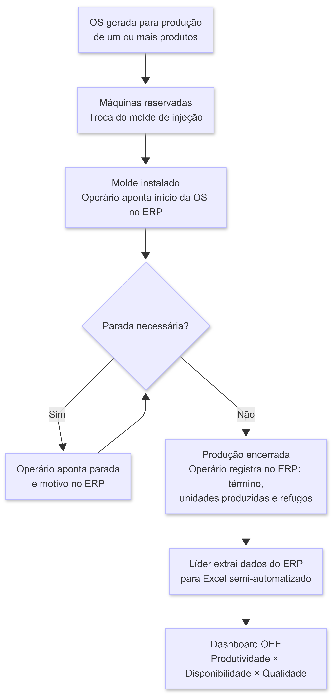

    

<h1 align="center">NJPlastic</h1>

<strong>RFC: <i>Request for Comments</i> — Projeto de Portfólio</strong>

<table align="center">
    <tr>
        <td><strong>Nome do Estudante</strong></td>
        <td>Nicolas Gustavo Conte</td>
    </tr>
    <tr>
        <td><strong>Curso</strong></td>
        <td>Engenharia de Software</td>
    </tr>
    <tr>
        <td><strong>Linha de Projeto</strong></td>
        <td>Web - IoT</td>
    </tr>
    <tr>
        <td><strong>Data da Proposta</strong></td>
        <td>05/07/2026</td>
    </tr>
    <tr>
        <td><strong>Versão</strong></td>
        <td>1.0.0</td>
    </tr>
</table>

# 1. Visão do Produto e Impacto (O Problema)

Empreendedores do setor de plásticos injetados brasileiro, operam máquinas predominantemente analógicas e dependem de processos manuais ou sistemas legados para acompanhar a produção. O controle preciso dos ciclos produtivos é crítico nessa indústria: a matéria-prima derivada do petróleo tem custo elevado e qualquer perda não monitorada impacta diretamente a margem. Ainda assim, encontrar um sistema que integre o chão de fábrica aos ERPs corporativos a um custo acessível é uma lacuna real no mercado.

Com isso em mente, a NJPlastic vem com com objetivo de integrar máquinas injetoras de plástico com equipamentos de IoT, processar dados de produção, e por fim, integrar tais dados nos ERPs (_Enterprise Resource Planning_) diversos que usuários adquirentes usem. Tem como intuíto resolver três problemas reais:
- Cruzar a retirada de um dado analógico das injetoras com dados de produção cadastrados no ERP (agora, cadastrados na NJPlastic primeiro);
- Permitir a visualização de produção para gestores em tempo real.

Atualmente já existem sistemas parecidos, porém não fazem integração com ERPs (ou fazem pouca integração - geralmente apenas leituras), são caros (comparado com o quê entregam), não são intuitivos e aparentam ter sido desenvolvidos com auxílio de IA puramente, o que pode ser um problema.

---

## 1.1 Contexto e Problema

Empreendedores brasileiros do setor de produtos plásticos enfrentam um mercado fragmentado e oneroso, onde até a aquisição de sistemas "especializados" em controle de produção, exige investimentos adicionais em customizações para que os mesmos se encaixem com o processo, sistemas conhecidos como _MES_ (_Manufacturing Execution System_)[[1]](#ref-1). Como não há escapatória, as empresas recorrem a customização de _softwares_ de controle de produção, utilização de ferramentas não especializadas e "datadas" (como Excel), ou, desenvolvimento interno de um _software_ (específico para empresas que tenham bastente capital).

Os sistemas _MES_ disponíveis para pequenas e médias empresas apresentam limitações críticas: a integração com _ERPs_ é rara ou superficial (geralmente apenas leitura de dados), a usabilidade é baixa e o custo de implementação e manutenção é alto. Alternativas mais baratas surgiram com a escalada da IA no mercado de _software_, porém, desenvolvidas sem rigor de arquitetura ou segurança, não entregam as garantias necessárias para um ambiente de produção industrial.

Como exemplo, vamos nos basear no processo produtivo da empresa Meplas[[2]](#ref-2):

<em>Figura 1. Diagrama de produção da empresa Meplas.</em>

Esse cenário deixa o empreendedor do setor plástico sem opção viável, ou ele investe em um _MES_ caro e genérico que ainda exigirá customização, ou, convive com ferramentas inadequadas que não eliminam o trabalho manual. A ausência de um sistema acessível, com integração real ao _ERP_ e calibrado para a realidade do setor, é a lacuna que a **NJPlastic** se propõe a preencher.

---

## 1.2 Origem da Demanda e Evidências

O projeto foi solicitado pela empresa Meplas, a pedido direto do sócio-proprietário Jair Sperandio. Assim como anteriormente, o mesmo relata que não há controle total do processo produtivo, possuindo os seguintes problemas:
- Não consegue extrair dados concretos de produção em tempo real;
    - Precisa cruzar os dados com diversas telas do ERP;
    - Customização do ERP está fora de questão, pelas questões citados anteriormente;
- Tem Perdas e/ou produção em excesso de 1 a cada 3 pedidos;
- Precisa deslocar pessoal (líderes de turno) para montarem relatórios;
- O processo produtivo não é integrado, utiliza várias ferramentas e processos manuais para registrar tudo.

## 1.3 Análise de Soluções Existentes (Benchmark)

Abaixo, veremos algumas soluções que executam funções parecidas a que a NJPlastic pretende implementar.

### Autoflex MES + Iniflex ERP (Projedata)[[3]](#ref-3)

**Público-alvo:** Fabricantes de plástico brasileiros de todos os portes. Oferece duas versões: *Iniflex PRO* para operações industriais de maior porte e *Iniflex SMART* voltada especificamente a micro e pequenas indústrias plásticas.

**Funcionalidades principais:**
- Coleta automática de ciclos produtivos, paradas e perdas diretamente das máquinas, sem apontamento manual;
- Cálculo de OEE baseado em dados reais com *dashboards* por turno, setor e equipamento;
- Ecossistema de quatro módulos integrados: *Autoflex* (MES chão de fábrica) + *Iniflex* (ERP) + *Iniflex.APS* (planejamento avançado) + *Iniflex.BI* (inteligência de dados);
- Módulos de ERP específicos para plástico: controle de moldes e cavidades, rastreabilidade de lotes e gestão de *setups*;
- Identificação de gargalos com interface voltada ao operador.

**Limitações:**
- Integração com ERPs de terceiros (SAP, TOTVS, etc.) requer consulta a especialistas — sem conectores prontos documentados publicamente;
- Ecossistema proprietário fechado: a integração fluida ocorre apenas entre os próprios produtos Projedata;
- Nenhuma informação de preço publicada — modelo comercial opaco para PMEs que precisam avaliar custo-benefício sem contato com o time de vendas;
- Especificações técnicas da captura IoT (tipo de sensor, protocolo, *hardware* necessário) não estão publicadas.

### Vedois MES (Vedois Tecnologia)[[4]](#ref-4)

**Público-alvo:** Indústrias de médio porte no Brasil com foco declarado em injeção plástica, embalagens, móveis, metalurgia, têxtil e química.

**Funcionalidades principais:**
- *Suite* modular: *Vedois Produção* (rastreamento automático), *Vedois Qualidade* (CEP), *Vedois Manutenção* e *Vedois DNC* (carga automática de arquivos CAD/CAM em CNCs);
- Monitoramento em tempo real de máquinas, operadores e processos com alertas via *e-mail*, *pop-up*, *mobile* e alarmes visuais e sonoros;
- OEE com rastreabilidade de matéria-prima e IDs de produto;
- Integração confirmada com TOTVS Protheus e compatibilidade declarada com qualquer ERP do mercado;
- Interface responsiva para computadores, *tablets* e *smartphones*.

**Limitações:**
- Integração com ERPs externos é descrita como possível, mas sem conectores prontos — cada integração parece ser um projeto sob demanda;
- Nenhum preço publicado e sem indicação de planos acessíveis para empresas de menor porte;
- Documentação técnica da captura IoT ausente — sem especificação de *hardware*, protocolos ou método de captura de pulso elétrico;
- Produto generalista por setor: sem funcionalidades específicas para injeção plástica como controle de moldes, cavidades ou gestão de OS de injeção.

### LiveMES (LiveMES Tecnologia)[[5]](#ref-5)

**Público-alvo:** Indústrias de manufatura discreta de todos os portes no Brasil, em setores como alimentos, automotivo, embalagens, farmacêutico, química e têxtil. Sem foco declarado em plástico.

**Funcionalidades principais:**
- Coletores IIoT instalados fisicamente nas máquinas, capazes de captar sinais variados para digitalizar equipamentos de qualquer tipo ou idade;
- OEE em tempo real com análise de perdas e histórico de produtividade;
- Análise de paradas com gráficos de Pareto e diagnóstico de causas raiz;
- *LivIA*: módulo de IA para suporte a decisões operacionais;
- *PMaaS* (*Production Manager as a Service*): engenheiros da própria LiveMES analisam os dados do cliente e entregam recomendações.

**Limitações:**
- Nenhuma especialização em injeção plástica — sem controle de moldes, cavidades, ciclos de injeção ou parâmetros específicos do processo;
- Integração com ERP mencionada, mas sem detalhes técnicos — a integração parece ser avaliada caso a caso;
- Nenhum preço publicado;
- Modelo *PMaaS* pode representar custo recorrente adicional significativo para PMEs de menor porte.

### Doeet MES (Doeet)[[6]](#ref-6)

**Público-alvo:** Fabricantes de plástico em geral — injeção, extrusão, sopro, rotomoldagem e termoformagem. Empresa espanhola com interface em português e espanhol e clientes documentados na América Latina.

**Funcionalidades principais:**
- OEE em tempo real com monitoramento de parâmetros de máquina (temperatura, etc.) via IoT e sistema de alarmes;
- Integração com ERP bidirecional, incluindo bloqueio de molde em uso diretamente no ERP;
- Rastreabilidade de ordens de produção e lotes de matéria-prima;
- Controle de moldes e ferramentas com rastreamento de uso — específico para plástico;
- Gestão de *changeover* (SMED) e controle de qualidade integrado.

**Limitações:**
- Empresa espanhola — suporte, contrato e localização para o Brasil podem ser obstáculos para PMEs sem estrutura de TI interna;
- Nenhuma informação de preço publicada;
- Sem *cases* brasileiros documentados publicamente;
- Abordagem IoT depende de sensores próprios cuja especificação técnica não está publicada.

### EGA PCPMaster (EGA Sistemas)[[7]](#ref-7)

**Público-alvo:** Indústrias de manufatura no Brasil — automotivo, alimentos, embalagens, plásticos, móveis e metalurgia. Produto generalista por setor.

**Funcionalidades principais:**
- Monitoramento em tempo real do chão de fábrica com coleta automática de dados e IHM (*Interface Homem-Máquina*) para interação do operador;
- Cálculo de OEE e gestão de ordens de produção;
- Integração com ERP via *WebAPI Rest* — abordagem técnica mais moderna e documentada publicamente entre os concorrentes avaliados;
- Controle de qualidade com CEP (*Controle Estatístico de Processo*) e rastreabilidade;
- Aplicativo *mobile* para gestão remota e notificações automáticas de parada de máquina.

**Limitações:**
- Injeção plástica é listada como setor atendido, mas sem funcionalidades específicas declaradas (controle de moldes, cavidades, ciclos de injeção);
- Especificações técnicas da camada IoT (*hardware*, sensores, protocolo de captura) não estão publicadas;
- Nenhum preço publicado;
- Produto aparentemente posicionado para indústrias de médio porte com equipe de TI interna.

### Comparação

| Solução | Pontos Fortes | Limitações |
|---|---|---|
| Autoflex + Iniflex (Projedata) | Único com ERP nativo para plástico; controle de moldes e cavidades; versão para micro e pequenas empresas | Ecossistema fechado; sem integração documentada com ERPs de terceiros; preço opaco |
| Vedois MES | Foco em injeção plástica; integração confirmada com TOTVS; alertas multicanal | Integração com ERP externo sob demanda; sem especificidades de injeção (moldes, OS) |
| LiveMES | Coletores IIoT para máquinas de qualquer tipo ou idade; escalável por porte | Sem especialização em plástico; integração com ERP caso a caso; custo do PMaaS |
| Doeet | Bidirecional com ERP; controle de moldes; específico para plástico; multi-processo | Empresa espanhola; sem cases brasileiros; preço não publicado |
| EGA PCPMaster | Integração via WebAPI Rest documentada; app mobile; CEP integrado | Sem funcionalidades específicas para injeção; IoT não documentado |

---

### Diferencial do Projeto

Explique claramente:

- por que criar algo novo
- qual lacuna não foi resolvida pelas soluções existentes
- qual nicho específico será atendido

---

## 1.4 Público-Alvo

Defina quem usará o sistema.

Exemplos:

- estudantes
- contadores
- equipes de suporte
- jogadores

Descreva:

- perfil do usuário
- contexto de uso
- nível de conhecimento técnico esperado

---

## 1.5 Objetivos do Projeto

### Objetivo Geral

<!-- Qual transformação o projeto pretende gerar. -->
Desenvolver um sistema integrado completo, fácil de utilizar e barato de implementar.

---

### Objetivos Específicos

Liste **3 a 5 objetivos técnicos ou de produto**.

Exemplo:

- automatizar um processo manual
- permitir análise de dados
- criar um sistema de recomendação

---

## 1.6 Métricas de Sucesso (KPIs)

Como saberemos que o projeto foi bem sucedido?

Exemplos:

- latência inferior a 200ms
- acurácia da IA superior a 85%
- suporte a 100 usuários simultâneos
- redução do tempo de um processo em 30%

---

# 2. Engenharia de Requisitos

Esta seção define **o que o sistema fará**.

Evite descrições vagas.

---

## 2.1 Personas

Crie **1 a 3 personas principais**.

Inclua:

- nome fictício
- contexto
- objetivos
- principais dificuldades

Adicionar **imagens ou ilustrações** pode ajudar na compreensão.

---

## 2.2 Casos de Uso Principais

Liste os principais fluxos do sistema.

Exemplo:

- criar conta
- registrar dados
- consultar informações
- gerar relatórios

Sempre que possível inclua **diagramas de caso de uso**.

---

## 2.3 Requisitos Funcionais (RF)

Use a estrutura:

> O sistema deve permitir que **[ator] realize [ação]**.

Exemplo:

RF01 — O sistema deve permitir que o usuário crie uma conta.

RF02 — O sistema deve permitir que o usuário registre informações.

RF03 — O sistema deve permitir que o usuário visualize dados registrados.

---

## 2.4 Requisitos Não Funcionais (RNF)

Inclua requisitos relacionados a:

- desempenho
- segurança
- disponibilidade
- escalabilidade
- usabilidade

Exemplo:

RNF01 — O sistema deve suportar 100 usuários simultâneos.  
RNF02 — O tempo de resposta deve ser inferior a 300ms.  
RNF03 — O sistema deve utilizar autenticação segura.

---

## 2.5 Regras de Negócio

Exemplos:

- apenas usuários autenticados podem acessar determinados recursos
- determinadas operações exigem validação adicional

---

## 2.6 Fora do Escopo

Liste explicitamente **o que o sistema não fará**.

Isso ajuda a evitar crescimento descontrolado do projeto.

---

# 3. Fluxos e Comportamento do Sistema

Esta seção demonstra **como o sistema funciona**.

Use diagramas sempre que possível.

---

## 3.1 Fluxo Principal do Usuário

Apresente o fluxo principal do sistema.

Utilize:

- fluxogramas
- diagramas de atividades
- diagramas de sequência

Inclua **imagens dos diagramas**.

---

## 3.2 Fluxos Alternativos

Descreva cenários como:

- erros
- cancelamentos
- exceções

---

# 4. Mockups e Experiência do Usuário (UX)

Esta seção apresenta **a visualização inicial do produto antes da implementação**.

Mockups ajudam a validar:

- fluxo de navegação
- organização da interface
- interações do usuário
- clareza da experiência

Ferramentas sugeridas:

- Figma
- Excalidraw
- Balsamiq
- Whimsical
- protótipos desenhados à mão

---

## 4.1 Fluxo de Navegação

Apresente um diagrama mostrando como o usuário navega entre telas.

Exemplo:

Login → Dashboard → Cadastro → Relatório

Inclua **imagem do fluxo de navegação**.

---

## 4.2 Wireframes ou Mockups das Telas

Apresente os principais mockups do sistema.

Inclua pelo menos:

- tela inicial
- fluxo principal
- tela de entrada de dados
- tela de resultado ou visualização

Para cada tela inclua:

- imagem
- breve descrição da funcionalidade
- ações principais do usuário

Sempre que possível:

- inclua **links para protótipo navegável**
- inclua **prints das telas**

---

## 4.3 Fluxo de Interação do Usuário

Demonstre passo a passo um fluxo importante.

Exemplo:

1. usuário acessa o sistema  
2. cria conta  
3. registra dados  
4. visualiza resultados  

Inclua **sequência de telas ou fluxo visual**.

---

## 4.4 Feedback Inicial de Usuários (Opcional)

Se possível, inclua:

- comentários de usuários
- sugestões de melhoria
- validação inicial do mockup

---

# 5. Arquitetura do Sistema

Esta seção demonstra **como o sistema será construído**.

---

## 5.1 Diagrama C4

Apresente três níveis.
## 1. Nível 1: Diagrama de Contexto
É a **visão macro** do sistema. O foco aqui não é a tecnologia, mas sim como o software se encaixa no ecossistema e no mundo real.

* **Objetivo:** Mostrar o sistema como uma "caixa preta" e suas interações básicas com o ambiente externo.
* **O que incluir:**
    * **Atores:** Diferentes perfis de usuários (Ex: Cliente, Administrador, Operador).
    * **Sistemas Externos:** Softwares legados, serviços de terceiros ou provedores de identidade.
    * **Fluxo de Valor:** Como a informação entra, circula e sai do sistema principal.

---

## 2. Nível 2: Diagrama de Containers
Neste estágio, damos o primeiro **"zoom"**. Decompomos o sistema em suas unidades de execução independentes (containers).

* **Objetivo:** Apresentar a arquitetura de alto nível e as decisões tecnológicas fundamentais.
* **O que incluir:**
    * **Aplicações Web/Mobile:** Interfaces de usuário (Ex: SPA em React, App Android/iOS).
    * **Serviços de Backend:** Unidades lógicas de processamento (Ex: API Gateway, Microserviços em Node.js ou Go).
    * **Armazenamento:** Persistência de dados (Ex: PostgreSQL, MongoDB, Redis).
    * **Protocolos:** Como os containers se comunicam (Ex: JSON/HTTPS, gRPC, RabbitMQ).

---

## 3. Nível 3: Diagrama de Componentes
O foco agora é o que acontece **dentro de um único container** (como uma API específica ou um serviço de backend).

* **Objetivo:** Identificar as responsabilidades internas, padrões de código e a organização lógica.
* **O que incluir:**
    * **Estrutura Interna:** Organização das camadas (Ex: Controladores, Serviços, Repositórios e Clientes de API).
    * **Lógica de Negócio:** Componentes que encapsulam as regras específicas do domínio.
    * **Interações:** Como os componentes internos se orquestram para processar e responder a uma requisição.
---

## 5.2 Modelo de Dados

Apresente:

- DER (diagrama entidade relacionamento)
- esquema relacional
- modelo de documentos (NoSQL)

Inclua **diagramas do modelo de dados**.

---

## 5.3 Principais Componentes

Descreva os principais módulos do sistema.

Exemplo:

- API
- sistema de autenticação
- módulo de processamento
- camada de persistência

---

## 5.4 Stack Tecnológica

Liste as tecnologias utilizadas.

Para cada tecnologia explique **por que ela foi escolhida**.

Exemplo:

Node.js  
Escolhido pela capacidade de lidar com alto volume de requisições I/O.

---

# 6. Segurança e Privacidade

Inclua preocupações básicas de segurança.

Exemplos:

- proteção contra OWASP Top 10
- autenticação e autorização
- criptografia de dados sensíveis

---

## 6.1 Privacidade e LGPD

Explique:

- quais dados serão coletados
- como serão armazenados
- como o usuário poderá solicitar remoção de dados

---

# 7. Planejamento do Projeto

Defina os principais marcos de desenvolvimento.

| Marco | Descrição | Prazo |
|---|---|---|
| M1 | Setup do ambiente e prova de conceito | Semana X |
| M2 | MVP funcional | Semana Y |
| M3 | Testes e melhorias | Semana Z |

---

# 8. Referências

<!-- Inclua:

- artigos
- documentação técnica
- ferramentas utilizadas
- repositórios

--- -->

1. <a id="ref-1">EGA SISTEMAS.</a> <i>Sistema MES na indústria de plástico injetado</i>. EGA, [s.d.]. Disponível em: [https://ega.com.br/sistema-mes-na-industria-de-plastico-injetado/](https://ega.com.br/sistema-mes-na-industria-de-plastico-injetado/). Acesso em: 29 abr. 2026.
2. <a id="ref-2">MEPLAS.</a> <i>Meplas</i>. [s.d.]. Disponível em: [https://meplas.com.br/](https://meplas.com.br/). Acesso em: 03 mai. 2026.
3. <a id="ref-3">PROJEDATA.</a> <i>Autoflex MES</i>. Projedata, [s.d.]. Disponível em: [https://www.projedata.com.br/autoflex/](https://www.projedata.com.br/autoflex/). Acesso em: 03 mai. 2026.
4. <a id="ref-4">VEDOIS TECNOLOGIA.</a> <i>Vedois MES</i>. Vedois, [s.d.]. Disponível em: [https://vedois.com.br/](https://vedois.com.br/). Acesso em: 03 mai. 2026.
5. <a id="ref-5">LIVEMES TECNOLOGIA.</a> <i>LiveMES — Sistema MES para Monitoramento Online de Produtividade</i>. LiveMES, [s.d.]. Disponível em: [https://www.livemes.com/](https://www.livemes.com/). Acesso em: 03 mai. 2026.
6. <a id="ref-6">DOEET.</a> <i>MES system for the plastics industry</i>. Doeet, [s.d.]. Disponível em: [https://doeet.com/en/industries/plastic-industry/](https://doeet.com/en/industries/plastic-industry/). Acesso em: 03 mai. 2026.
7. <a id="ref-7">EGA SISTEMAS.</a> <i>EGA — Sistema MES Indústria 4.0</i>. EGA, [s.d.]. Disponível em: [https://ega.com.br/](https://ega.com.br/). Acesso em: 03 mai. 2026.

- <a id="ref-xx">BRASIL ESCOLA.</a> <i>Commodities</i>. Brasil Escola, 2025. Disponível em: [https://brasilescola.uol.com.br/geografia/commodities.htm](https://brasilescola.uol.com.br/geografia/commodities.htm). Acesso em: 29 abr. 2026.
- <a id="ref-x">AGÊNCIA CRAB.</a> <i>Marketing agressivo: o que é?</i> Agência Crab, [s.d.]. Disponível em: [https://agenciacrab.com/marketing-agressivo-o-que-e/](https://agenciacrab.com/marketing-agressivo-o-que-e/). Acesso em: 29 abr. 2026.

# 9. Apêndices

Podem incluir:

- mockups adicionais
- resultados de pesquisa
- entrevistas com usuários
- diagramas complementares
- links para protótipos ou repositórios

Sempre que possível inclua **imagens, protótipos ou referências visuais**.

---

# 10. Parecer do Comitê de Avaliação

(A ser preenchido pelos professores)

**Avaliador 1:** __________________________  
**Status:** [ ] Aprovado  [ ] Ajustar

Observações:

---

**Avaliador 2:** __________________________  
**Status:** [ ] Aprovado  [ ] Ajustar

Observações:

---

**Avaliador 3:** __________________________  
**Status:** [ ] Aprovado  [ ] Ajustar

Observações: