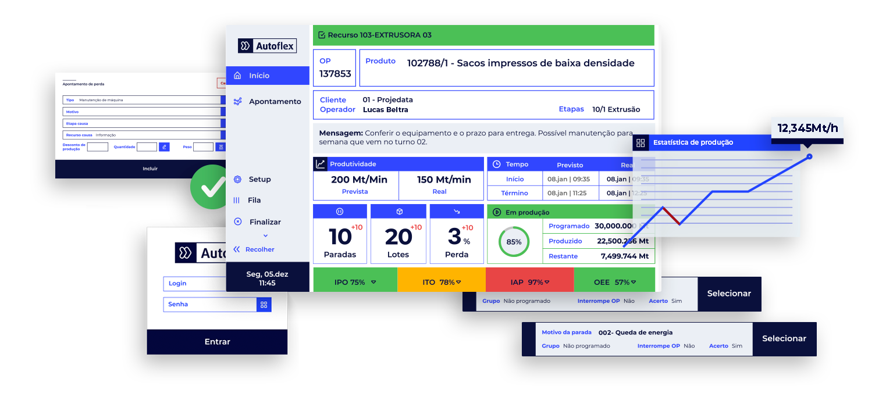
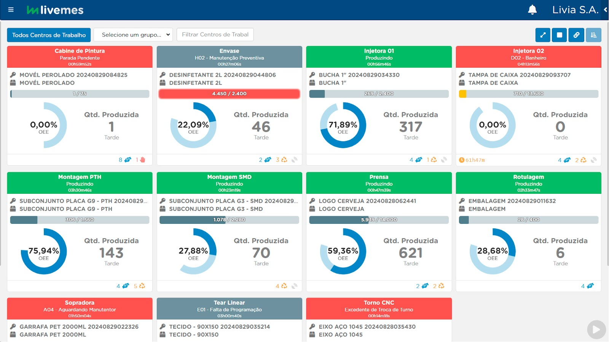
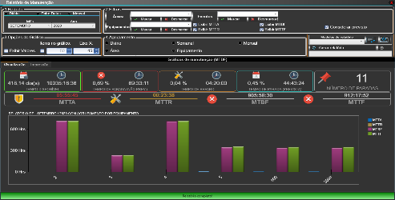

    

<h1 align="center">NJPlastic</h1>

<strong>RFC: <i>Request for Comments</i> — Projeto de Portfólio</strong>

<table align="center">
    <tr>
        <td><strong>Nome do Estudante</strong></td>
        <td>Nicolas Gustavo Conte</td>
    </tr>
    <tr>
        <td><strong>Curso</strong></td>
        <td>Engenharia de Software</td>
    </tr>
    <tr>
        <td><strong>Linha de Projeto</strong></td>
        <td>Web - IoT</td>
    </tr>
    <tr>
        <td><strong>Data da Proposta</strong></td>
        <td>05/07/2026</td>
    </tr>
    <tr>
        <td><strong>Versão</strong></td>
        <td>1.0.0</td>
    </tr>
</table>

# 1. Visão do Produto e Impacto (O Problema)

Empreendedores do setor de plásticos injetados brasileiro, operam máquinas predominantemente analógicas e dependem de processos manuais ou sistemas legados para acompanhar a produção. O controle preciso dos ciclos produtivos é crítico nessa indústria: a matéria-prima derivada do petróleo tem custo elevado e qualquer perda não monitorada impacta diretamente a margem. Ainda assim, encontrar um sistema que integre o chão de fábrica aos ERPs corporativos a um custo acessível é uma lacuna real no mercado.

Com isso em mente, a NJPlastic vem com objetivo de integrar máquinas injetoras de plástico com equipamentos de IoT, processar dados de produção, e por fim, integrar tais dados nos ERPs (_Enterprise Resource Planning_) diversos que usuários adquirentes usem. Tem como intuito resolver três problemas reais:
- Cruzar a retirada de um dado analógico das injetoras com dados de produção cadastrados no ERP (agora, cadastrados na NJPlastic primeiro);
- Permitir a visualização de produção para gestores em tempo real.

Atualmente já existem sistemas parecidos, porém não fazem integração com ERPs (ou fazem pouca integração - geralmente apenas leituras), são caros (comparado com o quê entregam), não são intuitivos e aparentam ter sido desenvolvidos com auxílio de IA puramente, o que pode ser um problema.

---

## 1.1. Contexto e Problema

Empreendedores brasileiros do setor de produtos plásticos enfrentam um mercado fragmentado e oneroso, onde até a aquisição de sistemas "especializados" em controle de produção, exige investimentos adicionais em customizações para que os mesmos se encaixem com o processo, sistemas conhecidos como _MES_ (_Manufacturing Execution System_)[[1]](#ref-1). Como não há escapatória, as empresas recorrem à customização de _softwares_ de controle de produção, utilização de ferramentas não especializadas e "datadas" (como Excel), ou, desenvolvimento interno de um _software_ (específico para empresas que tenham bastante capital).

Os sistemas _MES_ disponíveis para pequenas e médias empresas apresentam limitações críticas: a integração com _ERPs_ é rara ou superficial (geralmente apenas leitura de dados), a usabilidade é baixa e o custo de implementação e manutenção é alto. Alternativas mais baratas surgiram com a escalada da IA no mercado de _software_, porém, desenvolvidas sem rigor de arquitetura ou segurança, não entregam as garantias necessárias para um ambiente de produção industrial.

Como exemplo, vamos nos basear no processo produtivo da empresa Meplas[[2]](#ref-2):

<em>Figura 1. Diagrama de produção da empresa Meplas.</em>

Esse cenário deixa o empreendedor do setor plástico sem opção viável, ou ele investe em um _MES_ caro e genérico que ainda exigirá customização, ou, convive com ferramentas inadequadas que não eliminam o trabalho manual. A ausência de um sistema acessível, com integração real ao _ERP_ e calibrado para a realidade do setor, é a lacuna que a **NJPlastic** se propõe a preencher.

## 1.2. Origem da Demanda e Evidências

O projeto foi solicitado pela empresa Meplas, a pedido direto do sócio-proprietário Jair Sperandio. Assim como anteriormente, o mesmo relata que não há controle total do processo produtivo, possuindo os seguintes problemas:
- Não consegue extrair dados concretos de produção em tempo real;
    - Precisa cruzar os dados com diversas telas do ERP;
    - Customização do ERP está fora de questão, pelas questões citadas anteriormente;
- Tem Perdas e/ou produção em excesso de 1 a cada 3 pedidos;
- Precisa deslocar pessoal (líderes de turno) para montarem relatórios;
- O processo produtivo não é integrado, utiliza várias ferramentas e processos manuais para registrar tudo.

## 1.3. Análise de Soluções Existentes (Benchmark)

Abaixo, veremos algumas soluções que executam funções parecidas a que a NJPlastic pretende implementar.

### Autoflex MES + Iniflex ERP (Projedata)[[3]](#ref-3)

**Público-alvo:** Fabricantes de plástico brasileiros de todos os portes. Oferece duas versões: _Iniflex PRO_ para operações industriais de maior porte e _Iniflex SMART_ voltada especificamente a micro e pequenas indústrias plásticas.

**Funcionalidades principais:**
- Coleta automática de ciclos produtivos, paradas e perdas diretamente das máquinas, sem apontamento manual;
- Cálculo de OEE baseado em dados reais com _dashboards_ por turno, setor e equipamento;
- Ecossistema de quatro módulos integrados: _Autoflex_ (MES chão de fábrica) + _Iniflex_ (ERP) + _Iniflex.APS_ (planejamento avançado) + _Iniflex.BI_ (inteligência de dados);
- Módulos de ERP específicos para plástico: controle de moldes e cavidades, rastreabilidade de lotes e gestão de _setups_;
- Identificação de gargalos com interface voltada ao operador.

**Limitações:**
- Integração com ERPs de terceiros (SAP, TOTVS, etc.) requer consulta a especialistas — sem conectores prontos documentados publicamente;
- Ecossistema proprietário fechado: a integração fluida ocorre apenas entre os próprios produtos Projedata;
- Nenhuma informação de preço publicada — modelo comercial opaco para PMEs que precisam avaliar custo-benefício sem contato com o time de vendas;
- Especificações técnicas da captura IoT (tipo de sensor, protocolo, *hardware* necessário) não estão publicadas.

<em>Figura 2. Exemplo apresentado pela Projedata do Autoflex.</em>

### Vedois MES (Vedois Tecnologia)[[4]](#ref-4)

**Público-alvo:** Indústrias de médio porte no Brasil com foco declarado em injeção plástica, embalagens, móveis, metalurgia, têxtil e química.

**Funcionalidades principais:**
- _Suite_ modular: _Vedois Produção_ (rastreamento automático), _Vedois Qualidade_ (CEP), _Vedois Manutenção_ e _Vedois DNC_ (carga automática de arquivos CAD/CAM em CNCs);
- Monitoramento em tempo real de máquinas, operadores e processos com alertas via _e-mail_, _pop-up_, _mobile_ e alarmes visuais e sonoros;
- OEE com rastreabilidade de matéria-prima e IDs de produto;
- Integração confirmada com TOTVS Protheus e compatibilidade declarada com qualquer ERP do mercado;
- Interface responsiva para computadores, _tablets_ e _smartphones_.

**Limitações:**
- Integração com ERPs externos é descrita como possível, mas sem conectores prontos — cada integração parece ser um projeto sob demanda;
- Nenhum preço publicado e sem indicação de planos acessíveis para empresas de menor porte;
- Documentação técnica da captura IoT ausente — sem especificação de _hardware_, protocolos ou método de captura de pulso elétrico;
- Produto generalista por setor: sem funcionalidades específicas para injeção plástica como controle de moldes, cavidades ou gestão de OS de injeção.

<em>Figura 3. Exemplo apresentado pela Vedois em seu site.</em>

### LiveMES (LiveMES Tecnologia)[[5]](#ref-5)

**Público-alvo:** Indústrias de manufatura discreta de todos os portes no Brasil, em setores como alimentos, automotivo, embalagens, farmacêutico, química e têxtil. Sem foco declarado em plástico.

**Funcionalidades principais:**
- Coletores IIoT instalados fisicamente nas máquinas, capazes de captar sinais variados para digitalizar equipamentos de qualquer tipo ou idade;
- OEE em tempo real com análise de perdas e histórico de produtividade;
- Análise de paradas com gráficos de Pareto e diagnóstico de causas raiz;
- _LivIA_: módulo de IA para suporte a decisões operacionais;
- _PMaaS_ (_Production Manager as a Service_): engenheiros da própria LiveMES analisam os dados do cliente e entregam recomendações.

**Limitações:**
- Nenhuma especialização em injeção plástica — sem controle de moldes, cavidades, ciclos de injeção ou parâmetros específicos do processo;
- Integração com ERP mencionada, mas sem detalhes técnicos — a integração parece ser avaliada caso a caso;
- Nenhum preço publicado;
- Modelo *PMaaS* pode representar custo recorrente adicional significativo para PMEs de menor porte.

<em>Figura 4. Exemplo de tela do sistema LiveMES.</em>

### Doeet MES (Doeet)[[6]](#ref-6)

**Público-alvo:** Fabricantes de plástico em geral — injeção, extrusão, sopro, rotomoldagem e termoformagem. Empresa espanhola com interface em português e espanhol e clientes documentados na América Latina.

**Funcionalidades principais:**
- OEE em tempo real com monitoramento de parâmetros de máquina (temperatura, etc.) via IoT e sistema de alarmes;
- Integração com ERP bidirecional, incluindo bloqueio de molde em uso diretamente no ERP;
- Rastreabilidade de ordens de produção e lotes de matéria-prima;
- Controle de moldes e ferramentas com rastreamento de uso — específico para plástico;
- Gestão de _changeover_ (SMED) e controle de qualidade integrado.

**Limitações:**
- Empresa espanhola — suporte, contrato e localização para o Brasil podem ser obstáculos para PMEs sem estrutura de TI interna;
- Nenhuma informação de preço publicada;
- Sem _cases_ brasileiros documentados publicamente;
- Abordagem IoT depende de sensores próprios cuja especificação técnica não está publicada.

<em>Figura 5. Exemplo de tela do sistema Doeet.</em>

### EGA PCPMaster (EGA Sistemas)[[7]](#ref-7)

**Público-alvo:** Indústrias de manufatura no Brasil — automotivo, alimentos, embalagens, plásticos, móveis e metalurgia. Produto generalista por setor.

**Funcionalidades principais:**
- Monitoramento em tempo real do chão de fábrica com coleta automática de dados e IHM (_Interface Homem-Máquina_) para interação do operador;
- Cálculo de OEE e gestão de ordens de produção;
- Integração com ERP via _WebAPI Rest_ — abordagem técnica mais moderna e documentada publicamente entre os concorrentes avaliados;
- Controle de qualidade com CEP (_Controle Estatístico de Processo_) e rastreabilidade;
- Aplicativo _mobile_ para gestão remota e notificações automáticas de parada de máquina.

**Limitações:**
- Injeção plástica é listada como setor atendido, mas sem funcionalidades específicas declaradas (controle de moldes, cavidades, ciclos de injeção);
- Especificações técnicas da camada IoT (*hardware*, sensores, protocolo de captura) não estão publicadas;
- Nenhum preço publicado;
- Produto aparentemente posicionado para indústrias de médio porte com equipe de TI interna.

<em>Figura 7. Exemplo de tela do sistema EGA PCPMaster.</em>

### Comparação

| Solução | Pontos Fortes | Limitações |
|---|---|---|
| Autoflex + Iniflex (Projedata) | Único com ERP nativo para plástico; controle de moldes e cavidades; versão para micro e pequenas empresas | Ecossistema fechado; sem integração documentada com ERPs de terceiros; preço opaco |
| Vedois MES | Foco em injeção plástica; integração confirmada com TOTVS; alertas multicanal | Integração com ERP externo sob demanda; sem especificidades de injeção (moldes, OS) |
| LiveMES | Coletores IIoT para máquinas de qualquer tipo ou idade; escalável por porte | Sem especialização em plástico; integração com ERP caso a caso; custo do PMaaS |
| Doeet | Bidirecional com ERP; controle de moldes; específico para plástico; multi-processo | Empresa espanhola; sem cases brasileiros; preço não publicado |
| EGA PCPMaster | Integração via WebAPI Rest documentada; app mobile; CEP integrado | Sem funcionalidades específicas para injeção; IoT não documentado |

### 1.3.1. Diferencial do Projeto

A análise dos concorrentes revela um padrão consistente: as soluções disponíveis resolvem partes do problema, mas nenhuma os resolve todos de forma acessível para pequenas e médias indústrias brasileiras de injeção plástica. A NJPlastic se posiciona a partir dessas lacunas.

#### 1.3.1.1. Integração ERP real e bidirecional

Todos os concorrentes analisados descrevem integração com ERPs como "possível" ou "sob demanda" — cada implementação é um projeto customizado, sem conectores prontos. A NJPlastic propõe integração estrutural desde o início, com acesso direto ao banco de dados do ERP via JDBC, suportando leitura e escrita em SQL Server, Oracle e PostgreSQL sem dependência de _middleware_ proprietário.

#### 1.3.1.2. Especialização em injeção plástica com suporte ao mercado brasileiro

Dos concorrentes com especialização real em plástico, Projedata só integra com o próprio ERP e Doeet é uma empresa espanhola sem _cases_ documentados no Brasil. A NJPlastic combina foco no processo de injeção — captura de ciclos, detecção de pausas e controle de perdas — com integração direta aos ERPs já adotados pela indústria brasileira (como Consistem, SAP, TOTVS...).

#### 1.3.1.3. Hardware acessível e sem _vendor lock-in_

Nenhum concorrente publica especificações técnicas da camada IoT, enquanto a NJPlastic utiliza _hardware_ aberto e de baixo custo para captura dos sinais das máquinas via MQTT. No MVP, a captura será feita com Arduino, em versões posteriores, será migrada para um módulo ESP32[[8]](#ref-8) — que reduzirá custos, aumentará o processamento e armazenamento interno e permitirá sua atualização de código remotamente (CI/CD). Essa escolha elimina a dependência de sensores proprietários e mantém o custo de implementação acessível para PMEs sem equipe de TI interna.

#### 1.3.1.4. Custo previsível e arquitetura com rigor de engenharia

As soluções de menor custo que surgiram com a escalada da IA foram desenvolvidas sem uma arquitetura ou segurança sólida, não entregando garantias adequadas para ambientes de produção industrial. A NJPlastic é construída sobre decisões arquiteturais explícitas — separação de camadas, modelagem C4, protocolo aberto — o que garante manutenibilidade e credibilidade técnica sem o custo opaco dos sistemas estabelecidos.

## 1.4. Público-Alvo

<!-- Defina quem usará o sistema.

Exemplos:

- estudantes
- contadores
- equipes de suporte
- jogadores

Descreva:

- perfil do usuário
- contexto de uso
- nível de conhecimento técnico esperado -->

O sistema é destinado a **pequenas e médias indústrias brasileiras de injeção plástica** que já utilizam algum ERP corporativo e precisam integrar o chão de fábrica ao sistema de gestão sem investimento em customizações caras.

Dentro dessas empresas, os perfis de usuário são:

**Operador de máquina**
- **Contexto:** Atua diretamente no chão de fábrica, acompanha o andamento da produção turno a turno;
- **Objetivo:** Visualizar o status das máquinas e a contagem de ciclos em tempo real;
- **Nível técnico:** Baixo — espera-se uma interface simples, sem necessidade de treinamento formal.

**Líder de turno**
- **Contexto:** Supervisiona a produção durante um turno, atualmente responsável por montar relatórios manualmente ao final de cada período;
- **Objetivo:** Acessar relatórios de produção consolidados sem deslocamento físico ou retrabalho manual;
- **Nível técnico:** Básico — familiarizado com uso de computador e planilhas, sem experiência em sistemas industriais.

**Gestor / Sócio-proprietário**
- **Contexto:** Acompanha indicadores de produção e perdas para tomada de decisão, precisando cruzar dados em diversas telas do ERP;
- **Objetivo:** Ter visibilidade centralizada da produção integrada ao ERP, com dados confiáveis e em tempo real;
- **Nível técnico:** Médio — usa o ERP corporativo com regularidade, mas não tem perfil técnico de TI.

## 1.5. Objetivos do Projeto

### Objetivo Geral

<!-- Qual transformação o projeto pretende gerar.
Desenvolver um sistema integrado completo, fácil de utilizar e barato de implementar. -->

Desenvolver uma plataforma _Web-IoT_ que automatize a captura de ciclos produtivos de máquinas injetoras de plástico e sincronize esses dados com o ERP corporativo da empresa, eliminando apontamentos manuais e viabilizando o monitoramento da produção em tempo real para operadores, líderes de turno e gestores.

### Objetivos Específicos

<!-- Liste **3 a 5 objetivos técnicos ou de produto**.

Exemplo:

- automatizar um processo manual
- permitir análise de dados
- criar um sistema de recomendação -->

- Implementar uma camada IoT de captura de pulsos elétricos das injetoras via MQTT, utilizando Arduino no MVP e módulo ESP32 em versões posteriores;
- Desenvolver um _backend_ REST que processe os eventos MQTT, calcule tempos de ciclo, detecte pausas de máquina e persista os dados em PostgreSQL;
- Criar um _dashboard_ web em tempo real com indicadores de produção (ciclos, OEE, paradas) acessível por perfil de usuário (operador, líder, gestor);
- Implementar integração bidirecional com o ERP corporativo via JDBC direto, suportando SQL Server, Oracle e PostgreSQL sem dependência de _middleware_ proprietário;
- Disponibilizar autenticação com controle de acesso por perfil, garantindo que cada usuário visualize apenas o escopo de informações pertinente à sua função.

## 1.6. Métricas de Sucesso (KPIs)

<!-- Como saberemos que o projeto foi bem sucedido?

Exemplos:

- latência inferior a 200ms
- acurácia da IA superior a 85%
- suporte a 100 usuários simultâneos
- redução do tempo de um processo em 30% -->

| Métrica | Meta | Referência |
|---|---|---|
| Latência de registro de ciclo (pulso → banco) | < 5 segundos | Tempo aceitável para acompanhamento em tempo real |
| Taxa de perda/excesso por pedido | Redução de 33% para < 10% | Problema declarado: 1 em cada 3 pedidos com desvio |
| Tempo gasto por líder em relatórios de turno | Redução ≥ 80% | Atualmente exige deslocamento e montagem manual |
| Disponibilidade do sistema | ≥ 99% em horário de produção | Ambiente industrial crítico — parada afeta monitoramento |
| Sincronização com ERP | Dados disponíveis no ERP em até 1 minuto do registro | Latência aceitável para integração assíncrona |
| Adoção pelos usuários | 100% dos líderes e gestores utilizando ativamente em até 30 dias após implantação | Indicador de usabilidade e aderência ao processo |

# 2. Engenharia de Requisitos

<!-- Esta seção define **o que o sistema fará**.

Evite descrições vagas. -->

## 2.1. Personas

<!-- Crie **1 a 3 personas principais**.

Inclua:

- nome fictício
- contexto
- objetivos
- principais dificuldades

Adicionar **imagens ou ilustrações** pode ajudar na compreensão. -->

A partir dos perfis de usuário definidos em [1.4](#14-público-alvo), elaboramos três personas representativas das pessoas que utilizarão o sistema diariamente. Cada persona traduz uma das dores levantadas em [1.2](#12-origem-da-demanda-e-evidências) em um perfil concreto, para guiar decisões de produto e de _UX_.

### Persona 1 — Carlos, Operador de Injetora

- **Contexto:** Tem 38 anos, atua há 10 anos no chão de fábrica da Meplas. Trabalha em turnos rotativos, opera entre duas e três injetoras simultaneamente e acompanha visualmente o ciclo das máquinas;
- **Objetivos:** Acompanhar em tempo real a contagem de ciclos das máquinas que opera; saber rapidamente quando uma máquina parou e por quê; registrar manualmente o motivo de uma parada (refugo, _setup_, manutenção) sem precisar abrir várias telas;
- **Dificuldades:** Não tem familiaridade com sistemas industriais complexos; espera uma interface direta, com poucos cliques; não tem visibilidade do próprio desempenho durante o turno e descobre desvios apenas no final, quando o líder consolida os números.

### Persona 2 — Marina, Líder de Turno

- **Contexto:** Tem 32 anos, formada em Gestão da Produção, supervisiona um turno de oito operadores. Hoje monta os relatórios de turno manualmente, cruzando anotações em papel com telas do _ERP_ e planilhas Excel;
- **Objetivos:** Acessar um _dashboard_ consolidado com o status de todas as máquinas do turno; consultar histórico de ciclos e pausas por máquina e período; gerar e exportar o relatório de turno sem precisar montar planilhas à mão;
- **Dificuldades:** Perde de uma a duas horas por turno apenas montando relatórios; depende de informações repassadas verbalmente pelos operadores, sujeitas a erro; precisa se deslocar fisicamente entre máquinas e o escritório do _ERP_ para reunir dados.

### Persona 3 — Jair, Sócio-Gestor

- **Contexto:** Tem 56 anos, sócio-proprietário da Meplas, acompanha indicadores de produção e perdas para decisão estratégica. É o solicitante direto do projeto NJPlastic. Usa o _ERP_ corporativo com regularidade, mas não tem perfil técnico de TI;
- **Objetivos:** Visualizar o _OEE_ consolidado por máquina, turno e período; cruzar produção real com ordens cadastradas no _ERP_ sem abrir várias telas; ter dados confiáveis em tempo real para reduzir os desvios de 1 a cada 3 pedidos relatados em [1.2](#12-origem-da-demanda-e-evidências);
- **Dificuldades:** Hoje precisa cruzar manualmente diversas telas do _ERP_ para ter uma visão única da produção; sente falta de visibilidade imediata sobre paradas e perdas durante o expediente; descarta a customização do _ERP_ pelo custo e pela rigidez do fornecedor.

## 2.2. Casos de Uso Principais

<!-- Liste os principais fluxos do sistema.

Exemplo:

- criar conta
- registrar dados
- consultar informações
- gerar relatórios

Sempre que possível inclua **diagramas de caso de uso**. -->

Os principais fluxos do sistema são organizados por ator. Atores humanos seguem os perfis definidos em [1.4](#14-público-alvo); atores não-humanos representam os agentes automáticos da plataforma — Microcontrolador (camada IoT) e _Backend_ (camada de sistema), conforme modelados nos diagramas C4.

### Operador

- UC01 — Autenticar-se no sistema com credenciais (_login_/senha);
- UC02 — Visualizar status em tempo real das máquinas sob sua responsabilidade;
- UC03 — Registrar manualmente **pausa** de máquina informando o motivo (refugo, _setup_, manutenção);
- UC12 — Editar a mensagem de uma **parada automática** registrada pelo sistema (escopo restrito às máquinas do seu turno — RN02).

### Líder de Turno

- UC04 — Visualizar _dashboard_ consolidado do turno, com todas as máquinas do seu setor;
- UC05 — Consultar histórico de ciclos e pausas por máquina e período;
- UC06 — Gerar e exportar relatório consolidado de turno;
- UC12 — Editar a mensagem de uma **parada automática** registrada pelo sistema (escopo restrito ao seu setor/turno — RN03).

### Gestor

- UC07 — Visualizar _OEE_ consolidado por máquina, turno e período;
- UC08 — Acompanhar a integridade da sincronização com o _ERP_ corporativo;
- UC09 — Cadastrar usuários e atribuir perfis (Operador, Líder de Turno ou Gestor);
- UC12 — Editar a mensagem de qualquer **parada automática** registrada pelo sistema (visão completa — RN04).

### Atores de Sistema

- UC10 — Microcontrolador publica pulso elétrico de ciclo via _MQTT_ ao _broker_ a cada nova leitura;
- UC11 — _Backend_ lê ordens de produção abertas no _ERP_ e grava apontamentos de ciclos e pausas confirmados de volta, executando a sincronização bidirecional de forma periódica em janela de tempo configurável;
- UC13 — _Backend_ classifica automaticamente a máquina como _PARADA_ ao detectar N pausas consecutivas sem pulso válido intermediário, gerando registro automático com mensagem _default_ editável (RN09, RF17–RF18).

### Diagrama de Casos de Uso

<em>Figura 8. Diagrama de casos de uso da NJPlastic, agrupando atores humanos (Operador, Líder de Turno e Gestor) e atores de sistema (Microcontrolador e Backend), incluindo UC12 (edição de mensagem de parada automática) e UC13 (classificação automática como PARADA).</em>

## 2.3. Requisitos Funcionais (RF)

<!-- Use a estrutura:

> O sistema deve permitir que **[ator] realize [ação]**.

Exemplo:

RF01 — O sistema deve permitir que o usuário crie uma conta.

RF02 — O sistema deve permitir que o usuário registre informações.

RF03 — O sistema deve permitir que o usuário visualize dados registrados. -->

Os requisitos funcionais estão agrupados pelas áreas do sistema modeladas em [C4_Component_Diagram.puml](Assets/Diagrams/C4_Component_Diagram.puml). Itens marcados como **RF-F** representam funcionalidades planejadas para versões futuras, fora do MVP, mas que fazem parte da visão completa do produto.

### Captação IoT

- RF01 — O microcontrolador deve capturar o pulso elétrico de ciclo da injetora e publicar a leitura em tópico _MQTT_ contendo _timestamp_ preciso da captação;
- RF02 — O sistema deve aceitar publicações _MQTT_ de múltiplas máquinas simultaneamente, identificando-as por tópico distinto.

### Autenticação e Controle de Acesso

- RF03 — O sistema deve permitir que o usuário se autentique com credenciais (_login_ e senha);
- RF04 — O sistema deve permitir que o gestor cadastre usuários e atribua perfil (Operador, Líder de Turno ou Gestor), conforme UC09;
- RF05 — O sistema deve restringir telas e dados acessíveis conforme o perfil do usuário autenticado.

### Produção e Monitoramento

- RF06 — O sistema deve permitir cadastrar máquinas com identificador, tópico _MQTT_ associado, tempo de ciclo padrão, fator de tolerância e **número de pausas consecutivas para parada automática** (`pausas_consecutivas_para_parada`) — parâmetros consumidos por RF08, RF17, RN06 e RN09;
- RF07 — O sistema deve calcular o tempo entre ciclos consecutivos de cada máquina;
- RF08 — O sistema deve detectar pausa automaticamente quando o intervalo entre dois pulsos exceder um _threshold_ configurável por máquina (RN06), incrementando o contador de pausas consecutivas;
- RF09 — O sistema deve permitir que o operador registre manualmente o motivo de uma **pausa** isolada (refugo, _setup_, manutenção) — não cobre paradas automáticas, tratadas por RF18;
- RF10 — O sistema deve calcular o _OEE_ (Disponibilidade × Performance × Qualidade) por máquina, turno e período;
- RF11 — O sistema deve exibir _dashboard_ em tempo real com ciclos, pausas e _OEE_, com visualização adequada ao perfil do usuário e **indicação visual distinta** (cor e ícone) para máquinas no estado _PARADA_ (RN09);
- RF17 — O sistema deve classificar a máquina automaticamente como _PARADA_ quando o contador de pausas consecutivas atingir o limite configurado (`pausas_consecutivas_para_parada`), sem pulso válido intermediário (RN09), executando UC13;
- RF18 — Ao classificar a máquina como _PARADA_, o sistema deve gerar um registro de `Pausa` com `tipo = PARADA_AUTOMATICA` e mensagem _default_ editável — por exemplo: _"Parada detectada automaticamente após N pausas consecutivas"_;
- RF19 — O sistema deve permitir que Operador, Líder de Turno e Gestor editem a mensagem de um registro `PARADA_AUTOMATICA`, respeitando o escopo de visibilidade de cada perfil (RN02–RN04), executando UC12;
- RF20 — O sistema deve preservar histórico auditável de cada edição de mensagem de parada automática (autor, _timestamp_, conteúdo anterior), recuperável via _dashboard_ e relatório de turno (RN12).

### Integração com ERP

- RF12 — O sistema deve conectar via _JDBC_ direto a bancos de _ERP_ em _SQL Server_, _Oracle_ ou _PostgreSQL_;
- RF13 — O sistema deve sincronizar bidirecionalmente registros de produção entre o _PostgreSQL_ local e o _ERP_, lendo ordens de produção e escrevendo apontamentos;
- RF14 — O sistema deve permitir configurar a janela de sincronização com o _ERP_ (por exemplo, a cada 1 minuto).

### Relatórios

- RF15 — O sistema deve permitir que o líder de turno gere relatório consolidado do turno com ciclos, _OEE_, **pausas manuais** (`tipo = PAUSA`) e **paradas automáticas** (`tipo = PARADA_AUTOMATICA`) listadas em seções separadas; para cada parada automática, incluir mensagem atual e autor da última edição (RF20);
- RF16 — O sistema deve exportar relatórios em formato consumível, como _CSV_ ou _PDF_.

### Roadmap (RFs Futuros)

- RF-F01 — O sistema deve permitir migrar a captação de pulsos para módulo _ESP32_ com _OTA_ (atualização remota de _firmware_);
- RF-F02 — O sistema deve suportar a configuração de múltiplos _ERPs_ simultâneos no mesmo _deployment_, suportando cenários de transição entre fornecedores;
- RF-F03 — O sistema deve enviar notificações ativas de parada de máquina (_push_, _e-mail_ ou _SMS_) aos operadores e líderes responsáveis, complementando o monitoramento passivo de RF11.

## 2.4. Requisitos Não Funcionais (RNF)

<!-- Inclua requisitos relacionados a:

- desempenho
- segurança
- disponibilidade
- escalabilidade
- usabilidade

Exemplo:

RNF01 — O sistema deve suportar 100 usuários simultâneos.  
RNF02 — O tempo de resposta deve ser inferior a 300ms.  
RNF03 — O sistema deve utilizar autenticação segura. -->

Cada requisito não funcional está ancorado em um _KPI_ declarado em [1.6](#16-métricas-de-sucesso-kpis) ou em um diferencial competitivo de [1.3.1](#131-diferencial-do-projeto), garantindo rastreabilidade entre objetivos e restrições técnicas.

### Desempenho

- RNF01 — A latência entre o pulso elétrico e o registro do ciclo no _PostgreSQL_ deve ser inferior a 5 segundos (ancorado no _KPI_ de tempo real);
- RNF02 — O _dashboard_ deve refletir novos dados de produção com latência inferior a 2 segundos após a persistência no banco — limite derivado do _KPI_ de tempo real, garantindo que a soma RNF01 + RNF02 mantenha o monitoramento de UC02/UC04 dentro de uma janela perceptivelmente "ao vivo";
- RNF03 — A sincronização com o _ERP_ deve concluir em até 1 minuto após o registro do apontamento no _PostgreSQL_ (ancorado no _KPI_ de sincronização).

### Disponibilidade e Confiabilidade

- RNF04 — O sistema deve manter disponibilidade superior ou igual a 99% durante o horário de produção (ancorado no _KPI_ de disponibilidade);
- RNF05 — O sistema deve tratar perda de mensagens _MQTT_ utilizando _QoS_ adequado para garantir entrega _at-least-once_ ao _backend_.

### Segurança

- RNF06 — A comunicação entre _frontend_ e _backend_ deve ser cifrada via _HTTPS_/_TLS_;
- RNF07 — Senhas de usuário devem ser armazenadas com algoritmo de _hash_ adequado (por exemplo, _bcrypt_), nunca em texto puro;
- RNF08 — O sistema deve seguir as recomendações de mitigação do _OWASP Top 10_, com detalhamento na [Seção 6](#6-segurança-e-privacidade).

### Usabilidade

- RNF09 — A tela principal do operador deve ser interpretável sem treinamento formal, alinhada ao perfil de "nível técnico baixo" definido em [1.4](#14-público-alvo);
- RNF10 — A interface web deve ser responsiva, suportando _desktops_ de chão de fábrica e _tablets_.

### Escalabilidade

- RNF11 — A arquitetura deve suportar até 50 máquinas simultâneas publicando ciclos por _deployment_ — limite definido como teto operacional do perfil-alvo de PMEs descrito em [1.4](#14-público-alvo), com o piloto na Meplas iniciando em escala menor e teste de carga obrigatório antes de cada _release_.

### Manutenibilidade e Engenharia

- RNF12 — O código deve seguir a separação de camadas representada em [C4_Component_Diagram.puml](Assets/Diagrams/C4_Component_Diagram.puml), no padrão _Controller_ → _Service_ → _Repository_;
- RNF13 — O acesso ao banco do _ERP_ deve ser isolado em `ErpDatabaseRepository` via _JDBC_ direto, sem _JPA_, conforme decisão arquitetural de [1.3.1.1](#1311-integração-erp-real-e-bidirecional).

## 2.5. Regras de Negócio

<!-- Exemplos:
- apenas usuários autenticados podem acessar determinados recursos
- determinadas operações exigem validação adicional -->

As regras de negócio descrevem _invariantes_ do domínio — condições que devem ser sempre verdadeiras independentemente do fluxo de execução, distintas dos requisitos funcionais que descrevem ações.

- RN01 — Apenas usuários autenticados podem acessar qualquer tela do _dashboard_ ou recurso da _API_;
- RN02 — O operador só pode visualizar dados das máquinas atribuídas ao seu turno;
- RN03 — O líder de turno visualiza apenas máquinas e operadores do seu setor e turno;
- RN04 — O gestor tem visão completa de todas as máquinas e turnos do _deployment_;
- RN05 — Um ciclo só é considerado válido se o pulso _MQTT_ contiver _timestamp_ dentro de uma janela de tolerância configurável, protegendo contra _drift_ de relógio do microcontrolador;
- RN06 — Uma pausa é detectada quando o intervalo entre dois ciclos consecutivos excede o tempo de ciclo padrão da máquina multiplicado por um fator de tolerância, ambos configuráveis por máquina; cada detecção incrementa o contador de pausas consecutivas (ver RN09/RN11);
- RN07 — Cada registro de produção — tanto **apontamentos de ciclo** quanto **registros de pausa** (`tipo = PAUSA` ou `tipo = PARADA_AUTOMATICA`) — transita pelos estados: _pendente_ (criado a partir do pulso _MQTT_ ou gerado automaticamente), _confirmado_ (validado contra RN05 e RN06) e _sincronizado_ (escrito no _ERP_ via UC11). A sincronização propaga apenas registros _confirmados_, evitando dados parciais;
- RN08 — Em caso de falha na sincronização com o _ERP_, o registro local deve permanecer íntegro e o sistema deve tentar novamente na próxima janela, garantindo idempotência da operação;
- RN09 — Quando N pausas consecutivas (RN06) ocorrerem na mesma máquina sem pulso válido intermediário, a máquina é classificada automaticamente como _PARADA_; N corresponde ao parâmetro `pausas_consecutivas_para_parada`, configurável por máquina via RF06;
- RN10 — O retorno ao estado _PRODUZINDO_ é automático ao receber o próximo pulso válido (RN05); o registro `PARADA_AUTOMATICA` é fechado com _timestamps_ de início e fim no momento da retomada;
- RN11 — O contador de pausas consecutivas reseta após cada pulso válido (RN05 OK) ou imediatamente após o fechamento automático do registro de parada;
- RN12 — Toda edição de mensagem em um registro `PARADA_AUTOMATICA` gera entrada imutável no log de auditoria (autor, _timestamp_, conteúdo anterior); o histórico completo de edições é recuperável via _dashboard_ e relatório de turno (RF20).

## 2.6. Fora do Escopo

<!-- Liste explicitamente **o que o sistema não fará**.
Isso ajuda a evitar crescimento descontrolado do projeto. -->

Para proteger o projeto contra _scope creep_ e diferenciar com clareza o produto frente aos concorrentes mapeados em [1.3](#13-análise-de-soluções-existentes-benchmark), declaramos explicitamente o que a NJPlastic **não fará**:

- **Controle Estatístico de Processo (_CEP_) e inspeção dimensional** — domínio que permanece sob responsabilidade do _ERP_ corporativo do cliente. A NJPlastic foca exclusivamente em ciclos e pausas, não em inspeção de peças ou métricas de qualidade dimensional;
- **Gestão de moldes e cavidades** — diferente das soluções _Doeet_ e _Projedata_, a NJPlastic não fará rastreamento de uso de molde, troca, manutenção ou bloqueio bidirecional. O cadastro e o ciclo de vida de moldes permanecem no _ERP_;
- **Operação multi-_tenant_ ou modelo _SaaS_** — cada cliente recebe um _deployment_ dedicado, com seu próprio banco _PostgreSQL_ e _broker_ _MQTT_. O isolamento entre clientes é por infraestrutura, não por _schema_ ou _tenant_ lógico no banco.

# 3. Fluxos e Comportamento do Sistema

<!-- Esta seção demonstra **como o sistema funciona**.

Use diagramas sempre que possível. -->

A Seção 2 definiu **o que** o sistema faz; esta seção demonstra **como** funciona em _runtime_. Os fluxos estão organizados em dois grupos: o caminho feliz — do pulso elétrico da injetora até o _dashboard_ do gestor — e os cenários alternativos — falhas e exceções previsíveis que o sistema deve tratar de forma íntegra.

Três notações são utilizadas, cada uma com propósito distinto:
- **Diagrama de sequência** — captura a troca de mensagens entre atores e componentes ao longo do tempo; usado para o fluxo _end-to-end_ e para os cinco cenários alternativos;
- **Diagrama de estados** — modela o ciclo de vida dos registros de produção (apontamentos de ciclo e pausas, incluindo paradas automáticas — RN07) e o estado operacional da máquina (RN09–RN11);
- **Fluxograma de navegação** — descreve a jornada de cada _persona_ entre as telas do _frontend_, do _login_ às ações específicas do perfil, incluindo a edição de mensagens de paradas automáticas (UC12).

## 3.1. Fluxo Principal do Usuário

<!-- Apresente o fluxo principal do sistema.

Utilize:

- fluxogramas
- diagramas de atividades
- diagramas de sequência

Inclua **imagens dos diagramas**. -->

### 3.1.1. Visão _End-to-End_ do Ciclo Produtivo

O diagrama abaixo mostra o ciclo completo desde o pulso elétrico da injetora até a sincronização do apontamento no _ERP_ corporativo, envolvendo todos os atores e componentes modelados nos diagramas C4. Cada passo está ancorado nos requisitos e regras de negócio da Seção 2.

<em>Figura 9. Diagrama de sequência do fluxo principal end-to-end: pulso MQTT → Backend → PostgreSQL → Dashboard → sincronização com ERP. Inclui a lógica de contador de pausas consecutivas e classificação automática como PARADA (UC10, UC11, UC13, RF01, RF07, RF08, RF17, RF18, RF12–RF14, RN05–RN11, RNF01–RNF03, RNF05, RNF13).</em>

O fluxo se divide em seis etapas sequenciais:
- **Geração do pulso (RF01):** a injetora gera um sinal elétrico a cada ciclo de produção; o _Arduino_ captura o _timestamp_ preciso desse pulso e o publica no _MQTT Broker_ via tópico `maquina/{id}` com _QoS_ 1 (RNF05 — entrega _at-least-once_);
- **Processamento no _Backend_ (UC10, RF07, RN05–RN07):** o `MqttListener` delega ao `ProductionService`, que valida o _timestamp_ contra a janela de tolerância de _clock_ (RN05), calcula o intervalo desde o último ciclo (RF07) e persiste o apontamento como _pendente_ (RN07) — em menos de 5 segundos desde o pulso (RNF01);
- **Avaliação de pausa e contador de paradas (RF08, RF17, RN06, RN09):** se o intervalo excede `tempo_padrão × fator_tolerância`, uma pausa (`tipo = PAUSA`) é registrada e o contador de pausas consecutivas é incrementado; quando o contador atingir `pausas_consecutivas_para_parada`, o sistema executa UC13 — cria um registro `PARADA_AUTOMATICA` com mensagem _default_ editável (RF17, RF18, RN09). Se o intervalo não excede o _threshold_, o apontamento avança para _confirmado_ e o contador é resetado (RN11);
- **Retomada automática (RN10, RN11):** ao receber o próximo pulso válido após uma _PARADA_, o registro é fechado com _timestamp_ de fim e o contador é resetado — sem intervenção humana;
- **Visualização em tempo real (RF11, RNF02):** o _frontend_ consome os dados via _polling_ ou _SSE_ e exibe ciclos, pausas e _OEE_ atualizados em menos de 2 segundos; máquinas no estado _PARADA_ são exibidas com cor e ícone distintos (RF11);
- **Sincronização com o _ERP_ (UC11, RF12–RF14, RNF03, RNF13):** em janela configurável, o `ProductionService` lê ordens abertas do _ERP_ e grava apontamentos e pausas _confirmados_ via _JDBC_ direto (RNF13 — sem _JPA_), marcando-os como _sincronizados_ em até 1 minuto (RNF03).

### 3.1.2. Ciclos de Vida: Registros e Estado da Máquina (RN07, RN09–RN11)

Esta subseção apresenta dois diagramas complementares: o ciclo de vida dos **registros** (apontamentos de ciclo e pausas) e o estado operacional da **máquina** (produzindo/parada).

#### Ciclo de Vida dos Registros (RN07)

Todo registro gerado pelo sistema — seja um apontamento de ciclo (UC10) ou um registro de pausa (`tipo = PAUSA` via RF08 ou `tipo = PARADA_AUTOMATICA` via RF18) — transita pelos mesmos estados. Apenas registros _confirmados_ são propagados ao _ERP_ (RN07).

<em>Figura 10. Ciclo de vida dos registros de produção (apontamentos de ciclo e pausas dos tipos PAUSA e PARADA_AUTOMATICA): pendente → confirmado → sincronizado; com transições de descarte (RN05) e retry idempotente (RN08). Registros PARADA_AUTOMATICA confirmados permitem edição de mensagem (RF19, UC12) enquanto aguardam sincronização.</em>

Os estados e as transições responsáveis são:
- **_pendente_:** estado inicial criado ao receber o pulso (RF01, UC10) ou ao detectar pausa/parada automática (RF08/RF18);
- **_confirmado_:** alcançado após validação de _timestamp_ (RN05) e avaliação do _threshold_ de pausa (RN06, RF08); registros `PARADA_AUTOMATICA` confirmados permitem edição de mensagem (RF19, UC12, RN12);
- **_descartado_:** alcançado quando o _timestamp_ está fora da janela de tolerância (RN05 — _clock drift_); registro mantido para auditoria, não exibido no _dashboard_ nem propagado ao _ERP_;
- **_sincronizado_:** estado terminal após escrita bem-sucedida no _ERP_ (UC11, RF13); registro visível nos relatórios;
- **retry (_confirmado_ → _confirmado_):** falha temporária de sincronização; registro não regride de estado, escrita é idempotente pela chave `id_registro` (RN08).

#### Estado Operacional da Máquina (RN09–RN11)

Paralelamente ao ciclo de vida dos registros, cada máquina possui um estado operacional que reflete sua condição em tempo real no _dashboard_.

<em>Figura 10b. Estados operacionais da máquina injetora: PRODUZINDO (operação normal com pausas isoladas) e PARADA (N pausas consecutivas atingidas — RN09). Retomada automática ao próximo pulso válido (RN10). Contador resetado em cada retomada (RN11).</em>

As transições do estado da máquina são:
- **PRODUZINDO → PARADA:** acionada pelo _Backend_ (UC13) quando `consecutivePauseCount ≥ pausas_consecutivas_para_parada` (RF17, RN09); um registro `PARADA_AUTOMATICA` com mensagem _default_ editável é criado simultaneamente (RF18);
- **PARADA → PRODUZINDO:** automática ao receber o próximo pulso válido (RN05 OK); o registro `PARADA_AUTOMATICA` é fechado com _timestamp_ de fim (RN10) e o contador é resetado (RN11).

### 3.1.3. Jornadas de Navegação por *Persona*

Cada *persona* definida na Seção 2.1 percorre um subconjunto distinto de telas do _frontend_, determinado pelo seu perfil de acesso (RN02–RN04) e pelos casos de uso que lhe competem. As telas aqui listadas são derivadas dos UCs da Seção 2.2; os _mockups_ visuais de cada tela serão detalhados na Seção 4.

#### Carlos — Operador de Injetora

Carlos interage com o sistema para acompanhar as máquinas do seu turno, registrar os motivos de pausas isoladas (UC03) e editar a mensagem de paradas automáticas das suas máquinas (UC12, RN02).

<em>Figura 11. Jornada de Carlos (Persona 1 — Operador): Login → Dashboard Minhas Máquinas → [pausa isolada] Detalhe + Modal de Pausa (UC03, RF09) | [parada automática] Detalhe + Modal de Edição de Mensagem (UC12, RF19, RN12) (UC01, UC02, UC03, UC12, RN01, RN02, RNF09).</em>

#### Marina — Líder de Turno

Marina usa o sistema para supervisionar todo o turno sem deslocamento físico: consultar histórico, gerar relatório, exportar e editar mensagens de paradas automáticas do seu setor (UC12, RN03).

<em>Figura 12. Jornada de Marina (Persona 2 — Líder de Turno): Login → Dashboard Consolidado → Histórico / Relatório de Turno → Exportar CSV/PDF | Editar mensagem de parada automática (UC01, UC04, UC05, UC06, UC12, RN01, RN03, RF15, RF16).</em>

#### Jair — Gestor / Sócio-Proprietário

Jair acessa os indicadores estratégicos de _OEE_, monitora a integração com o _ERP_, administra usuários e máquinas — incluindo o parâmetro `pausas_consecutivas_para_parada` — e pode editar mensagens de qualquer parada automática (UC12, RN04).

<em>Figura 13. Jornada de Jair (Persona 3 — Gestor): Login → Dashboard Gerencial OEE → [switch] Indicadores ERP / Usuários e Perfis / Configuração de Máquinas / Editar Parada Automática (UC01, UC07, UC08, UC09, UC12, RF06, RN01, RN04, RN12).</em>

## 3.2. Fluxos Alternativos

<!-- Descreva cenários como:

- erros
- cancelamentos
- exceções -->

Os cinco cenários abaixo representam desvios do caminho feliz que o sistema deve tratar de forma previsível e íntegra. Cada diagrama indica o ponto exato do fluxo principal (Seção 3.1.1) onde a ramificação ocorre e o RN ou RF que governa o comportamento esperado.

### 3.2.1. Falha de Autenticação (UC01)

Ramifica no início de qualquer fluxo — antes do acesso ao _dashboard_. Três sub-cenários cobrem as variações de falha (RN01–RN04, RNF07, RNF08).

<em>Figura 14. Fluxo alternativo 3.2.1: credenciais inválidas (401), perfil sem permissão (403) e sessão expirada (401 durante uso) — com mensagem genérica conforme OWASP A07.</em>

Os comportamentos esperados são:
- **Credenciais inválidas:** Resposta 401 com mensagem genérica que não revela se o _login_ existe — previne enumeração de usuários (OWASP A07, RNF08, Seção 6);
- **Perfil sem permissão:** Resposta 403 e redirecionamento para a tela permitida pelo perfil do usuário (RN02–RN04);
- **Sessão expirada:** Qualquer _endpoint_ retorna 401 com _token_ vencido; _frontend_ redireciona para a tela de _login_.

### 3.2.2. *Drift* de Relógio no Microcontrolador (RN05)

Ramifica na etapa de validação de _timestamp_ do fluxo principal (passo 2 — "Processamento no _Backend_"). Ocorre quando o relógio interno do _Arduino_ acumula deriva em relação ao tempo real do servidor.

<em>Figura 15. Fluxo alternativo 3.2.2: timestamp fora da janela de tolerância (RN05) — apontamento descartado com registro de auditoria; contagem de ciclos preservada íntegra.</em>

O comportamento esperado é:
- O `ProductionService` calcula `delta = |timestamp_recebido − now()|` e rejeita o pulso quando `delta > janela_tolerância` (RN05);
- O apontamento é salvo como _descartado_ com `motivo = "clock_drift"` para auditoria — não exibido no _dashboard_ nem contabilizado nos indicadores;
- Mitigação futura: sincronização de relógio via _NTP_ no _ESP32_ (RF-F01).

### 3.2.3. Pausa Isolada Detectada sem Motivo Registrado (RF08, RF09)

Este cenário cobre **uma pausa isolada** (contador de pausas consecutivas abaixo de N). Ramifica após a detecção automática de pausa (passo 3 do fluxo principal) quando o operador não executa o UC03. Para o cenário em que N pausas consecutivas acumulam sem motivo e acionam a classificação automática, ver §3.2.5.

<em>Figura 16. Fluxo alternativo 3.2.3: pausa isolada detectada pelo threshold (RN06) sem registro de motivo pelo operador — pausa persiste com motivo = desconhecido e aparece no relatório como "pendente de classificação". Distinção com PARADA_AUTOMATICA indicada no diagrama.</em>

O comportamento esperado é:
- O sistema **não bloqueia** nenhuma operação por ausência do motivo — decisão de design que preserva a continuidade produtiva;
- A pausa fica persistida com `tipo = PAUSA` e `motivo = null`, exibida como _"pendente de classificação"_ no relatório de turno, **na seção de pausas manuais** (UC06, RF15);
- Se N pausas consecutivas se acumularem sem pulso intermediário, o sistema escalará automaticamente para `PARADA_AUTOMATICA` (RF17, RN09 — ver §3.2.5);
- A líder de turno pode cobrar a regularização retroativamente ou classificar a pausa antes de exportar o relatório (RF16).

### 3.2.4. Falha de Sincronização com _ERP_ (RN08, RF14)

Ramifica na etapa de sincronização periódica do fluxo principal (passo 5) quando o _ERP_ está indisponível, ocorre _timeout_ de conexão ou a credencial _JDBC_ expirou.

<em>Figura 17. Fluxo alternativo 3.2.4: ErpDatabaseRepository lança exceção → apontamentos permanecem CONFIRMADOS (RN07) → retry idempotente na próxima janela (RN08) → visibilidade da falha via UC08.</em>

O comportamento esperado é:
- O `ErpDatabaseRepository` lança exceção; apontamentos permanecem _confirmados_ — **não regridem** de estado (RN07), registro local permanece íntegro (RN08);
- A falha é registrada com contador de tentativas e _timestamp_; a próxima janela configurável (RF14) tenta novamente;
- A escrita no _ERP_ é idempotente pela chave `id_apontamento`, evitando duplicatas em caso de reenvio (RN08);
- O gestor visualiza o status _"Erro na última sincronização"_ com contador de tentativas via UC08 — indicador de observabilidade da camada de integração.

### 3.2.5. Classificação Automática como Parada e Edição da Mensagem (RF17–RF20, RN09–RN12)

Ramifica no passo 3 do fluxo principal quando o contador de pausas consecutivas atinge o limite configurado (`pausas_consecutivas_para_parada`). Este cenário cobre todo o ciclo da parada automática: criação, exibição, edição auditada da mensagem e retomada automática.

<em>Figura 18. Fluxo alternativo 3.2.5: N pausas consecutivas → criação automática de PARADA_AUTOMATICA (UC13, RF17–RF18) → exibição no dashboard com ícone distinto (RF11) → edição de mensagem com log de auditoria (UC12, RF19–RF20, RN12) → retomada automática ao próximo pulso válido (RN10, RN11).</em>

O comportamento esperado é:
- Ao acumular N pausas consecutivas (RN09), o `ProductionService` executa UC13: cria registro `Pausa { tipo = PARADA_AUTOMATICA, mensagem = "Parada detectada após N pausas consecutivas", inicio = now() }` (RF18);
- O _dashboard_ exibe a máquina em estado _PARADA_ com cor e ícone distintos (RF11); a mensagem _default_ é imediatamente visível;
- Qualquer usuário autorizado (Operador — RN02, Líder — RN03, Gestor — RN04) pode editar a mensagem via UC12 (RF19); cada edição gera entrada imutável no log de auditoria com autor, _timestamp_ e conteúdo anterior (RN12, RF20);
- Ao receber o próximo pulso válido (RN05 OK), o registro é fechado com _timestamp_ de fim e o estado da máquina retorna automaticamente a _PRODUZINDO_ (RN10); o contador é resetado (RN11);
- O registro fechado aparece no relatório de turno na seção de **paradas automáticas**, com mensagem atual e histórico de edições (RF15, RF16).

# 4. Mockups e Experiência do Usuário (UX)

Esta seção apresenta **a visualização inicial do produto antes da implementação**.

Mockups ajudam a validar:

- fluxo de navegação
- organização da interface
- interações do usuário
- clareza da experiência

Ferramentas sugeridas:

- Figma
- Excalidraw
- Balsamiq
- Whimsical
- protótipos desenhados à mão

---

## 4.1. Fluxo de Navegação

Apresente um diagrama mostrando como o usuário navega entre telas.

Exemplo:

Login → Dashboard → Cadastro → Relatório

Inclua **imagem do fluxo de navegação**.

---

## 4.2. Wireframes ou Mockups das Telas

Apresente os principais mockups do sistema.

Inclua pelo menos:

- tela inicial
- fluxo principal
- tela de entrada de dados
- tela de resultado ou visualização

Para cada tela inclua:

- imagem
- breve descrição da funcionalidade
- ações principais do usuário

Sempre que possível:

- inclua **links para protótipo navegável**
- inclua **prints das telas**

---

## 4.3. Fluxo de Interação do Usuário

Demonstre passo a passo um fluxo importante.

Exemplo:

1. usuário acessa o sistema  
2. cria conta  
3. registra dados  
4. visualiza resultados  

Inclua **sequência de telas ou fluxo visual**.

---

## 4.4. Feedback Inicial de Usuários (Opcional)

Se possível, inclua:

- comentários de usuários
- sugestões de melhoria
- validação inicial do mockup

---

# 5. Arquitetura do Sistema

Esta seção demonstra **como o sistema será construído**.

---

## 5.1. Diagrama C4

Apresente três níveis.
## 1. Nível 1: Diagrama de Contexto
É a **visão macro** do sistema. O foco aqui não é a tecnologia, mas sim como o software se encaixa no ecossistema e no mundo real.

* **Objetivo:** Mostrar o sistema como uma "caixa preta" e suas interações básicas com o ambiente externo.
* **O que incluir:**
    * **Atores:** Diferentes perfis de usuários (Ex: Cliente, Administrador, Operador).
    * **Sistemas Externos:** Softwares legados, serviços de terceiros ou provedores de identidade.
    * **Fluxo de Valor:** Como a informação entra, circula e sai do sistema principal.

---

## 2. Nível 2: Diagrama de Containers
Neste estágio, damos o primeiro **"zoom"**. Decompomos o sistema em suas unidades de execução independentes (containers).

* **Objetivo:** Apresentar a arquitetura de alto nível e as decisões tecnológicas fundamentais.
* **O que incluir:**
    * **Aplicações Web/Mobile:** Interfaces de usuário (Ex: SPA em React, App Android/iOS).
    * **Serviços de Backend:** Unidades lógicas de processamento (Ex: API Gateway, Microserviços em Node.js ou Go).
    * **Armazenamento:** Persistência de dados (Ex: PostgreSQL, MongoDB, Redis).
    * **Protocolos:** Como os containers se comunicam (Ex: JSON/HTTPS, gRPC, RabbitMQ).

---

## 3. Nível 3: Diagrama de Componentes
O foco agora é o que acontece **dentro de um único container** (como uma API específica ou um serviço de backend).

* **Objetivo:** Identificar as responsabilidades internas, padrões de código e a organização lógica.
* **O que incluir:**
    * **Estrutura Interna:** Organização das camadas (Ex: Controladores, Serviços, Repositórios e Clientes de API).
    * **Lógica de Negócio:** Componentes que encapsulam as regras específicas do domínio.
    * **Interações:** Como os componentes internos se orquestram para processar e responder a uma requisição.
---

## 5.2. Modelo de Dados

Apresente:

- DER (diagrama entidade relacionamento)
- esquema relacional
- modelo de documentos (NoSQL)

Inclua **diagramas do modelo de dados**.

---

## 5.3. Principais Componentes

Descreva os principais módulos do sistema.

Exemplo:

- API
- sistema de autenticação
- módulo de processamento
- camada de persistência

---

## 5.4. Stack Tecnológica

Liste as tecnologias utilizadas.

Para cada tecnologia explique **por que ela foi escolhida**.

Exemplo:

Node.js  
Escolhido pela capacidade de lidar com alto volume de requisições I/O.

---

# 6. Segurança e Privacidade

Inclua preocupações básicas de segurança.

Exemplos:

- proteção contra OWASP Top 10
- autenticação e autorização
- criptografia de dados sensíveis

---

## 6.1. Privacidade e LGPD

Explique:

- quais dados serão coletados
- como serão armazenados
- como o usuário poderá solicitar remoção de dados

---

# 7. Planejamento do Projeto

Defina os principais marcos de desenvolvimento.

| Marco | Descrição | Prazo |
|---|---|---|
| M1 | Setup do ambiente e prova de conceito | Semana X |
| M2 | MVP funcional | Semana Y |
| M3 | Testes e melhorias | Semana Z |

---

# 8. Referências

<!-- Inclua:

- artigos
- documentação técnica
- ferramentas utilizadas
- repositórios

--- -->

1. <a id="ref-1">EGA SISTEMAS.</a> <i>Sistema MES na indústria de plástico injetado</i>. EGA, [s.d.]. Disponível em: [https://ega.com.br/sistema-mes-na-industria-de-plastico-injetado/](https://ega.com.br/sistema-mes-na-industria-de-plastico-injetado/). Acesso em: 29 abr. 2026.
2. <a id="ref-2">MEPLAS.</a> <i>Meplas</i>. [s.d.]. Disponível em: [https://meplas.com.br/](https://meplas.com.br/). Acesso em: 03 mai. 2026.
3. <a id="ref-3">PROJEDATA.</a> <i>Autoflex MES</i>. Projedata, [s.d.]. Disponível em: [https://www.projedata.com.br/autoflex/](https://www.projedata.com.br/autoflex/). Acesso em: 03 mai. 2026.
4. <a id="ref-4">VEDOIS TECNOLOGIA.</a> <i>Vedois MES</i>. Vedois, [s.d.]. Disponível em: [https://vedois.com.br/](https://vedois.com.br/). Acesso em: 03 mai. 2026.
5. <a id="ref-5">LIVEMES TECNOLOGIA.</a> <i>LiveMES — Sistema MES para Monitoramento Online de Produtividade</i>. LiveMES, [s.d.]. Disponível em: [https://www.livemes.com/](https://www.livemes.com/). Acesso em: 03 mai. 2026.
6. <a id="ref-6">DOEET.</a> <i>MES system for the plastics industry</i>. Doeet, [s.d.]. Disponível em: [https://doeet.com/en/industries/plastic-industry/](https://doeet.com/en/industries/plastic-industry/). Acesso em: 03 mai. 2026.
7. <a id="ref-7">EGA SISTEMAS.</a> <i>EGA — Sistema MES Indústria 4.0</i>. EGA, [s.d.]. Disponível em: [https://ega.com.br/](https://ega.com.br/). Acesso em: 03 mai. 2026.
8. <a id="ref-8">ESPRESSIF SYSTEMS.</a> <i>ESP32 Series</i>. Espressif, [s.d.]. Disponível em: [https://www.espressif.com/en/products/socs/esp32](https://www.espressif.com/en/products/socs/esp32). Acesso em: 05 mai. 2026.

- <a id="ref-xx">BRASIL ESCOLA.</a> <i>Commodities</i>. Brasil Escola, 2025. Disponível em: [https://brasilescola.uol.com.br/geografia/commodities.htm](https://brasilescola.uol.com.br/geografia/commodities.htm). Acesso em: 29 abr. 2026.
- <a id="ref-x">AGÊNCIA CRAB.</a> <i>Marketing agressivo: o que é?</i> Agência Crab, [s.d.]. Disponível em: [https://agenciacrab.com/marketing-agressivo-o-que-e/](https://agenciacrab.com/marketing-agressivo-o-que-e/). Acesso em: 29 abr. 2026.

# 9. Apêndices

Podem incluir:

- mockups adicionais
- resultados de pesquisa
- entrevistas com usuários
- diagramas complementares
- links para protótipos ou repositórios

Sempre que possível inclua **imagens, protótipos ou referências visuais**.

---

# 10. Parecer do Comitê de Avaliação

(A ser preenchido pelos professores)

**Avaliador 1:** __________________________  
**Status:** [ ] Aprovado  [ ] Ajustar

Observações:

---

**Avaliador 2:** __________________________  
**Status:** [ ] Aprovado  [ ] Ajustar

Observações:

---

**Avaliador 3:** __________________________  
**Status:** [ ] Aprovado  [ ] Ajustar

Observações: