<p align="center">
    
</p>

<h1 align="center">NJPlastic</h1>

<p align="center"><strong>RFC: <i>Request for Comments</i> — Projeto de Portfólio</strong></p>
<table align="center">
    <tr>
        <td><strong>Nome do Estudante</strong></td>
        <td>Nicolas Gustavo Conte</td>
    </tr>
    <tr>
        <td><strong>Curso</strong></td>
        <td>Engenharia de Software</td>
    </tr>
    <tr>
        <td><strong>Linha de Projeto</strong></td>
        <td>Web - IoT</td>
    </tr>
    <tr>
        <td><strong>Data da Proposta</strong></td>
        <td>05/07/2026</td>
    </tr>
    <tr>
        <td><strong>Versão</strong></td>
        <td>1.0.0</td>
    </tr>
    <tr>
        <td><strong>Repositórios</strong></td>
        <td>
            <a href="https://github.com/MrNicolass/NJPlastic-Front">Frontend</a>
            <a href="https://github.com/MrNicolass/NJPlastic-Back">Backend</a>
        </td>
    </tr>
</table>

# 1. Visão do Produto e Impacto (O Problema)

Empreendedores do setor de plásticos injetados brasileiro, operam máquinas predominantemente analógicas e dependem de processos manuais ou sistemas legados para acompanhar a produção. O controle preciso dos ciclos produtivos é crítico nessa indústria: a matéria-prima derivada do petróleo tem custo elevado e qualquer perda não monitorada impacta diretamente a margem. Ainda assim, encontrar um sistema que integre o chão de fábrica aos ERPs corporativos a um custo acessível é uma lacuna real no mercado.

Com isso em mente, a NJPlastic vem com objetivo de integrar máquinas injetoras de plástico com equipamentos de IoT, processar dados de produção, e por fim, integrar tais dados nos ERPs (_Enterprise Resource Planning_) diversos que usuários adquirentes usem. Tem como intuito resolver três problemas reais:
- Cruzar a retirada de um dado analógico das injetoras com dados de produção cadastrados no ERP (agora, cadastrados na NJPlastic primeiro);
- Permitir a visualização de produção para gestores em tempo real.

Atualmente já existem sistemas parecidos, porém não fazem integração com ERPs (ou fazem pouca integração - geralmente apenas leituras), são caros (comparado com o quê entregam), não são intuitivos e aparentam ter sido desenvolvidos com auxílio de IA puramente, o que pode ser um problema.

## 1.1. Contexto e Problema

Empreendedores brasileiros do setor de produtos plásticos enfrentam um mercado fragmentado e oneroso, onde até a aquisição de sistemas "especializados" em controle de produção, exige investimentos adicionais em customizações para que os mesmos se encaixem com o processo, sistemas conhecidos como _MES_ (_Manufacturing Execution System_)<sup>[[1]](#ref-1)</sup>. Como não há escapatória, as empresas recorrem à customização de _softwares_ de controle de produção, utilização de ferramentas não especializadas e "datadas" (como Excel), ou, desenvolvimento interno de um _software_ (específico para empresas que tenham bastante capital).

Os sistemas _MES_ disponíveis para pequenas e médias empresas apresentam limitações críticas: a integração com _ERPs_ é rara ou superficial (geralmente apenas leitura de dados), a usabilidade é baixa e o custo de implementação e manutenção é alto. Alternativas mais baratas surgiram com a escalada da IA no mercado de _software_, porém, desenvolvidas sem rigor de arquitetura ou segurança, não entregam as garantias necessárias para um ambiente de produção industrial.

Como exemplo, vamos nos basear no processo produtivo da empresa Meplas<sup>[[2]](#ref-2)</sup>:

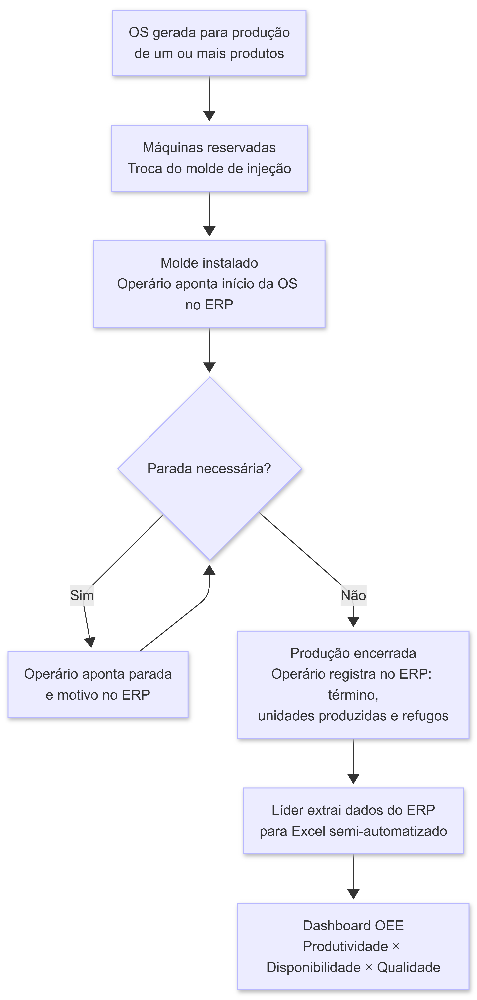
<p align="center"><em>Figura 1. Diagrama de produção da empresa Meplas.</em></p>

Esse cenário deixa o empreendedor do setor plástico sem opção viável, ou ele investe em um _MES_ caro e genérico que ainda exigirá customização, ou, convive com ferramentas inadequadas que não eliminam o trabalho manual. A ausência de um sistema acessível, com integração real ao _ERP_ e calibrado para a realidade do setor, é a lacuna que a **NJPlastic** se propõe a preencher.

## 1.2. Origem da Demanda e Evidências

O projeto foi solicitado pela empresa Meplas, a pedido direto do sócio-proprietário Jair Sperandio. Assim como anteriormente, o mesmo relata que não há controle total do processo produtivo, possuindo os seguintes problemas:
- Não consegue extrair dados concretos de produção em tempo real;
    - Precisa cruzar os dados com diversas telas do ERP;
    - Customização do ERP está fora de questão, pelas questões citadas anteriormente;
- Tem Perdas e/ou produção em excesso de 1 a cada 3 pedidos;
- Precisa deslocar pessoal (líderes de turno) para montarem relatórios;
- O processo produtivo não é integrado, utiliza várias ferramentas e processos manuais para registrar tudo.

## 1.3. Análise de Soluções Existentes (Benchmark)

Abaixo, veremos algumas soluções que executam funções parecidas a que a NJPlastic pretende implementar.

### Autoflex MES + Iniflex ERP (Projedata)<sup>[[3]](#ref-3)</sup>

**Público-alvo:** Fabricantes de plástico brasileiros de todos os portes. Oferece duas versões: _Iniflex PRO_ para operações industriais de maior porte e _Iniflex SMART_ voltada especificamente a micro e pequenas indústrias plásticas.

**Funcionalidades principais:**
- Coleta automática de ciclos produtivos, paradas e perdas diretamente das máquinas, sem apontamento manual;
- Cálculo de OEE baseado em dados reais com _dashboards_ por turno, setor e equipamento;
- Ecossistema de quatro módulos integrados: _Autoflex_ (MES chão de fábrica) + _Iniflex_ (ERP) + _Iniflex.APS_ (planejamento avançado) + _Iniflex.BI_ (inteligência de dados);
- Módulos de ERP específicos para plástico: controle de moldes e cavidades, rastreabilidade de lotes e gestão de _setups_;
- Identificação de gargalos com interface voltada ao operador.

**Limitações:**
- Integração com ERPs de terceiros (SAP, TOTVS, etc.) requer consulta a especialistas — sem conectores prontos documentados publicamente;
- Ecossistema proprietário fechado: a integração fluida ocorre apenas entre os próprios produtos Projedata;
- Nenhuma informação de preço publicada — modelo comercial opaco para PMEs que precisam avaliar custo-benefício sem contato com o time de vendas;
- Especificações técnicas da captura IoT (tipo de sensor, protocolo, *hardware* necessário) não estão publicadas.


<p align="center"><em>Figura 2. Exemplo apresentado pela Projedata do Autoflex.</em></p>

### Vedois MES (Vedois Tecnologia)<sup>[[4]](#ref-4)</sup>

**Público-alvo:** Indústrias de médio porte no Brasil com foco declarado em injeção plástica, embalagens, móveis, metalurgia, têxtil e química.

**Funcionalidades principais:**
- _Suite_ modular: _Vedois Produção_ (rastreamento automático), _Vedois Qualidade_ (CEP), _Vedois Manutenção_ e _Vedois DNC_ (carga automática de arquivos CAD/CAM em CNCs);
- Monitoramento em tempo real de máquinas, operadores e processos com alertas via _e-mail_, _pop-up_, _mobile_ e alarmes visuais e sonoros;
- OEE com rastreabilidade de matéria-prima e IDs de produto;
- Integração confirmada com TOTVS Protheus e compatibilidade declarada com qualquer ERP do mercado;
- Interface responsiva para computadores, _tablets_ e _smartphones_.

**Limitações:**
- Integração com ERPs externos é descrita como possível, mas sem conectores prontos — cada integração parece ser um projeto sob demanda;
- Nenhum preço publicado e sem indicação de planos acessíveis para empresas de menor porte;
- Documentação técnica da captura IoT ausente — sem especificação de _hardware_, protocolos ou método de captura de pulso elétrico;
- Produto generalista por setor: sem funcionalidades específicas para injeção plástica como controle de moldes, cavidades ou gestão de OS de injeção.


<p align="center"><em>Figura 3. Exemplo apresentado pela Vedois em seu site.</em></p>

### LiveMES (LiveMES Tecnologia)<sup>[[5]](#ref-5)</sup>

**Público-alvo:** Indústrias de manufatura discreta de todos os portes no Brasil, em setores como alimentos, automotivo, embalagens, farmacêutico, química e têxtil. Sem foco declarado em plástico.

**Funcionalidades principais:**
- Coletores IIoT instalados fisicamente nas máquinas, capazes de captar sinais variados para digitalizar equipamentos de qualquer tipo ou idade;
- OEE em tempo real com análise de perdas e histórico de produtividade;
- Análise de paradas com gráficos de Pareto e diagnóstico de causas raiz;
- _LivIA_: módulo de IA para suporte a decisões operacionais;
- _PMaaS_ (_Production Manager as a Service_): engenheiros da própria LiveMES analisam os dados do cliente e entregam recomendações.

**Limitações:**
- Nenhuma especialização em injeção plástica — sem controle de moldes, cavidades, ciclos de injeção ou parâmetros específicos do processo;
- Integração com ERP mencionada, mas sem detalhes técnicos — a integração parece ser avaliada caso a caso;
- Nenhum preço publicado;
- Modelo *PMaaS* pode representar custo recorrente adicional significativo para PMEs de menor porte.


<p align="center"><em>Figura 4. Exemplo de tela do sistema LiveMES.</em></p>

### Doeet MES (Doeet)<sup>[[6]](#ref-6)</sup>

**Público-alvo:** Fabricantes de plástico em geral — injeção, extrusão, sopro, rotomoldagem e termoformagem. Empresa espanhola com interface em português e espanhol e clientes documentados na América Latina.

**Funcionalidades principais:**
- OEE em tempo real com monitoramento de parâmetros de máquina (temperatura, etc.) via IoT e sistema de alarmes;
- Integração com ERP bidirecional, incluindo bloqueio de molde em uso diretamente no ERP;
- Rastreabilidade de ordens de produção e lotes de matéria-prima;
- Controle de moldes e ferramentas com rastreamento de uso — específico para plástico;
- Gestão de _changeover_ (SMED) e controle de qualidade integrado.

**Limitações:**
- Empresa espanhola — suporte, contrato e localização para o Brasil podem ser obstáculos para PMEs sem estrutura de TI interna;
- Nenhuma informação de preço publicada;
- Sem _cases_ brasileiros documentados publicamente;
- Abordagem IoT depende de sensores próprios cuja especificação técnica não está publicada.

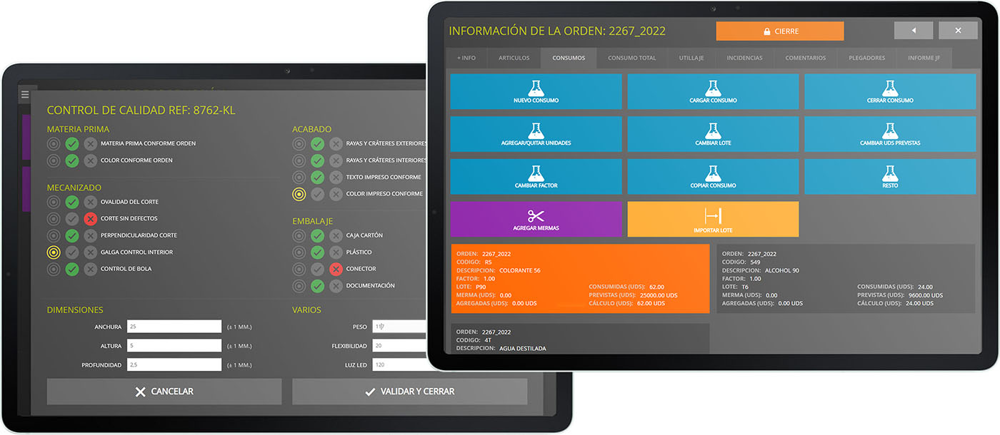
<p align="center"><em>Figura 5. Exemplo de tela do sistema Doeet.</em></p>

### EGA PCPMaster (EGA Sistemas)<sup>[[7]](#ref-7)</sup>

**Público-alvo:** Indústrias de manufatura no Brasil — automotivo, alimentos, embalagens, plásticos, móveis e metalurgia. Produto generalista por setor.

**Funcionalidades principais:**
- Monitoramento em tempo real do chão de fábrica com coleta automática de dados e IHM (_Interface Homem-Máquina_) para interação do operador;
- Cálculo de OEE e gestão de ordens de produção;
- Integração com ERP via _WebAPI Rest_ — abordagem técnica mais moderna e documentada publicamente entre os concorrentes avaliados;
- Controle de qualidade com CEP (_Controle Estatístico de Processo_) e rastreabilidade;
- Aplicativo _mobile_ para gestão remota e notificações automáticas de parada de máquina.

**Limitações:**
- Injeção plástica é listada como setor atendido, mas sem funcionalidades específicas declaradas (controle de moldes, cavidades, ciclos de injeção);
- Especificações técnicas da camada IoT (*hardware*, sensores, protocolo de captura) não estão publicadas;
- Nenhum preço publicado;
- Produto aparentemente posicionado para indústrias de médio porte com equipe de TI interna.


<p align="center"><em>Figura 6. Exemplo de tela do sistema EGA PCPMaster.</em></p>

### Comparação

| Solução | Pontos Fortes | Limitações |
|---|---|---|
| Autoflex + Iniflex (Projedata) | Único com ERP nativo para plástico; controle de moldes e cavidades; versão para micro e pequenas empresas | Ecossistema fechado; sem integração documentada com ERPs de terceiros; preço opaco |
| Vedois MES | Foco em injeção plástica; integração confirmada com TOTVS; alertas multicanal | Integração com ERP externo sob demanda; sem especificidades de injeção (moldes, OS) |
| LiveMES | Coletores IIoT para máquinas de qualquer tipo ou idade; escalável por porte | Sem especialização em plástico; integração com ERP caso a caso; custo do PMaaS |
| Doeet | Bidirecional com ERP; controle de moldes; específico para plástico; multi-processo | Empresa espanhola; sem cases brasileiros; preço não publicado |
| EGA PCPMaster | Integração via WebAPI Rest documentada; app mobile; CEP integrado | Sem funcionalidades específicas para injeção; IoT não documentado |

### 1.3.1. Diferencial do Projeto

A análise dos concorrentes revela um padrão consistente: as soluções disponíveis resolvem partes do problema, mas nenhuma os resolve todos de forma acessível para pequenas e médias indústrias brasileiras de injeção plástica. A NJPlastic se posiciona a partir dessas lacunas.

#### 1.3.1.1. Integração ERP real e bidirecional

Todos os concorrentes analisados descrevem integração com ERPs como "possível" ou "sob demanda" — cada implementação é um projeto customizado, sem conectores prontos. A NJPlastic propõe integração estrutural desde o início, com acesso direto ao banco de dados do ERP via JDBC, suportando leitura e escrita em SQL Server, Oracle e PostgreSQL sem dependência de _middleware_ proprietário.

#### 1.3.1.2. Especialização em injeção plástica com suporte ao mercado brasileiro

Dos concorrentes com especialização real em plástico, Projedata só integra com o próprio ERP e Doeet é uma empresa espanhola sem _cases_ documentados no Brasil. A NJPlastic combina foco no processo de injeção — captura de ciclos, detecção de pausas e controle de perdas — com integração direta aos ERPs já adotados pela indústria brasileira (como Consistem, SAP, TOTVS...).

#### 1.3.1.3. Hardware acessível e sem _vendor lock-in_

Nenhum concorrente publica especificações técnicas da camada IoT, enquanto a NJPlastic utiliza _hardware_ aberto e de baixo custo para captura dos sinais das máquinas via MQTT. No MVP, a captura será feita com Arduino, em versões posteriores, será migrada para um módulo ESP32<sup>[[8]](#ref-8)</sup> — que reduzirá custos, aumentará o processamento e armazenamento interno e permitirá sua atualização de código remotamente (CI/CD). Essa escolha elimina a dependência de sensores proprietários e mantém o custo de implementação acessível para PMEs sem equipe de TI interna.

#### 1.3.1.4. Custo previsível e arquitetura com rigor de engenharia

As soluções de menor custo que surgiram com a escalada da IA foram desenvolvidas sem uma arquitetura ou segurança sólida, não entregando garantias adequadas para ambientes de produção industrial. A NJPlastic é construída sobre decisões arquiteturais explícitas — separação de camadas, modelagem C4, protocolo aberto — o que garante manutenibilidade e credibilidade técnica sem o custo opaco dos sistemas estabelecidos.

## 1.4. Público-Alvo

<!-- Defina quem usará o sistema.

Exemplos:

- estudantes
- contadores
- equipes de suporte
- jogadores

Descreva:

- perfil do usuário
- contexto de uso
- nível de conhecimento técnico esperado -->

O sistema é destinado a **pequenas e médias indústrias brasileiras de injeção plástica** que já utilizam algum ERP corporativo e precisam integrar o chão de fábrica ao sistema de gestão sem investimento em customizações caras.

Dentro dessas empresas, os perfis de usuário são:

**Operador de máquina**
- **Contexto:** Atua diretamente no chão de fábrica, acompanha o andamento da produção turno a turno;
- **Objetivo:** Visualizar o status das máquinas e a contagem de ciclos em tempo real;
- **Nível técnico:** Baixo — espera-se uma interface simples, sem necessidade de treinamento formal.

**Líder de turno**
- **Contexto:** Supervisiona a produção durante um turno, atualmente responsável por montar relatórios manualmente ao final de cada período;
- **Objetivo:** Acessar relatórios de produção consolidados sem deslocamento físico ou retrabalho manual;
- **Nível técnico:** Básico — familiarizado com uso de computador e planilhas, sem experiência em sistemas industriais.

**Gestor / Sócio-proprietário**
- **Contexto:** Acompanha indicadores de produção e perdas para tomada de decisão, precisando cruzar dados em diversas telas do ERP;
- **Objetivo:** Ter visibilidade centralizada da produção integrada ao ERP, com dados confiáveis e em tempo real;
- **Nível técnico:** Médio — usa o ERP corporativo com regularidade, mas não tem perfil técnico de TI.

## 1.5. Objetivos do Projeto

### Objetivo Geral

<!-- Qual transformação o projeto pretende gerar.
Desenvolver um sistema integrado completo, fácil de utilizar e barato de implementar. -->

Desenvolver uma plataforma _Web-IoT_ que automatize a captura de ciclos produtivos de máquinas injetoras de plástico e sincronize esses dados com o ERP corporativo da empresa, eliminando apontamentos manuais e viabilizando o monitoramento da produção em tempo real para operadores, líderes de turno e gestores.

### Objetivos Específicos

<!-- Liste **3 a 5 objetivos técnicos ou de produto**.

Exemplo:

- automatizar um processo manual
- permitir análise de dados
- criar um sistema de recomendação -->

- Implementar uma camada IoT de captura de pulsos elétricos das injetoras via MQTT, utilizando Arduino no MVP e módulo ESP32 em versões posteriores;
- Desenvolver um _backend_ REST que processe os eventos MQTT, calcule tempos de ciclo, detecte pausas de máquina e persista os dados em PostgreSQL;
- Criar um _dashboard_ web em tempo real com indicadores de produção (ciclos, OEE, paradas) acessível por perfil de usuário (operador, líder, gestor);
- Implementar integração bidirecional com o ERP corporativo via JDBC direto, suportando SQL Server, Oracle e PostgreSQL sem dependência de _middleware_ proprietário;
- Disponibilizar autenticação com controle de acesso por perfil, garantindo que cada usuário visualize apenas o escopo de informações pertinente à sua função.

## 1.6. Métricas de Sucesso (KPIs)

<!-- Como saberemos que o projeto foi bem sucedido?

Exemplos:

- latência inferior a 200ms
- acurácia da IA superior a 85%
- suporte a 100 usuários simultâneos
- redução do tempo de um processo em 30% -->

| Métrica | Meta | Referência |
|---|---|---|
| Latência de registro de ciclo (pulso → banco) | < 5 segundos | Tempo aceitável para acompanhamento em tempo real |
| Taxa de perda/excesso por pedido | Redução de 33% para < 10% | Problema declarado: 1 em cada 3 pedidos com desvio |
| Tempo gasto por líder em relatórios de turno | Redução ≥ 80% | Atualmente exige deslocamento e montagem manual |
| Disponibilidade do sistema | ≥ 99% em horário de produção | Ambiente industrial crítico — parada afeta monitoramento |
| Sincronização com ERP | Dados disponíveis no ERP em até 1 minuto do registro | Latência aceitável para integração assíncrona |
| Adoção pelos usuários | 100% dos líderes e gestores utilizando ativamente em até 30 dias após implantação | Indicador de usabilidade e aderência ao processo |

# 2. Engenharia de Requisitos

<!-- Esta seção define **o que o sistema fará**.

Evite descrições vagas. -->

## 2.1. Personas

<!-- Crie **1 a 3 personas principais**.

Inclua:

- nome fictício
- contexto
- objetivos
- principais dificuldades

Adicionar **imagens ou ilustrações** pode ajudar na compreensão. -->

A partir dos perfis de usuário definidos em [1.4](#14-público-alvo), elaboramos três personas representativas das pessoas que utilizarão o sistema diariamente. Cada persona traduz uma das dores levantadas em [1.2](#12-origem-da-demanda-e-evidências) em um perfil concreto, para guiar decisões de produto e de _UX_.

### Persona 1 — Carlos, Operador de Injetora

- **Contexto:** Tem 38 anos, atua há 10 anos no chão de fábrica da Meplas. Trabalha em turnos rotativos, opera entre duas e três injetoras simultaneamente e acompanha visualmente o ciclo das máquinas;
- **Objetivos:** Acompanhar em tempo real a contagem de ciclos das máquinas que opera; saber rapidamente quando uma máquina parou e por quê; registrar manualmente o motivo de uma parada (refugo, _setup_, manutenção) sem precisar abrir várias telas;
- **Dificuldades:** Não tem familiaridade com sistemas industriais complexos; espera uma interface direta, com poucos cliques; não tem visibilidade do próprio desempenho durante o turno e descobre desvios apenas no final, quando o líder consolida os números.

### Persona 2 — Marina, Líder de Turno

- **Contexto:** Tem 32 anos, formada em Gestão da Produção, supervisiona um turno de oito operadores. Hoje monta os relatórios de turno manualmente, cruzando anotações em papel com telas do _ERP_ e planilhas Excel;
- **Objetivos:** Acessar um _dashboard_ consolidado com o status de todas as máquinas do turno; consultar histórico de ciclos e pausas por máquina e período; gerar e exportar o relatório de turno sem precisar montar planilhas à mão;
- **Dificuldades:** Perde de uma a duas horas por turno apenas montando relatórios; depende de informações repassadas verbalmente pelos operadores, sujeitas a erro; precisa se deslocar fisicamente entre máquinas e o escritório do _ERP_ para reunir dados.

### Persona 3 — Jair, Sócio-Gestor

- **Contexto:** Tem 56 anos, sócio-proprietário da Meplas, acompanha indicadores de produção e perdas para decisão estratégica. É o solicitante direto do projeto NJPlastic. Usa o _ERP_ corporativo com regularidade, mas não tem perfil técnico de TI;
- **Objetivos:** Visualizar o _OEE_ consolidado por máquina, turno e período; cruzar produção real com ordens cadastradas no _ERP_ sem abrir várias telas; ter dados confiáveis em tempo real para reduzir os desvios de 1 a cada 3 pedidos relatados em [1.2](#12-origem-da-demanda-e-evidências);
- **Dificuldades:** Hoje precisa cruzar manualmente diversas telas do _ERP_ para ter uma visão única da produção; sente falta de visibilidade imediata sobre paradas e perdas durante o expediente; descarta a customização do _ERP_ pelo custo e pela rigidez do fornecedor.

## 2.2. Casos de Uso Principais

<!-- Liste os principais fluxos do sistema.

Exemplo:

- criar conta
- registrar dados
- consultar informações
- gerar relatórios

Sempre que possível inclua **diagramas de caso de uso**. -->

Os principais fluxos do sistema são organizados por ator. Atores humanos seguem os perfis definidos em [1.4](#14-público-alvo); atores não-humanos representam os agentes automáticos da plataforma — Microcontrolador (camada IoT) e _Backend_ (camada de sistema), conforme modelados nos diagramas C4.

### Operador

- UC01 — Autenticar-se no sistema com credenciais (_login_/senha);
- UC02 — Visualizar status em tempo real das máquinas sob sua responsabilidade;
- UC03 — Registrar manualmente **pausa** de máquina informando o motivo (refugo, _setup_, manutenção);
- UC12 — Editar a mensagem de uma **parada automática** registrada pelo sistema (escopo restrito às máquinas do seu turno — RN02).

### Líder de Turno

- UC04 — Visualizar _dashboard_ consolidado do turno, com todas as máquinas do seu setor;
- UC05 — Consultar histórico de ciclos e pausas por máquina e período;
- UC06 — Gerar e exportar relatório consolidado de turno;
- UC12 — Editar a mensagem de uma **parada automática** registrada pelo sistema (escopo restrito ao seu setor/turno — RN03).

### Gestor

- UC07 — Visualizar _OEE_ consolidado por máquina, turno e período;
- UC08 — Acompanhar a integridade da sincronização com o _ERP_ corporativo;
- UC09 — Cadastrar usuários e atribuir perfis (Operador, Líder de Turno ou Gestor);
- UC12 — Editar a mensagem de qualquer **parada automática** registrada pelo sistema (visão completa — RN04).

### Atores de Sistema

- UC10 — Microcontrolador publica pulso elétrico de ciclo via _MQTT_ ao _broker_ a cada nova leitura;
- UC11 — _Backend_ lê ordens de produção abertas no _ERP_ e grava apontamentos de ciclos e pausas confirmados de volta, executando a sincronização bidirecional de forma periódica em janela de tempo configurável;
- UC13 — _Backend_ classifica automaticamente a máquina como _PARADA_ ao detectar N pausas consecutivas sem pulso válido intermediário, gerando registro automático com mensagem _default_ editável (RN09, RF17–RF18).

### Diagrama de Casos de Uso

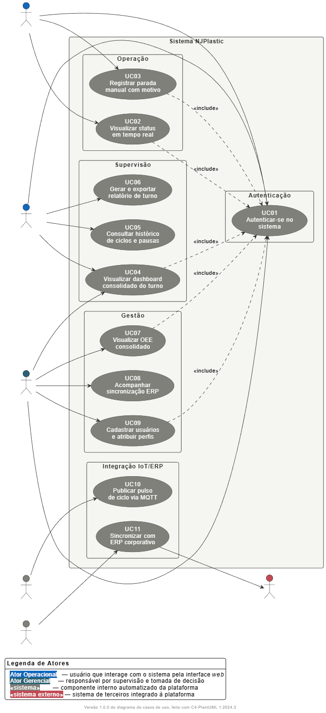
<p align="center"><em>Figura 7. Diagrama de casos de uso da NJPlastic, agrupando atores humanos (Operador, Líder de Turno e Gestor) e atores de sistema (Microcontrolador e Backend), incluindo UC12 (edição de mensagem de parada automática) e UC13 (classificação automática como PARADA).</em></p>

## 2.3. Requisitos Funcionais (RF)

<!-- Use a estrutura:

> O sistema deve permitir que **[ator] realize [ação]**.

Exemplo:

RF01 — O sistema deve permitir que o usuário crie uma conta.

RF02 — O sistema deve permitir que o usuário registre informações.

RF03 — O sistema deve permitir que o usuário visualize dados registrados. -->

Os requisitos funcionais estão agrupados pelas áreas do sistema modeladas em [C4_Component_Diagram.puml](Assets/Diagrams/C4_Component_Diagram.puml). Itens marcados como **RF-F** representam funcionalidades planejadas para versões futuras, fora do MVP, mas que fazem parte da visão completa do produto.

### Captação IoT

- RF01 — O microcontrolador deve capturar o pulso elétrico de ciclo da injetora e publicar a leitura em tópico _MQTT_ contendo _timestamp_ preciso da captação;
- RF02 — O sistema deve aceitar publicações _MQTT_ de múltiplas máquinas simultaneamente, identificando-as por tópico distinto.

### Autenticação e Controle de Acesso

- RF03 — O sistema deve permitir que o usuário se autentique com credenciais (_login_ e senha);
- RF04 — O sistema deve permitir que o gestor cadastre usuários e atribua perfil (Operador, Líder de Turno ou Gestor), conforme UC09;
- RF05 — O sistema deve restringir telas e dados acessíveis conforme o perfil do usuário autenticado.

### Produção e Monitoramento

- RF06 — O sistema deve permitir cadastrar máquinas com identificador, tópico _MQTT_ associado, tempo de ciclo padrão, fator de tolerância e **número de pausas consecutivas para parada automática** (`pausas_consecutivas_para_parada`) — parâmetros consumidos por RF08, RF17, RN06 e RN09;
- RF07 — O sistema deve calcular o tempo entre ciclos consecutivos de cada máquina;
- RF08 — O sistema deve detectar pausa automaticamente quando o intervalo entre dois pulsos exceder um _threshold_ configurável por máquina (RN06), incrementando o contador de pausas consecutivas;
- RF09 — O sistema deve permitir que o operador registre manualmente o motivo de uma **pausa** isolada (refugo, _setup_, manutenção) — não cobre paradas automáticas, tratadas por RF18;
- RF10 — O sistema deve calcular o _OEE_ (Disponibilidade × Performance × Qualidade) por máquina, turno e período;
- RF11 — O sistema deve exibir _dashboard_ em tempo real com ciclos, pausas e _OEE_, com visualização adequada ao perfil do usuário e **indicação visual distinta** (cor e ícone) para máquinas no estado _PARADA_ (RN09);
- RF17 — O sistema deve classificar a máquina automaticamente como _PARADA_ quando o contador de pausas consecutivas atingir o limite configurado (`pausas_consecutivas_para_parada`), sem pulso válido intermediário (RN09), executando UC13;
- RF18 — Ao classificar a máquina como _PARADA_, o sistema deve gerar um registro de `Pausa` com `tipo = PARADA_AUTOMATICA` e mensagem _default_ editável — por exemplo: _"Parada detectada automaticamente após N pausas consecutivas"_;
- RF19 — O sistema deve permitir que Operador, Líder de Turno e Gestor editem a mensagem de um registro `PARADA_AUTOMATICA`, respeitando o escopo de visibilidade de cada perfil (RN02–RN04), executando UC12;
- RF20 — O sistema deve preservar histórico auditável de cada edição de mensagem de parada automática (autor, _timestamp_, conteúdo anterior), recuperável via _dashboard_ e relatório de turno (RN12).

### Integração com ERP

- RF12 — O sistema deve conectar via _JDBC_ direto a bancos de _ERP_ em _SQL Server_, _Oracle_ ou _PostgreSQL_;
- RF13 — O sistema deve sincronizar bidirecionalmente registros de produção entre o _PostgreSQL_ local e o _ERP_, lendo ordens de produção e escrevendo apontamentos;
- RF14 — O sistema deve permitir configurar a janela de sincronização com o _ERP_ (por exemplo, a cada 1 minuto).

### Relatórios

- RF15 — O sistema deve permitir que o líder de turno gere relatório consolidado do turno com ciclos, _OEE_, **pausas manuais** (`tipo = PAUSA`) e **paradas automáticas** (`tipo = PARADA_AUTOMATICA`) listadas em seções separadas; para cada parada automática, incluir mensagem atual e autor da última edição (RF20);
- RF16 — O sistema deve exportar relatórios em formato consumível, como _CSV_ ou _PDF_.

### Roadmap (RFs Futuros)

- RF-F01 — O sistema deve permitir migrar a captação de pulsos para módulo _ESP32_ com _OTA_ (atualização remota de _firmware_);
- RF-F02 — O sistema deve suportar a configuração de múltiplos _ERPs_ simultâneos no mesmo _deployment_, suportando cenários de transição entre fornecedores;
- RF-F03 — O sistema deve enviar notificações ativas de parada de máquina (_push_, _e-mail_ ou _SMS_) aos operadores e líderes responsáveis, complementando o monitoramento passivo de RF11.

## 2.4. Requisitos Não Funcionais (RNF)

<!-- Inclua requisitos relacionados a:

- desempenho
- segurança
- disponibilidade
- escalabilidade
- usabilidade

Exemplo:

RNF01 — O sistema deve suportar 100 usuários simultâneos.  
RNF02 — O tempo de resposta deve ser inferior a 300ms.  
RNF03 — O sistema deve utilizar autenticação segura. -->

Cada requisito não funcional está ancorado em um _KPI_ declarado em [1.6](#16-métricas-de-sucesso-kpis) ou em um diferencial competitivo de [1.3.1](#131-diferencial-do-projeto), garantindo rastreabilidade entre objetivos e restrições técnicas.

### Desempenho

- RNF01 — A latência entre o pulso elétrico e o registro do ciclo no _PostgreSQL_ deve ser inferior a 5 segundos (ancorado no _KPI_ de tempo real);
- RNF02 — O _dashboard_ deve refletir novos dados de produção com latência inferior a 2 segundos após a persistência no banco — limite derivado do _KPI_ de tempo real, garantindo que a soma RNF01 + RNF02 mantenha o monitoramento de UC02/UC04 dentro de uma janela perceptivelmente "ao vivo";
- RNF03 — A sincronização com o _ERP_ deve concluir em até 1 minuto após o registro do apontamento no _PostgreSQL_ (ancorado no _KPI_ de sincronização).

### Disponibilidade e Confiabilidade

- RNF04 — O sistema deve manter disponibilidade superior ou igual a 99% durante o horário de produção (ancorado no _KPI_ de disponibilidade);
- RNF05 — O sistema deve tratar perda de mensagens _MQTT_ utilizando _QoS_ adequado para garantir entrega _at-least-once_ ao _backend_.

### Segurança

- RNF06 — A comunicação entre _frontend_ e _backend_ deve ser cifrada via _HTTPS_/_TLS_;
- RNF07 — Senhas de usuário devem ser armazenadas com algoritmo de _hash_ adequado (por exemplo, _bcrypt_), nunca em texto puro;
- RNF08 — O sistema deve seguir as recomendações de mitigação do _OWASP Top 10_, com detalhamento na [Seção 6](#6-segurança-e-privacidade).

### Usabilidade

- RNF09 — A tela principal do operador deve ser interpretável sem treinamento formal, alinhada ao perfil de "nível técnico baixo" definido em [1.4](#14-público-alvo);
- RNF10 — A interface web deve ser responsiva, suportando _desktops_ de chão de fábrica e _tablets_.

### Escalabilidade

- RNF11 — A arquitetura deve suportar até 50 máquinas simultâneas publicando ciclos por _deployment_ — limite definido como teto operacional do perfil-alvo de PMEs descrito em [1.4](#14-público-alvo), com o piloto na Meplas iniciando em escala menor e teste de carga obrigatório antes de cada _release_.

### Manutenibilidade e Engenharia

- RNF12 — O código deve seguir a separação de camadas representada em [C4_Component_Diagram.puml](Assets/Diagrams/C4_Component_Diagram.puml), no padrão _Controller_ → _Service_ → _Repository_;
- RNF13 — O acesso ao banco do _ERP_ deve ser isolado em `ErpDatabaseRepository` via _JDBC_ direto, sem _JPA_, conforme decisão arquitetural de [1.3.1.1](#1311-integração-erp-real-e-bidirecional).

## 2.5. Regras de Negócio

<!-- Exemplos:
- apenas usuários autenticados podem acessar determinados recursos
- determinadas operações exigem validação adicional -->

As regras de negócio descrevem _invariantes_ do domínio — condições que devem ser sempre verdadeiras independentemente do fluxo de execução, distintas dos requisitos funcionais que descrevem ações.

- RN01 — Apenas usuários autenticados podem acessar qualquer tela do _dashboard_ ou recurso da _API_;
- RN02 — O operador só pode visualizar dados das máquinas atribuídas ao seu turno;
- RN03 — O líder de turno visualiza apenas máquinas e operadores do seu setor e turno;
- RN04 — O gestor tem visão completa de todas as máquinas e turnos do _deployment_;
- RN05 — Um ciclo só é considerado válido se o pulso _MQTT_ contiver _timestamp_ dentro de uma janela de tolerância configurável, protegendo contra _drift_ de relógio do microcontrolador;
- RN06 — Uma pausa é detectada quando o intervalo entre dois ciclos consecutivos excede o tempo de ciclo padrão da máquina multiplicado por um fator de tolerância, ambos configuráveis por máquina; cada detecção incrementa o contador de pausas consecutivas (ver RN09/RN11);
- RN07 — Cada registro de produção — tanto **apontamentos de ciclo** quanto **registros de pausa** (`tipo = PAUSA` ou `tipo = PARADA_AUTOMATICA`) — transita pelos estados: _pendente_ (criado a partir do pulso _MQTT_ ou gerado automaticamente), _confirmado_ (validado contra RN05 e RN06) e _sincronizado_ (escrito no _ERP_ via UC11). A sincronização propaga apenas registros _confirmados_, evitando dados parciais;
- RN08 — Em caso de falha na sincronização com o _ERP_, o registro local deve permanecer íntegro e o sistema deve tentar novamente na próxima janela, garantindo idempotência da operação;
- RN09 — Quando N pausas consecutivas (RN06) ocorrerem na mesma máquina sem pulso válido intermediário, a máquina é classificada automaticamente como _PARADA_; N corresponde ao parâmetro `pausas_consecutivas_para_parada`, configurável por máquina via RF06;
- RN10 — O retorno ao estado _PRODUZINDO_ é automático ao receber o próximo pulso válido (RN05); o registro `PARADA_AUTOMATICA` é fechado com _timestamps_ de início e fim no momento da retomada;
- RN11 — O contador de pausas consecutivas reseta após cada pulso válido (RN05 OK) ou imediatamente após o fechamento automático do registro de parada;
- RN12 — Toda edição de mensagem em um registro `PARADA_AUTOMATICA` gera entrada imutável no log de auditoria (autor, _timestamp_, conteúdo anterior); o histórico completo de edições é recuperável via _dashboard_ e relatório de turno (RF20).

## 2.6. Fora do Escopo

<!-- Liste explicitamente **o que o sistema não fará**.
Isso ajuda a evitar crescimento descontrolado do projeto. -->

Para proteger o projeto contra _scope creep_ e diferenciar com clareza o produto frente aos concorrentes mapeados em [1.3](#13-análise-de-soluções-existentes-benchmark), declaramos explicitamente o que a NJPlastic **não fará**:

- **Controle Estatístico de Processo (_CEP_) e inspeção dimensional** — domínio que permanece sob responsabilidade do _ERP_ corporativo do cliente. A NJPlastic foca exclusivamente em ciclos e pausas, não em inspeção de peças ou métricas de qualidade dimensional;
- **Gestão de moldes e cavidades** — diferente das soluções _Doeet_ e _Projedata_, a NJPlastic não fará rastreamento de uso de molde, troca, manutenção ou bloqueio bidirecional. O cadastro e o ciclo de vida de moldes permanecem no _ERP_;
- **Operação multi-_tenant_ ou modelo _SaaS_** — cada cliente recebe um _deployment_ dedicado, com seu próprio banco _PostgreSQL_ e _broker_ _MQTT_. O isolamento entre clientes é por infraestrutura, não por _schema_ ou _tenant_ lógico no banco.

# 3. Fluxos e Comportamento do Sistema

<!-- Esta seção demonstra **como o sistema funciona**.

Use diagramas sempre que possível. -->

A Seção 2 definiu **o que** o sistema faz; esta seção demonstra **como** funciona em _runtime_. Os fluxos estão organizados em dois grupos: o caminho feliz — do pulso elétrico da injetora até o _dashboard_ do gestor — e os cenários alternativos — falhas e exceções previsíveis que o sistema deve tratar de forma íntegra.

Três notações são utilizadas, cada uma com propósito distinto:
- **Diagrama de sequência** — captura a troca de mensagens entre atores e componentes ao longo do tempo; usado para o fluxo _end-to-end_ e para os cinco cenários alternativos;
- **Diagrama de estados** — modela o ciclo de vida dos registros de produção (apontamentos de ciclo e pausas, incluindo paradas automáticas — RN07) e o estado operacional da máquina (RN09–RN11);
- **Fluxograma de navegação** — descreve a jornada de cada _persona_ entre as telas do _frontend_, do _login_ às ações específicas do perfil, incluindo a edição de mensagens de paradas automáticas (UC12).

## 3.1. Fluxo Principal do Usuário

<!-- Apresente o fluxo principal do sistema.

Utilize:

- fluxogramas
- diagramas de atividades
- diagramas de sequência

Inclua **imagens dos diagramas**. -->

### 3.1.1. Visão _End-to-End_ do Ciclo Produtivo

O diagrama abaixo mostra o ciclo completo desde o pulso elétrico da injetora até a sincronização do apontamento no _ERP_ corporativo, envolvendo todos os atores e componentes modelados nos diagramas C4. Cada passo está ancorado nos requisitos e regras de negócio da Seção 2.

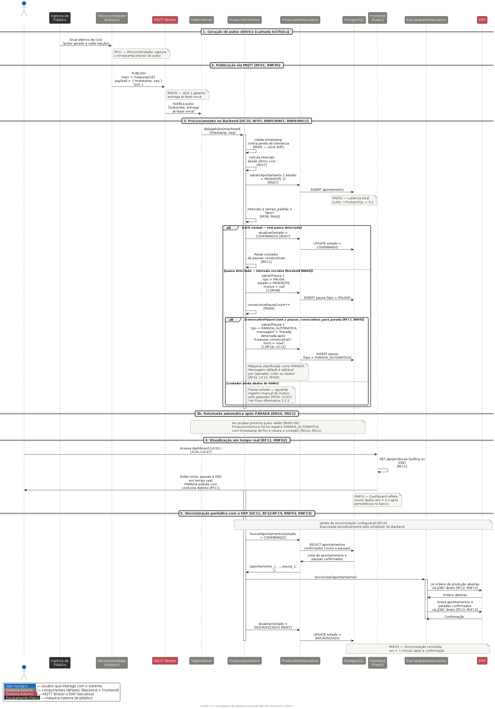
<p align="center"><em>Figura 8. Diagrama de sequência do fluxo principal end-to-end: pulso MQTT → Backend → PostgreSQL → Dashboard → sincronização com ERP. Inclui a lógica de contador de pausas consecutivas e classificação automática como PARADA (UC10, UC11, UC13, RF01, RF07, RF08, RF17, RF18, RF12–RF14, RN05–RN11, RNF01–RNF03, RNF05, RNF13).</em></p>

O fluxo se divide em seis etapas sequenciais:
- **Geração do pulso (RF01):** a injetora gera um sinal elétrico a cada ciclo de produção; o _Arduino_ captura o _timestamp_ preciso desse pulso e o publica no _MQTT Broker_ via tópico `maquina/{id}` com _QoS_ 1 (RNF05 — entrega _at-least-once_);
- **Processamento no _Backend_ (UC10, RF07, RN05–RN07):** o `MqttListener` delega ao `ProductionService`, que valida o _timestamp_ contra a janela de tolerância de _clock_ (RN05), calcula o intervalo desde o último ciclo (RF07) e persiste o apontamento como _pendente_ (RN07) — em menos de 5 segundos desde o pulso (RNF01);
- **Avaliação de pausa e contador de paradas (RF08, RF17, RN06, RN09):** se o intervalo excede `tempo_padrão × fator_tolerância`, uma pausa (`tipo = PAUSA`) é registrada e o contador de pausas consecutivas é incrementado; quando o contador atingir `pausas_consecutivas_para_parada`, o sistema executa UC13 — cria um registro `PARADA_AUTOMATICA` com mensagem _default_ editável (RF17, RF18, RN09). Se o intervalo não excede o _threshold_, o apontamento avança para _confirmado_ e o contador é resetado (RN11);
- **Retomada automática (RN10, RN11):** ao receber o próximo pulso válido após uma _PARADA_, o registro é fechado com _timestamp_ de fim e o contador é resetado — sem intervenção humana;
- **Visualização em tempo real (RF11, RNF02):** o _frontend_ consome os dados via _polling_ ou _SSE_ e exibe ciclos, pausas e _OEE_ atualizados em menos de 2 segundos; máquinas no estado _PARADA_ são exibidas com cor e ícone distintos (RF11);
- **Sincronização com o _ERP_ (UC11, RF12–RF14, RNF03, RNF13):** em janela configurável, o `ProductionService` lê ordens abertas do _ERP_ e grava apontamentos e pausas _confirmados_ via _JDBC_ direto (RNF13 — sem _JPA_), marcando-os como _sincronizados_ em até 1 minuto (RNF03).

### 3.1.2. Ciclos de Vida: Registros e Estado da Máquina (RN07, RN09–RN11)

Esta subseção apresenta dois diagramas complementares: o ciclo de vida dos **registros** (apontamentos de ciclo e pausas) e o estado operacional da **máquina** (produzindo/parada).

#### Ciclo de Vida dos Registros (RN07)

Todo registro gerado pelo sistema — seja um apontamento de ciclo (UC10) ou um registro de pausa (`tipo = PAUSA` via RF08 ou `tipo = PARADA_AUTOMATICA` via RF18) — transita pelos mesmos estados. Apenas registros _confirmados_ são propagados ao _ERP_ (RN07).

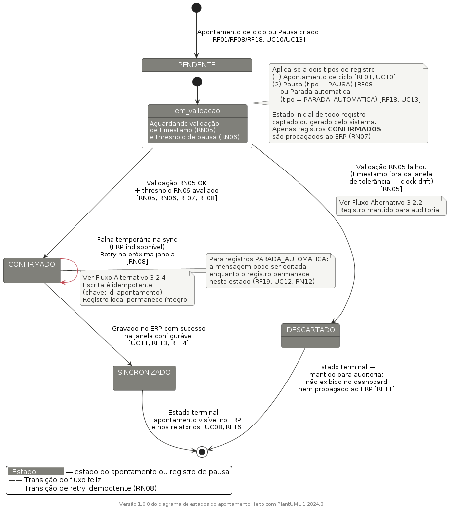
<p align="center"><em>Figura 9. Ciclo de vida dos registros de produção (apontamentos de ciclo e pausas dos tipos PAUSA e PARADA_AUTOMATICA): pendente → confirmado → sincronizado; com transições de descarte (RN05) e retry idempotente (RN08). Registros PARADA_AUTOMATICA confirmados permitem edição de mensagem (RF19, UC12) enquanto aguardam sincronização.</em></p>

Os estados e as transições responsáveis são:
- **_pendente_:** estado inicial criado ao receber o pulso (RF01, UC10) ou ao detectar pausa/parada automática (RF08/RF18);
- **_confirmado_:** alcançado após validação de _timestamp_ (RN05) e avaliação do _threshold_ de pausa (RN06, RF08); registros `PARADA_AUTOMATICA` confirmados permitem edição de mensagem (RF19, UC12, RN12);
- **_descartado_:** alcançado quando o _timestamp_ está fora da janela de tolerância (RN05 — _clock drift_); registro mantido para auditoria, não exibido no _dashboard_ nem propagado ao _ERP_;
- **_sincronizado_:** estado terminal após escrita bem-sucedida no _ERP_ (UC11, RF13); registro visível nos relatórios;
- **retry (_confirmado_ → _confirmado_):** falha temporária de sincronização; registro não regride de estado, escrita é idempotente pela chave `id_registro` (RN08).

#### Estado Operacional da Máquina (RN09–RN11)

Paralelamente ao ciclo de vida dos registros, cada máquina possui um estado operacional que reflete sua condição em tempo real no _dashboard_.

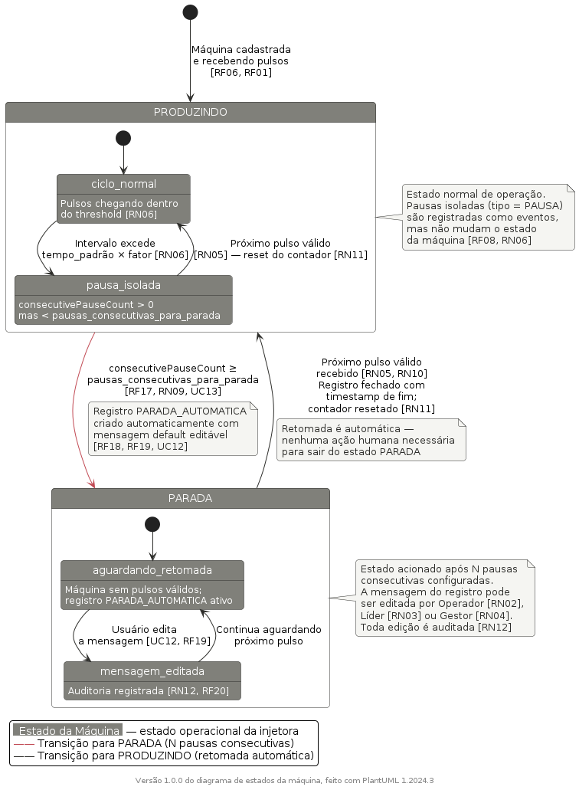
<p align="center"><em>Figura 10b. Estados operacionais da máquina injetora: PRODUZINDO (operação normal com pausas isoladas) e PARADA (N pausas consecutivas atingidas — RN09). Retomada automática ao próximo pulso válido (RN10). Contador resetado em cada retomada (RN11).</em></p>

As transições do estado da máquina são:
- **PRODUZINDO → PARADA:** acionada pelo _Backend_ (UC13) quando `consecutivePauseCount ≥ pausas_consecutivas_para_parada` (RF17, RN09); um registro `PARADA_AUTOMATICA` com mensagem _default_ editável é criado simultaneamente (RF18);
- **PARADA → PRODUZINDO:** automática ao receber o próximo pulso válido (RN05 OK); o registro `PARADA_AUTOMATICA` é fechado com _timestamp_ de fim (RN10) e o contador é resetado (RN11).

### 3.1.3. Jornadas de Navegação por *Persona*

Cada *persona* definida na Seção 2.1 percorre um subconjunto distinto de telas do _frontend_, determinado pelo seu perfil de acesso (RN02–RN04) e pelos casos de uso que lhe competem. As telas aqui listadas são derivadas dos UCs da Seção 2.2; os _mockups_ visuais de cada tela serão detalhados na Seção 4.

#### Carlos — Operador de Injetora

Carlos interage com o sistema para acompanhar as máquinas do seu turno, registrar os motivos de pausas isoladas (UC03) e editar a mensagem de paradas automáticas das suas máquinas (UC12, RN02).

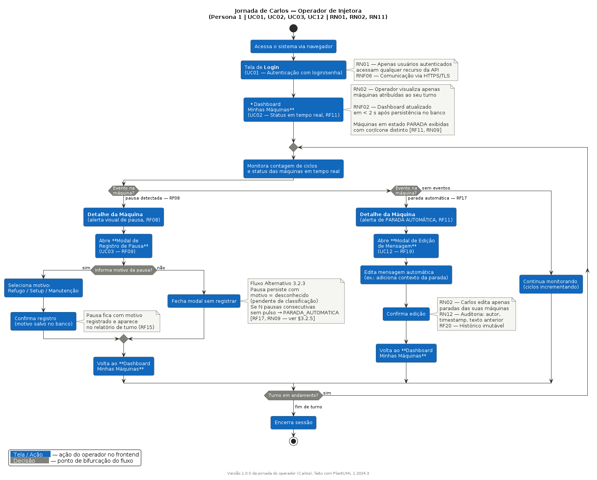
<p align="center"><em>Figura 10. Jornada de Carlos (Persona 1 — Operador): Login → Dashboard Minhas Máquinas → [pausa isolada] Detalhe + Modal de Pausa (UC03, RF09) | [parada automática] Detalhe + Modal de Edição de Mensagem (UC12, RF19, RN12) (UC01, UC02, UC03, UC12, RN01, RN02, RNF09).</em></p>

#### Marina — Líder de Turno

Marina usa o sistema para supervisionar todo o turno sem deslocamento físico: consultar histórico, gerar relatório, exportar e editar mensagens de paradas automáticas do seu setor (UC12, RN03).

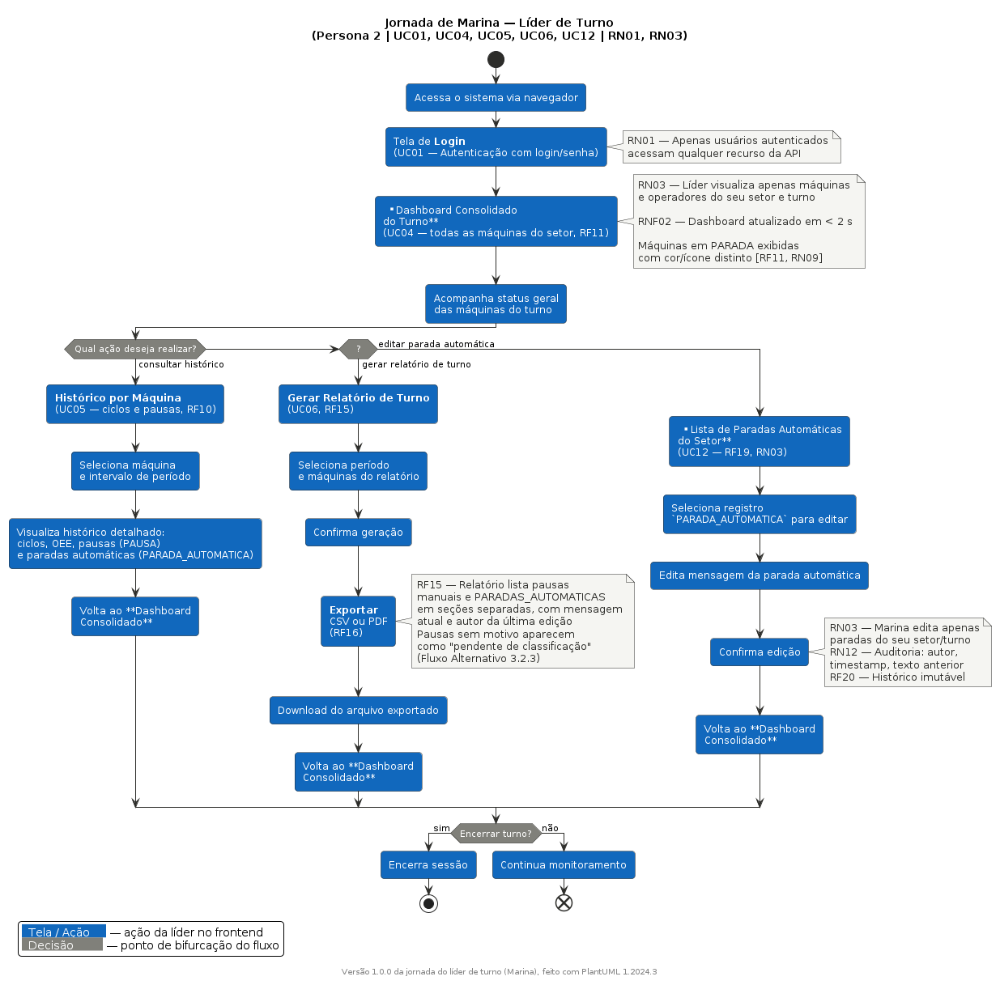
<p align="center"><em>Figura 11. Jornada de Marina (Persona 2 — Líder de Turno): Login → Dashboard Consolidado → Histórico / Relatório de Turno → Exportar CSV/PDF | Editar mensagem de parada automática (UC01, UC04, UC05, UC06, UC12, RN01, RN03, RF15, RF16).</em></p>

#### Jair — Gestor / Sócio-Proprietário

Jair acessa os indicadores estratégicos de _OEE_, monitora a integração com o _ERP_, administra usuários e máquinas — incluindo o parâmetro `pausas_consecutivas_para_parada` — e pode editar mensagens de qualquer parada automática (UC12, RN04).

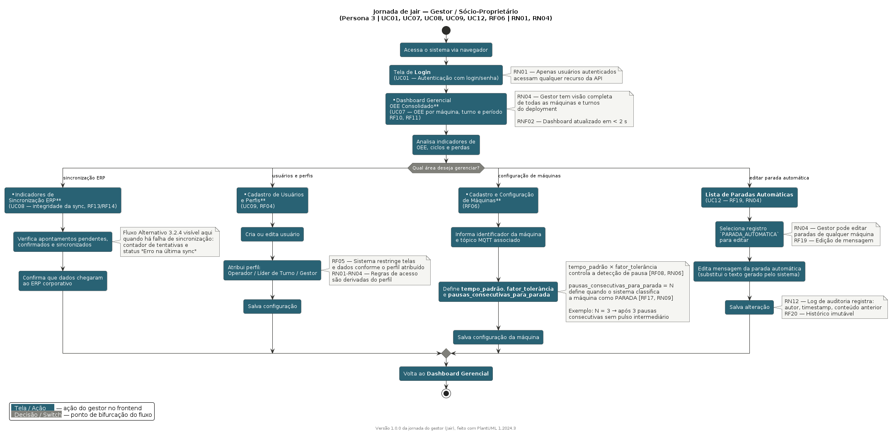
<p align="center"><em>Figura 12. Jornada de Jair (Persona 3 — Gestor): Login → Dashboard Gerencial OEE → [switch] Indicadores ERP / Usuários e Perfis / Configuração de Máquinas / Editar Parada Automática (UC01, UC07, UC08, UC09, UC12, RF06, RN01, RN04, RN12).</em></p>

## 3.2. Fluxos Alternativos

<!-- Descreva cenários como:

- erros
- cancelamentos
- exceções -->

Os cinco cenários abaixo representam desvios do caminho feliz que o sistema deve tratar de forma previsível e íntegra. Cada diagrama indica o ponto exato do fluxo principal (Seção 3.1.1) onde a ramificação ocorre e o RN ou RF que governa o comportamento esperado.

### 3.2.1. Falha de Autenticação (UC01)

Ramifica no início de qualquer fluxo — antes do acesso ao _dashboard_. Três sub-cenários cobrem as variações de falha (RN01–RN04, RNF07, RNF08).

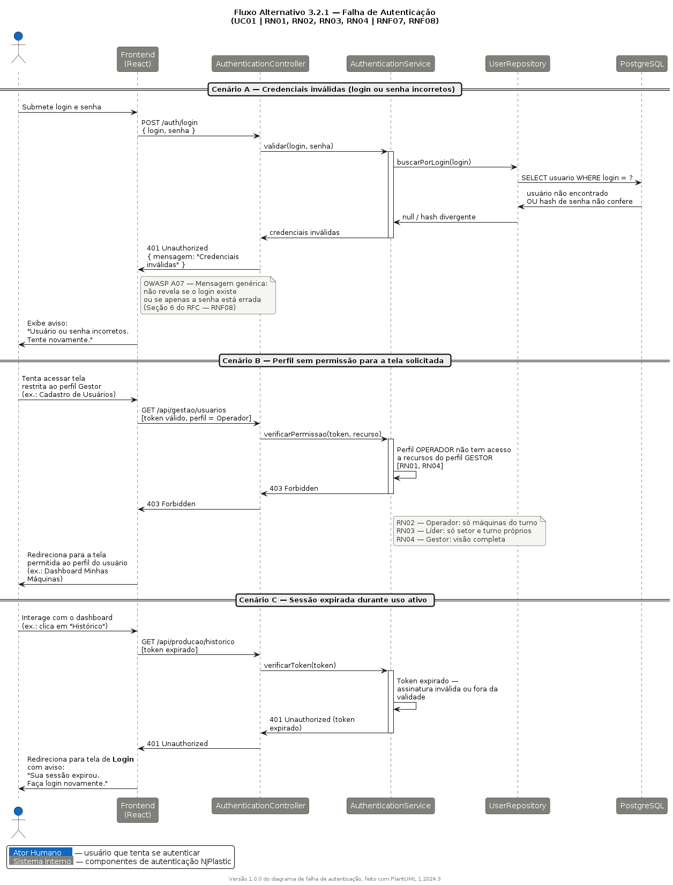
<p align="center"><em>Figura 13. Fluxo alternativo 3.2.1: credenciais inválidas (401), perfil sem permissão (403) e sessão expirada (401 durante uso) — com mensagem genérica conforme OWASP A07.</em></p>

Os comportamentos esperados são:
- **Credenciais inválidas:** Resposta 401 com mensagem genérica que não revela se o _login_ existe — previne enumeração de usuários (OWASP A07, RNF08, Seção 6);
- **Perfil sem permissão:** Resposta 403 e redirecionamento para a tela permitida pelo perfil do usuário (RN02–RN04);
- **Sessão expirada:** Qualquer _endpoint_ retorna 401 com _token_ vencido; _frontend_ redireciona para a tela de _login_.

### 3.2.2. *Drift* de Relógio no Microcontrolador (RN05)

Ramifica na etapa de validação de _timestamp_ do fluxo principal (passo 2 — "Processamento no _Backend_"). Ocorre quando o relógio interno do _Arduino_ acumula deriva em relação ao tempo real do servidor.

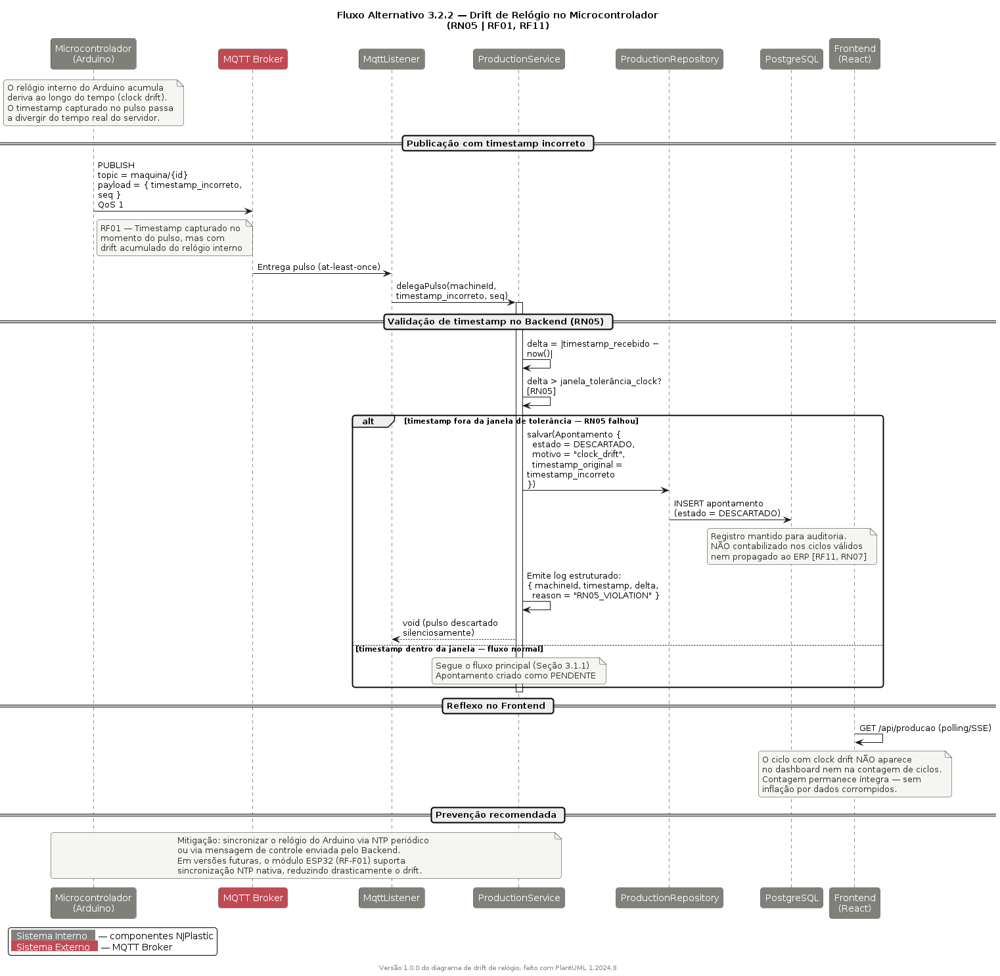
<p align="center"><em>Figura 14. Fluxo alternativo 3.2.2: timestamp fora da janela de tolerância (RN05) — apontamento descartado com registro de auditoria; contagem de ciclos preservada íntegra.</em></p>

O comportamento esperado é:
- O `ProductionService` calcula `delta = |timestamp_recebido − now()|` e rejeita o pulso quando `delta > janela_tolerância` (RN05);
- O apontamento é salvo como _descartado_ com `motivo = "clock_drift"` para auditoria — não exibido no _dashboard_ nem contabilizado nos indicadores;
- Mitigação futura: sincronização de relógio via _NTP_ no _ESP32_ (RF-F01).

### 3.2.3. Pausa Isolada Detectada sem Motivo Registrado (RF08, RF09)

Este cenário cobre **uma pausa isolada** (contador de pausas consecutivas abaixo de N). Ramifica após a detecção automática de pausa (passo 3 do fluxo principal) quando o operador não executa o UC03. Para o cenário em que N pausas consecutivas acumulam sem motivo e acionam a classificação automática, ver §3.2.5.

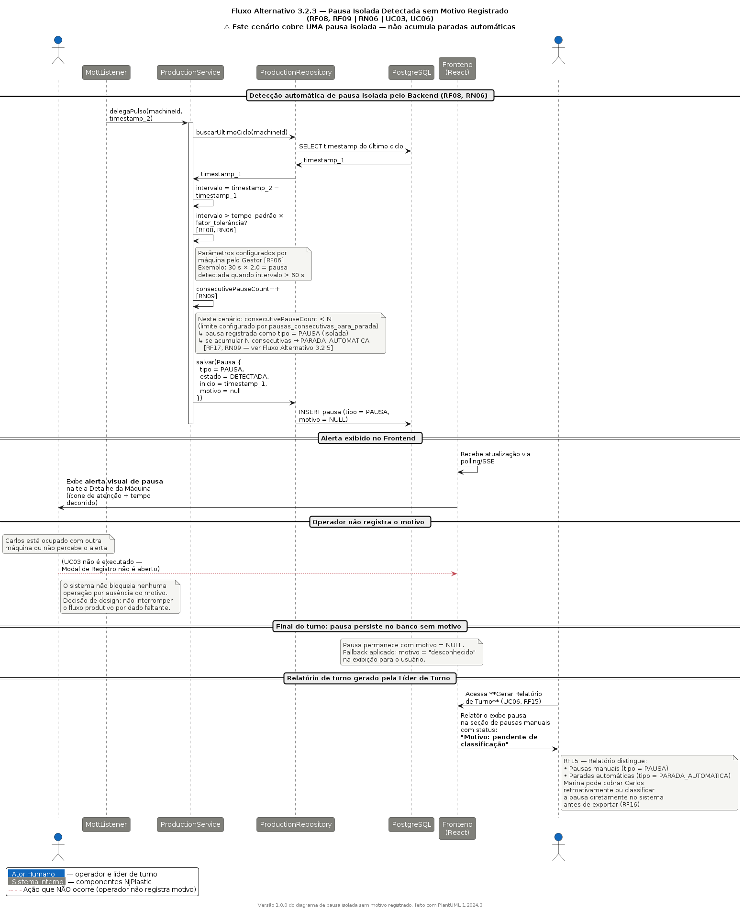
<p align="center"><em>Figura 15. Fluxo alternativo 3.2.3: pausa isolada detectada pelo threshold (RN06) sem registro de motivo pelo operador — pausa persiste com motivo = desconhecido e aparece no relatório como "pendente de classificação". Distinção com PARADA_AUTOMATICA indicada no diagrama.</em></p>

O comportamento esperado é:
- O sistema **não bloqueia** nenhuma operação por ausência do motivo — decisão de design que preserva a continuidade produtiva;
- A pausa fica persistida com `tipo = PAUSA` e `motivo = null`, exibida como _"pendente de classificação"_ no relatório de turno, **na seção de pausas manuais** (UC06, RF15);
- Se N pausas consecutivas se acumularem sem pulso intermediário, o sistema escalará automaticamente para `PARADA_AUTOMATICA` (RF17, RN09 — ver §3.2.5);
- A líder de turno pode cobrar a regularização retroativamente ou classificar a pausa antes de exportar o relatório (RF16).

### 3.2.4. Falha de Sincronização com _ERP_ (RN08, RF14)

Ramifica na etapa de sincronização periódica do fluxo principal (passo 5) quando o _ERP_ está indisponível, ocorre _timeout_ de conexão ou a credencial _JDBC_ expirou.

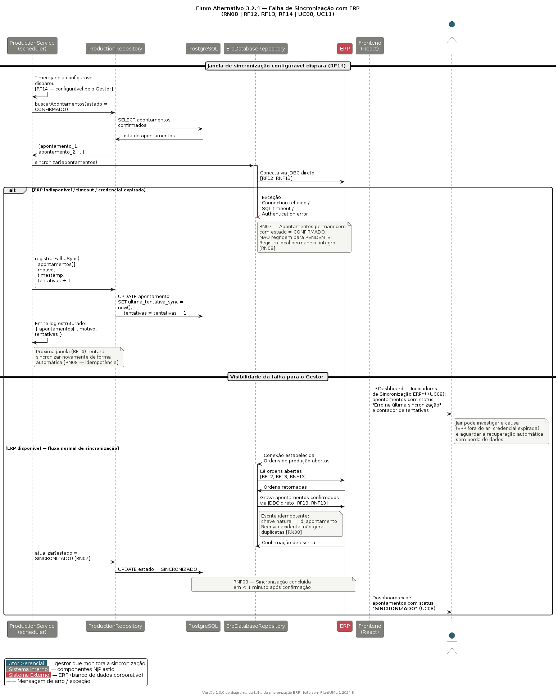
<p align="center"><em>Figura 16. Fluxo alternativo 3.2.4: ErpDatabaseRepository lança exceção → apontamentos permanecem CONFIRMADOS (RN07) → retry idempotente na próxima janela (RN08) → visibilidade da falha via UC08.</em></p>

O comportamento esperado é:
- O `ErpDatabaseRepository` lança exceção; apontamentos permanecem _confirmados_ — **não regridem** de estado (RN07), registro local permanece íntegro (RN08);
- A falha é registrada com contador de tentativas e _timestamp_; a próxima janela configurável (RF14) tenta novamente;
- A escrita no _ERP_ é idempotente pela chave `id_apontamento`, evitando duplicatas em caso de reenvio (RN08);
- O gestor visualiza o status _"Erro na última sincronização"_ com contador de tentativas via UC08 — indicador de observabilidade da camada de integração.

### 3.2.5. Classificação Automática como Parada e Edição da Mensagem (RF17–RF20, RN09–RN12)

Ramifica no passo 3 do fluxo principal quando o contador de pausas consecutivas atinge o limite configurado (`pausas_consecutivas_para_parada`). Este cenário cobre todo o ciclo da parada automática: criação, exibição, edição auditada da mensagem e retomada automática.

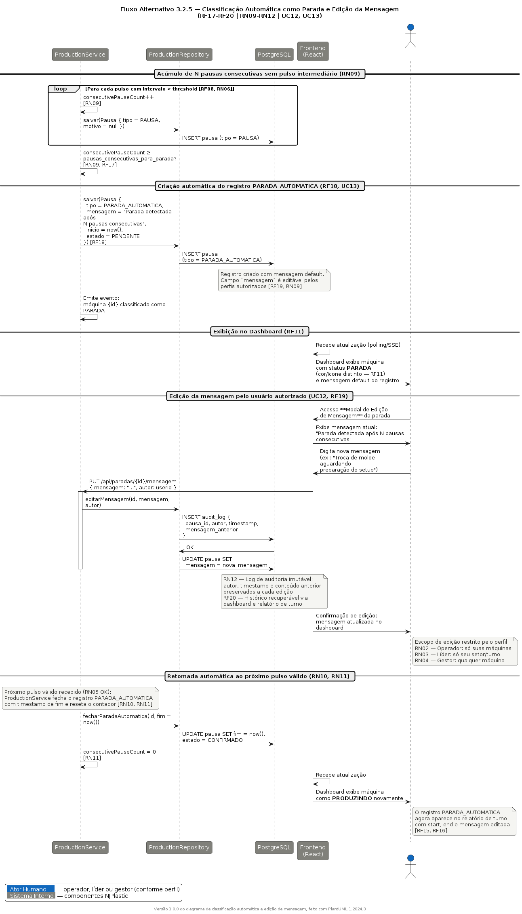
<p align="center"><em>Figura 17. Fluxo alternativo 3.2.5: N pausas consecutivas → criação automática de PARADA_AUTOMATICA (UC13, RF17–RF18) → exibição no dashboard com ícone distinto (RF11) → edição de mensagem com log de auditoria (UC12, RF19–RF20, RN12) → retomada automática ao próximo pulso válido (RN10, RN11).</em></p>

O comportamento esperado é:
- Ao acumular N pausas consecutivas (RN09), o `ProductionService` executa UC13: cria registro `Pausa { tipo = PARADA_AUTOMATICA, mensagem = "Parada detectada após N pausas consecutivas", inicio = now() }` (RF18);
- O _dashboard_ exibe a máquina em estado _PARADA_ com cor e ícone distintos (RF11); a mensagem _default_ é imediatamente visível;
- Qualquer usuário autorizado (Operador — RN02, Líder — RN03, Gestor — RN04) pode editar a mensagem via UC12 (RF19); cada edição gera entrada imutável no log de auditoria com autor, _timestamp_ e conteúdo anterior (RN12, RF20);
- Ao receber o próximo pulso válido (RN05 OK), o registro é fechado com _timestamp_ de fim e o estado da máquina retorna automaticamente a _PRODUZINDO_ (RN10); o contador é resetado (RN11);
- O registro fechado aparece no relatório de turno na seção de **paradas automáticas**, com mensagem atual e histórico de edições (RF15, RF16).

# 4. Mockups e Experiência do Usuário (UX)

Esta seção apresenta, em telas concretas, os requisitos funcionais da [Seção 2](#2-engenharia-de-requisitos) e as jornadas de _persona_ da [Seção 3.1.3](#313-jornadas-de-navegação-por-persona). Os _mockups_ foram feitos via Figma, seguindo integralmente a paleta documentada em [4.5](#45-identidade-visual-e-paleta-de-cores) — _Cobalt_ para ações primárias, _Cinnabar_ para eventos críticos (`PARADA_AUTOMATICA`, falhas de _ERP_), _Teal Deep_ para navegação lateral e _Bone_ como _surface_ de _cards_ e fundo geral. Onze telas principais e dois _modais_ cobrem o MVP; pequenas variações por _persona_ (escopo RN02–RN04) — em especial no _modal_ de edição de mensagem de `PARADA_AUTOMATICA` — são apresentadas lado a lado quando relevantes.

## 4.1. Fluxo de Navegação

O fluxo de navegação é descrito **por tipo de usuário**, refletindo o escopo de acesso definido pelas regras RN02–RN04 e os casos de uso da [Seção 2.2](#22-casos-de-uso-principais). Cada _persona_ percorre um subconjunto distinto de telas — os fluxogramas completos com pontos de bifurcação (pausa isolada, parada automática, falhas) já foram apresentados em [Seção 3.1.3](#313-jornadas-de-navegação-por-persona) como Figura 10 (Carlos), Figura 11 (Marina) e Figura 12 (Jair); as tabelas abaixo consolidam a sequência de telas reais que cada perfil utiliza no MVP.

**Carlos — Operador de Injetora** (referência visual: Figura 10 em [3.1.3](#313-jornadas-de-navegação-por-persona))

| Passo | Tela | UCs | RNs / RFs |
|-------|------|-----|------------|
| 1 | _Login_ ([4.2.1](#421-login)) | UC01 | RN01, RNF06, RNF07 |
| 2 | _Dashboard_ do Operador ([4.2.2](#422-dashboard-do-operador-carlos)) | UC02 | RN02, RF11, RNF09 |
| 3a (pausa isolada) | _Modal_ Registrar Pausa ([4.2.9](#429-modal-registrar-pausa-manual)) | UC03 | RF09, RN06 |
| 3b (parada automática) | _Modal_ Editar Mensagem da Parada — variante Operador ([4.2.10](#4210-modal-editar-mensagem-de-parada-automática)) | UC12 | RF19, RN12 |
| 4 (opcional) | Detalhe da Máquina ([4.2.4](#424-detalhe-da-máquina)) | UC02 (escopo RN02) | RF11 |

**Marina — Líder de Turno** (referência visual: Figura 11 em [3.1.3](#313-jornadas-de-navegação-por-persona))

| Passo | Tela | UCs | RNs / RFs |
|-------|------|-----|------------|
| 1 | _Login_ ([4.2.1](#421-login)) | UC01 | RN01 |
| 2 | _Dashboard_ de Chão de Fábrica ([4.2.3](#423-dashboard-de-chão-de-fábrica-marina-e-jair)) | UC02, UC04 | RN03, RF11 |
| 3 | Detalhe da Máquina ([4.2.4](#424-detalhe-da-máquina)) — invoca _Modal_ Editar Mensagem variante Líder/Gestor ([4.2.10](#4210-modal-editar-mensagem-de-parada-automática)) | UC05, UC12 | RF11, RF19, RN12 |
| 4 | Ordens de Produção ([4.2.5](#425-ordens-de-produção)) | UC05, UC11 | RF12, RF13 |
| 5 | Relatórios ([4.2.6](#426-relatórios)) | UC06 | RF15, RF16, RF20 |

**Jair — Gestor / Sócio-Proprietário** (referência visual: Figura 12 em [3.1.3](#313-jornadas-de-navegação-por-persona))

| Passo | Tela | UCs | RNs / RFs |
|-------|------|-----|------------|
| 1 | _Login_ ([4.2.1](#421-login)) | UC01 | RN01 |
| 2 | _Dashboard_ de Chão de Fábrica ([4.2.3](#423-dashboard-de-chão-de-fábrica-marina-e-jair)) | UC02, UC04, UC07 | RN04, RF10, RF11 |
| 3 | Integração ERP ([4.2.8](#428-integração-erp)) | UC08 | RF12, RF13, RF14, RN07, RN08 |
| 4 | Usuários e Perfis ([4.2.7](#427-usuários-e-perfis)) | UC09 | RF04, RF05 |
| 5 | Cadastro de Máquinas ([4.2.11](#4211-cadastro-de-máquinas-administração)) | parte de UC09 (admin) | RF06, RN04, RN06, RN09 |
| 6 | Relatórios e Detalhe da Máquina ([4.2.4](#424-detalhe-da-máquina) e [4.2.6](#426-relatórios)) — invoca _Modal_ Editar Mensagem variante Líder/Gestor ([4.2.10](#4210-modal-editar-mensagem-de-parada-automática)) | UC05, UC06, UC12 | RF15, RF19, RF20 |

## 4.2. Wireframes ou Mockups das Telas

Os _mockups_ a seguir refletem a versão V1 das telas, sendo cada tela apresentada com a finalidade, as _personas_ que a acessam, os casos de uso e requisitos funcionais cobertos, e as ações principais disponíveis. As telas com rolagem vertical são apresentadas em duas figuras consecutivas (_Part1_ — topo e _Part2_ — rolagem) para preservar a fidelidade do protótipo.

### 4.2.1. Login

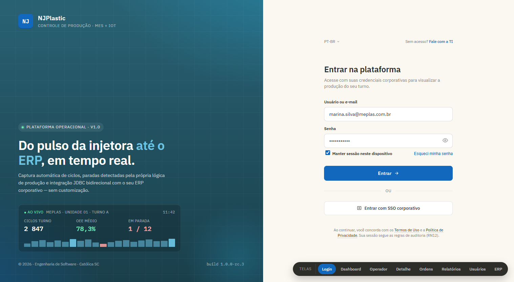
<p align="center"><em>Figura 19. Tela de Login (UC01) — coluna esquerda em Teal Deep com proposta de valor da plataforma; coluna direita em Bone com formulário de autenticação.</em></p>

- **Propósito:** Autenticar Operador, Líder de Turno ou Gestor com credenciais corporativas, ponto de entrada único do sistema (RN01);
- **Acessada por:** Carlos, Marina e Jair (todas as _personas_);
- **UCs / RFs cobertos:** UC01; RF03; RN01, RNF06, RNF07;
- **Ações principais:**
  - Informar usuário (e-mail ou matrícula) e senha;
  - Marcar opção _manter sessão neste dispositivo_;
  - Acionar _esqueci minha senha_ — fluxo de recuperação por _e-mail_;
  - Acionar _entrar com SSO corporativo_ (futuro, fora do MVP);
  - Submeter via botão "Entrar" (_Cobalt_ — `colorPrimary`).

### 4.2.2. Dashboard do Operador (Carlos)

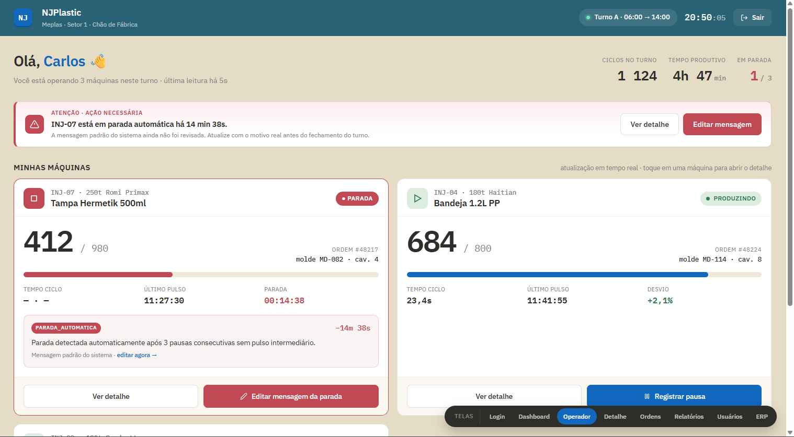
<p align="center"><em>Figura 20a. Dashboard do Operador (UC02) — topo: saudação personalizada, contadores de turno e banner de ação necessária para PARADA_AUTOMATICA ainda não revisada.</em></p>

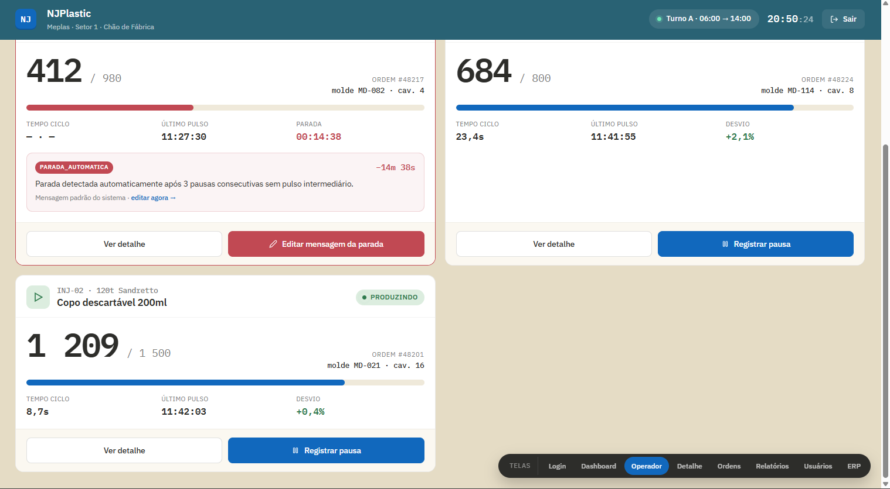
<p align="center"><em>Figura 20b. Dashboard do Operador (UC02) — rolagem: cards de cada máquina atribuída ao turno, com contagem de ciclos, status visual (PRODUZINDO / PARADA) e ações inline.</em></p>

- **Propósito:** _Dashboard_ simplificado e direto ao ponto, otimizado para Carlos acompanhar apenas as máquinas do seu turno (RN02). Diferente de [4.2.3](#423-dashboard-de-chão-de-fábrica-marina-e-jair), **não possui _sider_ lateral** — escolha alinhada a RNF09 (interpretável sem treinamento formal) e ao perfil de "nível técnico baixo" definido em [1.4](#14-público-alvo);
- **Acessada por:** Carlos (Operador), escopo RN02;
- **UCs / RFs cobertos:** UC02, UC03 (entrada via "Registrar pausa"), UC12 (entrada via "Editar mensagem"); RF11, RF19;
- **Ações principais:**
  - Visualizar contagem em tempo real de ciclos por máquina, ordem em execução, molde e cavidades ativas;
  - Identificar visualmente máquinas em estado _PARADA_ por _Cinnabar_ no _badge_ e na barra de progresso (RF11, RN09);
  - Acionar "Registrar pausa" (_Cobalt_) — abre [_Modal_ Registrar Pausa Manual](#429-modal-registrar-pausa-manual) para UC03;
  - Acionar "Editar mensagem da parada" (_Cinnabar_) — abre [_Modal_ Editar Mensagem da Parada — variante Operador](#4210-modal-editar-mensagem-de-parada-automática) para UC12;
  - Acionar "Ver detalhe" — navega para [4.2.4](#424-detalhe-da-máquina) (escopo restrito a RN02).

### 4.2.3. Dashboard de Chão de Fábrica (Marina e Jair)

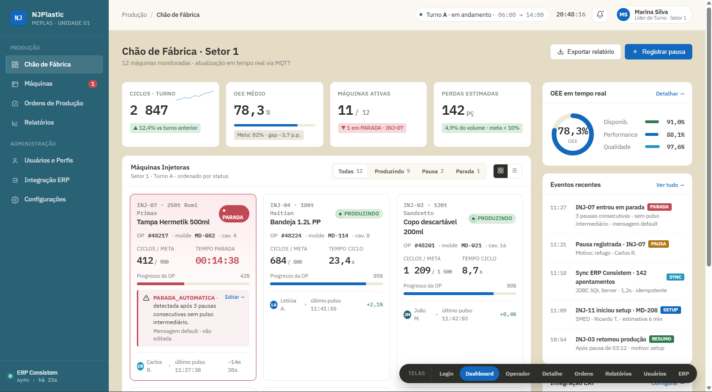
<p align="center"><em>Figura 21a. Dashboard de Chão de Fábrica (UC04, UC07) — topo: KPIs consolidados do setor (ciclos do turno, OEE, máquinas ativas, perdas), filtro por seção e medidor radial de OEE em tempo real.</em></p>

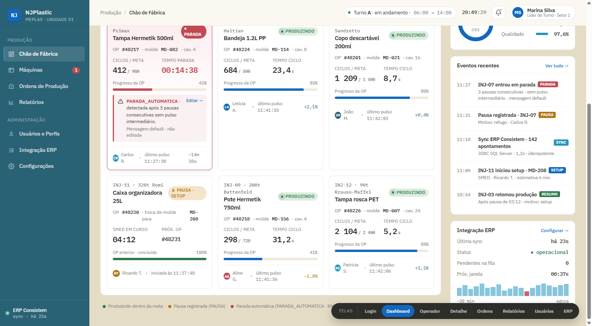
<p align="center"><em>Figura 21b. Dashboard de Chão de Fábrica (UC04) — rolagem: grade completa de máquinas do setor, eventos recentes e indicador de saúde da integração ERP.</em></p>

- **Propósito:** Visão consolidada de **todas** as máquinas do setor (Marina, escopo RN03) ou do _deployment_ (Jair, escopo RN04), com KPIs do turno, _OEE_ por máquina e eventos recentes. _Sider_ lateral completo com acesso a Máquinas, Ordens, Relatórios, Usuários e Integração ERP;
- **Acessada por:** Marina (Líder de Turno, RN03) e Jair (Gestor, RN04);
- **UCs / RFs cobertos:** UC02, UC04, UC07; RF10, RF11;
- **Ações principais:**
  - Filtrar por setor, turno e estado (Todas / Produzindo / Paradas);
  - Clicar em _card_ de máquina — navega para [4.2.4](#424-detalhe-da-máquina);
  - Acionar "Exportar resumo" — gera arquivo do estado atual do _dashboard_;
  - Acionar "Registrar evento" — registro manual de ocorrência avulsa não vinculada a máquina;
  - Acompanhar painel "Integração ERP" (saúde da sincronização, atalho para [4.2.8](#428-integração-erp)).

### 4.2.4. Detalhe da Máquina

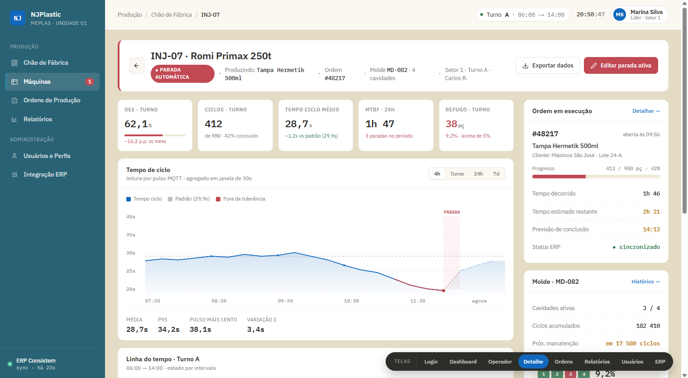
<p align="center"><em>Figura 22a. Detalhe da Máquina (UC05, UC12) — topo: identificação, badge PARADA_AUTOMATICA em Cinnabar, KPIs de turno (OEE, ciclos, tempo de ciclo médio, MTBF, refugo), gráfico de tempo de ciclo agregado em janela de 30s com banda de tolerância.</em></p>

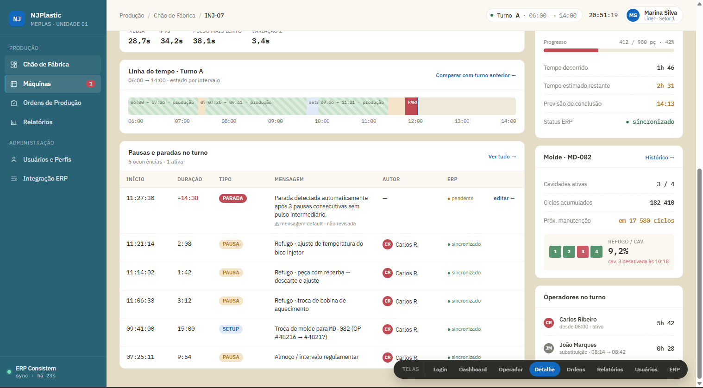
<p align="center"><em>Figura 22b. Detalhe da Máquina — rolagem: linha do tempo do turno com setups, pausas e PARADA; tabela de pausas e paradas no turno (RF15, RF20); ficha do molde com cavidades ativas e operadores no turno.</em></p>

- **Propósito:** Visão profunda de uma máquina específica, com histórico de ciclos, lista de pausas / paradas, mensagem editável da `PARADA_AUTOMATICA` ativa, dados do molde e operadores que passaram pelo turno;
- **Acessada por:** Carlos (escopo RN02 — apenas máquinas do seu turno), Marina (RN03), Jair (RN04);
- **UCs / RFs cobertos:** UC02, UC05, UC12; RF11, RF15, RF19, RF20; RN09, RN12;
- **Ações principais:**
  - Acionar "Editar parada ativa" (_Cinnabar_) — abre [_Modal_ Editar Mensagem da Parada](#4210-modal-editar-mensagem-de-parada-automática) para UC12;
  - Selecionar janela temporal do gráfico (4h / Turno / 24h / 7d);
  - Inspecionar lista de pausas e paradas com motivo, autor da última edição (RF20) e _timestamp_;
  - Acionar "Exportar dados" — exporta CSV do turno corrente;
  - Acionar "Detalhar" da ordem em execução — navega para [4.2.5](#425-ordens-de-produção).

### 4.2.5. Ordens de Produção

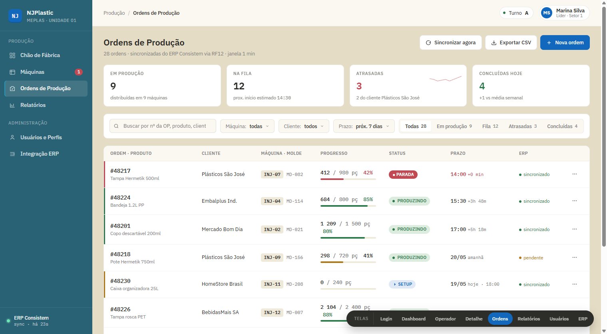
<p align="center"><em>Figura 23a. Ordens de Produção — topo: KPIs (em produção, na fila, atrasadas, concluídas hoje), filtros e tabela de ordens com progresso por OP.</em></p>

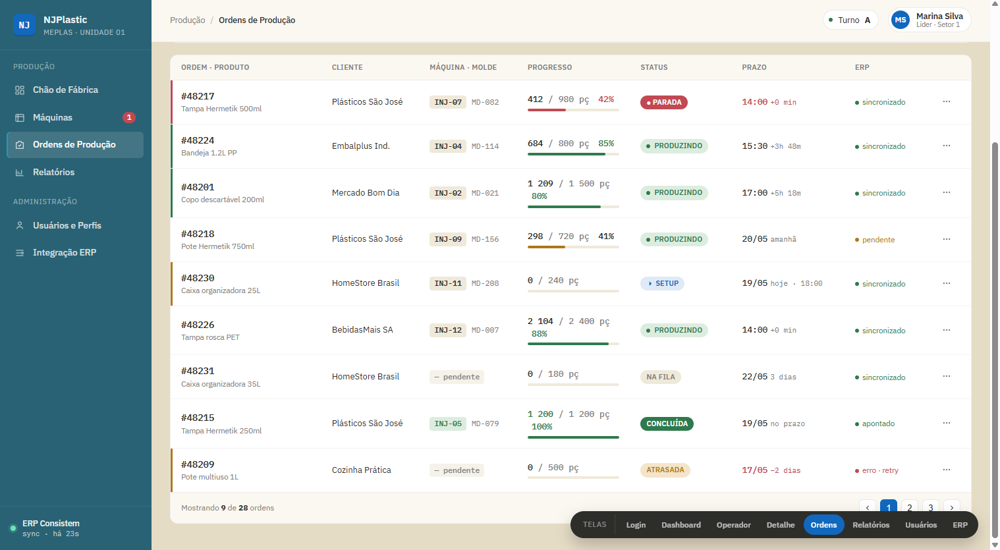
<p align="center"><em>Figura 23b. Ordens de Produção — rolagem: linhas adicionais com estados PARADA, SETUP, NA FILA, CONCLUÍDA e ATRASADA; status de sincronização ERP por linha (sincronizado, pendente, erro – retry).</em></p>

- **Propósito:** Listagem operacional das ordens lidas e gravadas no _ERP_ corporativo (RF13, RF14), permitindo cruzar produção real com ordens cadastradas. Cada linha exibe progresso, máquina, molde, prazo e _status_ ERP individual;
- **Acessada por:** Marina (RN03 — ordens do seu setor), Jair (RN04 — visão global);
- **UCs / RFs cobertos:** UC05 (suporte ao histórico), UC11 (visibilidade da sincronização); RF12, RF13, RF14; RN07, RN08;
- **Ações principais:**
  - Filtrar por máquina, cliente, prazo e _status_ (Todas / Em produção / Atrasadas / Concluídas);
  - Acionar "Sincronizar agora" — força janela de sincronização imediata (RF14);
  - Acionar "+ Nova ordem" (_Cobalt_) — formulário de criação manual de ordem (escopo Marina/Jair);
  - Acionar "Exportar CSV" — gera relatório consolidado de ordens;
  - Clicar em uma OP — abre detalhe da ordem com apontamentos vinculados.

### 4.2.6. Relatórios

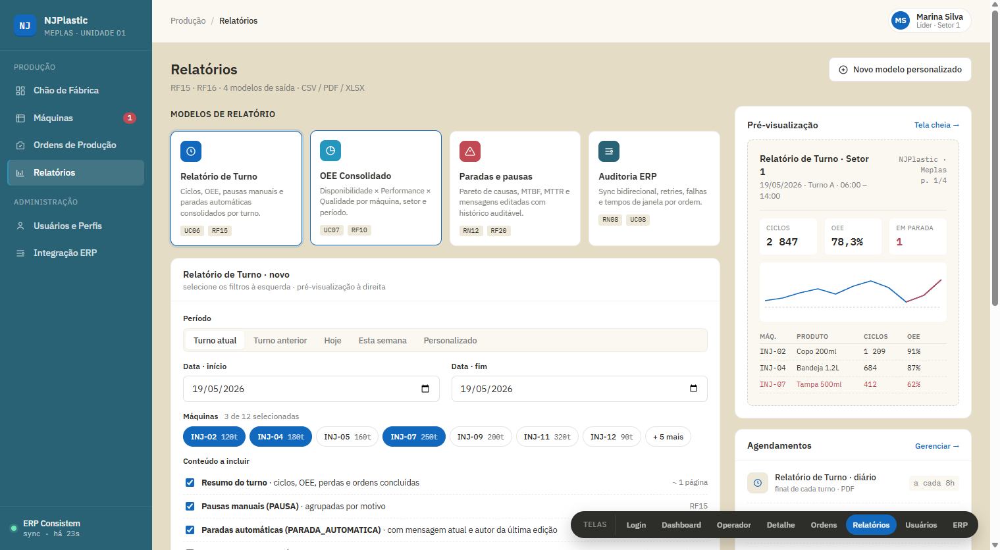
<p align="center"><em>Figura 24a. Relatórios (UC06) — topo: modelos pré-prontos (Turno, OEE Consolidado, Paradas e Pausas, Auditoria ERP), formulário de configuração do relatório, pré-visualização ao vivo e cards de agendamentos.</em></p>

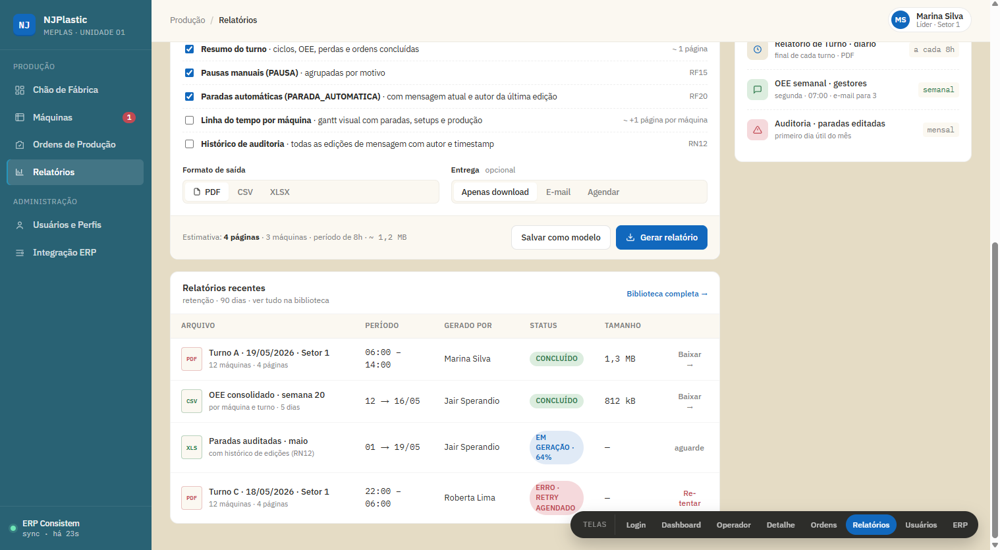
<p align="center"><em>Figura 24b. Relatórios — rolagem: lista de seções inclusas (resumo, pausas manuais, paradas automáticas com mensagem atual e autor da última edição — RF20, linha do tempo, histórico de auditoria — RN12) e biblioteca de relatórios recentes com status (concluído, em geração, erro – retry agendado).</em></p>

- **Propósito:** Geração, exportação e agendamento de relatórios consolidados — turno, _OEE_, paradas, auditoria. Cada relatório lista pausas manuais (`tipo = PAUSA`) e paradas automáticas (`tipo = PARADA_AUTOMATICA`) em seções separadas, com mensagem atual e autor da última edição (RF15, RF20);
- **Acessada por:** Marina (escopo RN03), Jair (escopo RN04);
- **UCs / RFs cobertos:** UC06; RF15, RF16, RF20; RN12;
- **Ações principais:**
  - Selecionar modelo (Turno, OEE, Paradas, Auditoria ERP) ou _Novo modelo personalizado_;
  - Ajustar período, turno, setor e seções inclusas via _checkbox_;
  - Escolher formato de saída (PDF / CSV / XLSX) e modo de entrega (Apenas _download_ / _E-mail_ / Agendar);
  - Acionar "Gerar relatório" (_Cobalt_) — relatório passa a estado _em geração_ e entra na lista de _Relatórios recentes_;
  - Acessar _biblioteca completa_ para histórico (retenção 90 dias).

### 4.2.7. Usuários e Perfis

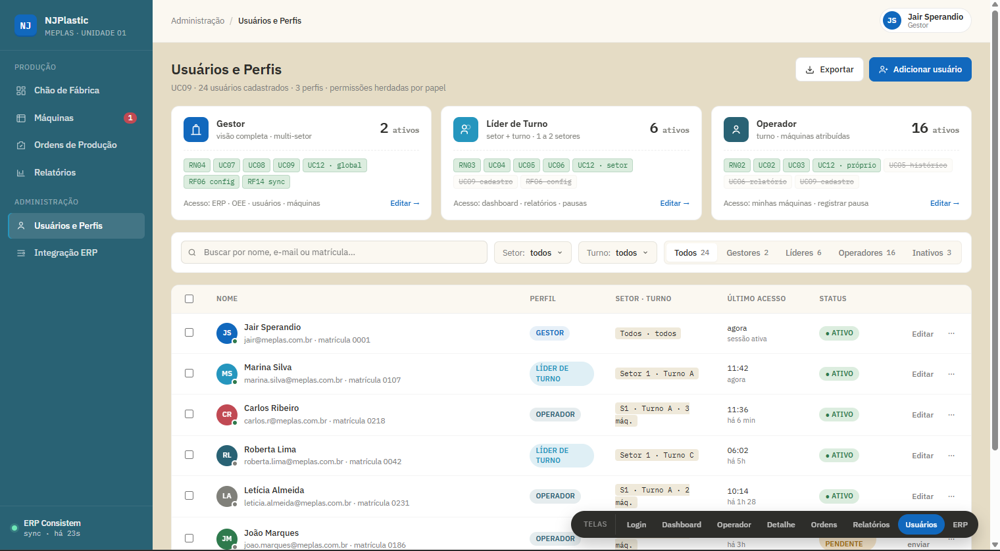
<p align="center"><em>Figura 25a. Usuários e Perfis (UC09) — topo: cards dos três perfis (Gestor, Líder de Turno, Operador) com lista de RNs/UCs herdados, e tabela paginada de usuários cadastrados com perfil, setor/turno e status.</em></p>

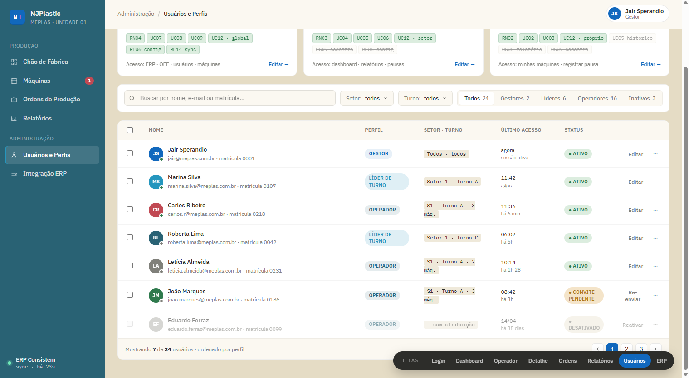
<p align="center"><em>Figura 25b. Usuários e Perfis — rolagem: linhas adicionais com status ATIVO, CONVITE PENDENTE e DESATIVADO; ações de Editar, Reativar e Reenviar convite por linha.</em></p>

- **Propósito:** Administração de usuários — cadastrar pessoa nova, atribuir perfil (Gestor / Líder de Turno / Operador), vincular a setor / turno e gerenciar ciclo de vida (ativo, convite pendente, desativado);
- **Acessada por:** Jair (Gestor — RN04, exclusivo);
- **UCs / RFs cobertos:** UC09; RF04, RF05;
- **Ações principais:**
  - Acionar "+ Adicionar usuário" (_Cobalt_) — abre formulário de cadastro e envia convite por _e-mail_;
  - Filtrar por setor, turno e perfil (Todos / Gestores / Líderes / Operadores / Inativos);
  - Editar permissões herdadas por perfil — atalho "Editar →" no _card_ de cada perfil;
  - Acionar "Reenviar" em convites pendentes ou "Reativar" em usuários desativados;
  - Exportar lista completa de usuários e perfis para auditoria.

### 4.2.8. Integração ERP

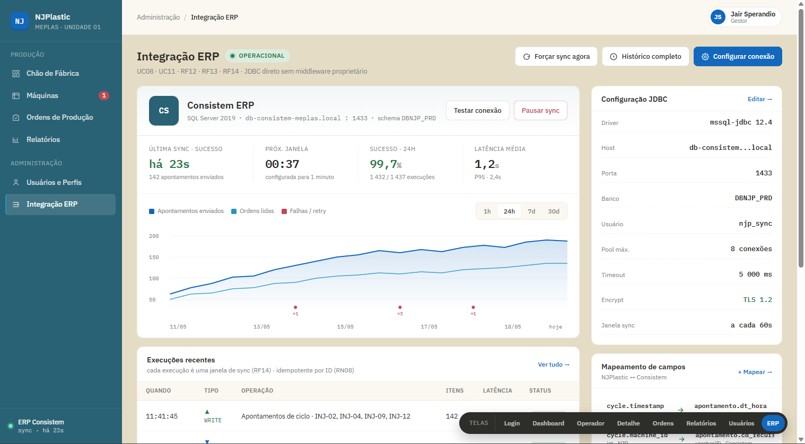
<p align="center"><em>Figura 26a. Integração ERP (UC08) — topo: status OPERACIONAL, KPIs de sincronização (última sync, próxima janela, taxa de sucesso 24h, latência média), gráfico de apontamentos enviados / ordens lidas / falhas, e painel JDBC com driver, host, porta, banco e janela de sync.</em></p>

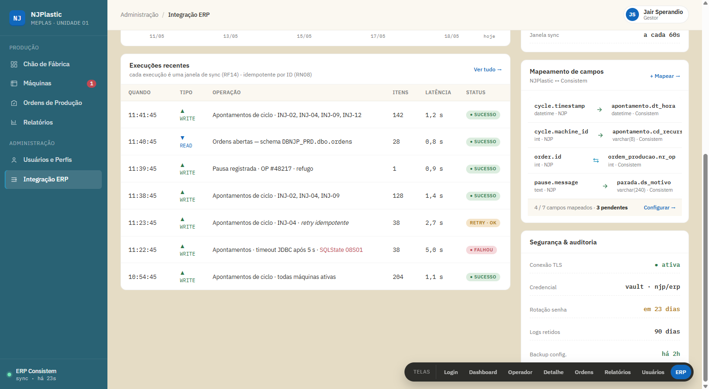
<p align="center"><em>Figura 26b. Integração ERP — rolagem: log de execuções recentes idempotente por ID (RN08) com tipo WRITE/READ, operação, latência e status (sucesso, retry – ok, falhou); mapeamento de campos NJPlastic ↔ ERP; bloco de segurança e auditoria (TLS, credencial em vault, rotação de senha, retenção de logs).</em></p>

- **Propósito:** Monitorar e configurar a integração _JDBC_ direta com o _ERP_ corporativo (sem _middleware_ proprietário, conforme [1.3.1.1](#1311-integração-erp-real-e-bidirecional)). Exibe saúde da conexão, log de execuções idempotentes, mapeamento de campos e parâmetros de segurança;
- **Acessada por:** Jair (Gestor — RN04, exclusivo);
- **UCs / RFs cobertos:** UC08, UC11; RF12, RF13, RF14; RN07, RN08, RNF13;
- **Ações principais:**
  - Acionar "Forçar sync agora" — dispara execução fora da janela configurada;
  - Acionar "Configurar conexão" (_Cobalt_) — abre formulário de credenciais JDBC, janela de sync (RF14) e _pool_;
  - Acionar "Testar conexão" — validação do _datasource_ sem efetuar _writes_;
  - Acionar "Pausar sync" — interrompe execução periódica preservando registros _confirmados_ (RN08);
  - Inspecionar e mapear campos NJPlastic ↔ ERP via painel _Mapeamento de campos_.

### 4.2.9. _Modal_ Registrar Pausa Manual

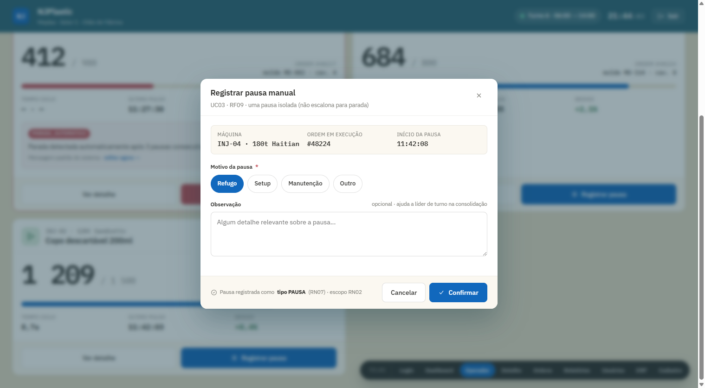
<p align="center"><em>Figura 27. Modal Registrar Pausa Manual (UC03, RF09) — bloco read-only com máquina, ordem em execução e timestamp; seletor de motivo com 4 opções exatas; campo Observação livre opcional; rótulo de escopo "Pausa registrada como tipo PAUSA (RN07) · escopo RN02".</em></p>

- **Propósito:** Registrar o motivo de uma **pausa isolada** (não escalona para `PARADA_AUTOMATICA`), com classificação rápida em quatro motivos pré-definidos. O _timestamp_ de início da pausa é pré-preenchido a partir da detecção automática (RF08, RN06);
- **Acessada por:** Carlos (Operador, escopo RN02), invocável a partir de [4.2.2](#422-dashboard-do-operador-carlos) ou [4.2.4](#424-detalhe-da-máquina);
- **UCs / RFs cobertos:** UC03; RF09; RN02, RN06, RN07;
- **Ações principais:**
  - Conferir bloco _read-only_ — Máquina (ID + tonelagem/modelo), Ordem em execução, Início da pausa;
  - Selecionar motivo entre **Refugo** (default em _Cobalt_), **Setup**, **Manutenção** ou **Outro** — ao escolher _Outro_, um campo de texto livre aparece dinamicamente;
  - Preencher Observação opcional (auxilia a líder na consolidação do turno);
  - Acionar "Confirmar" (_Cobalt_) — pausa persistida com `tipo = PAUSA` e motivo classificado;
  - Acionar "Cancelar" (_ghost_) — pausa permanece com `motivo = null` e aparece como _pendente de classificação_ no relatório de turno (ver fluxo alternativo §3.2.3).

### 4.2.10. _Modal_ Editar Mensagem de Parada Automática

Este _modal_ é compartilhado pelas três _personas_, mas apresenta variações por escopo (RN02 / RN03 / RN04) — apresentadas abaixo lado a lado. Em todas as variantes, salvar a edição grava uma entrada imutável no log de auditoria (RN12, RF20).

**(a) Variante Operador** (Carlos — escopo RN02)

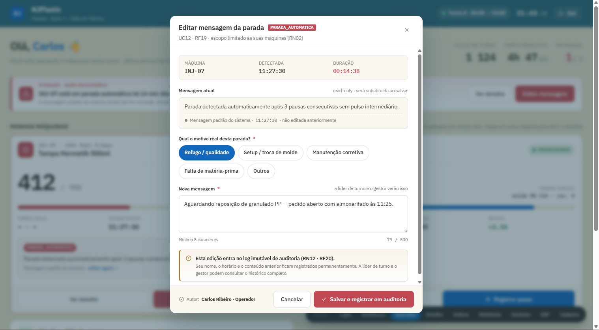
<p align="center"><em>Figura 28a. Modal Editar Mensagem da Parada — variante Operador (UC12, RF19, escopo RN02): mensagem atual read-only com nota "não editada anteriormente"; 5 categorias do motivo real; textarea com limite de 500 caracteres e contador; callout amarelo de auditoria; rodapé identifica o autor da edição.</em></p>

**(b) Variante Líder de Turno / Gestor** (Marina — RN03, Jair — RN04)

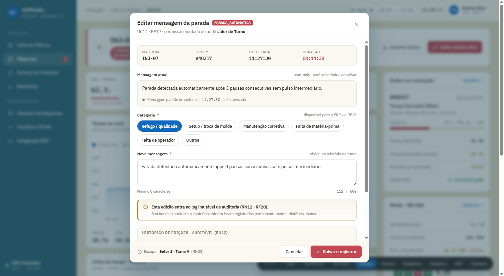
<p align="center"><em>Figura 28b. Modal Editar Mensagem da Parada — variante Líder/Gestor (UC12, RF19): adiciona categoria "Falta de operador" como opção (não disponível ao Operador); cabeçalho indica permissão herdada do perfil; bloco read-only com visibilidade ampliada.</em></p>

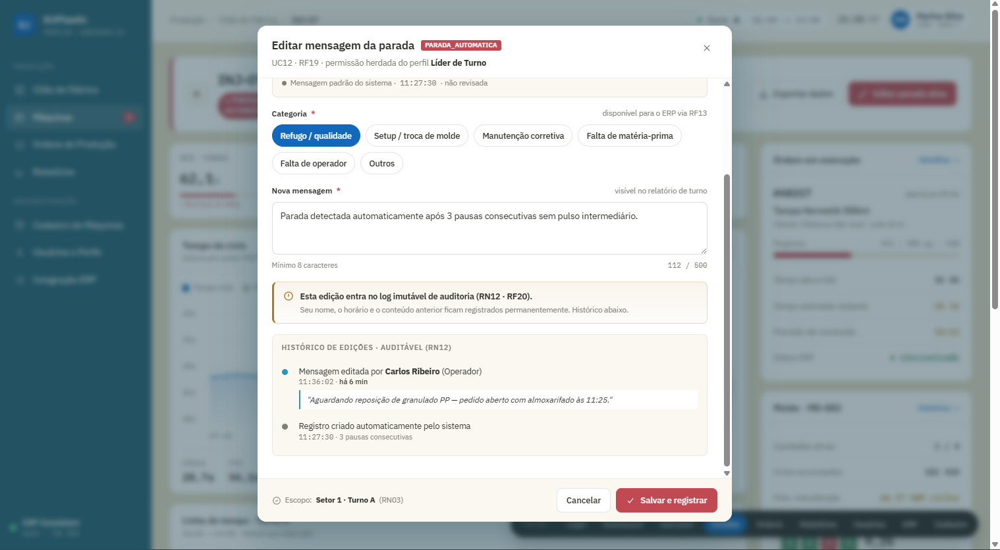
<p align="center"><em>Figura 28c. Modal Editar Mensagem da Parada — bloco "Histórico de edições · auditável (RN12)" com timeline de edições anteriores (autor, timestamp, conteúdo); rótulo de escopo "Setor 1 · Turno A (RN03)" para Marina ou "Visão completa (RN04)" para Jair.</em></p>

- **Propósito:** Editar a mensagem _default_ gerada pelo sistema em uma `PARADA_AUTOMATICA`, classificando a causa real e adicionando contexto operacional. Cada salvamento gera entrada imutável no log de auditoria (RN12, RF20) e dispara recálculo dos relatórios de turno e auditoria;
- **Acessada por:** Carlos (RN02 — apenas suas máquinas), Marina (RN03 — seu setor/turno), Jair (RN04 — visão completa); invocável a partir de [4.2.2](#422-dashboard-do-operador-carlos), [4.2.3](#423-dashboard-de-chão-de-fábrica-marina-e-jair) ou [4.2.4](#424-detalhe-da-máquina);
- **UCs / RFs cobertos:** UC12; RF19, RF20; RN12;
- **Ações principais:**
  - Conferir bloco _read-only_ — Máquina, Detectada, Duração corrente; e a mensagem atual com autor / _timestamp_ da última edição (ou nota "não editada anteriormente · mensagem padrão do sistema");
  - Escolher categoria do motivo real — 5 opções para Carlos (_Refugo / qualidade_, _Setup / troca de molde_, _Manutenção corretiva_, _Falta de matéria-prima_, _Outros_), +1 opção _Falta de operador_ para Marina e Jair;
  - Digitar nova mensagem na _textarea_ (mínimo 8 caracteres, **limite 500**);
  - Ler o _callout_ amarelo de auditoria — "Esta edição entra no log imutável de auditoria (RN12 · RF20). Seu nome, o horário e o conteúdo anterior ficam registrados permanentemente";
  - Acionar "Salvar e registrar em auditoria" (_Cinnabar_) — reforça a criticidade do evento e dispara o _write_ no log; ou "Cancelar" (_ghost_).

### 4.2.11. Cadastro de Máquinas (Administração)

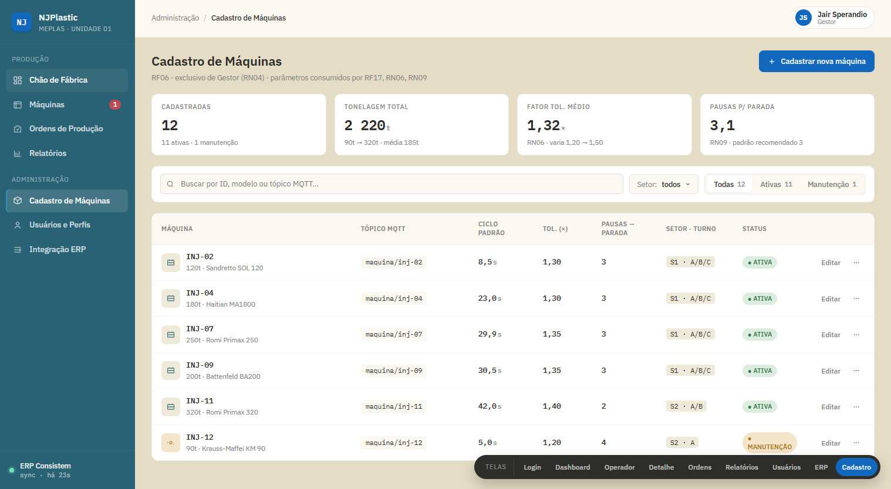
<p align="center"><em>Figura 29. Cadastro de Máquinas (RF06, RN04) — exclusivo de Gestor: 4 KPIs (cadastradas, tonelagem total, fator tol. médio, pausas/parada padrão), filtros por ID/modelo/tópico/setor/status, tabela com parâmetros operacionais.</em></p>

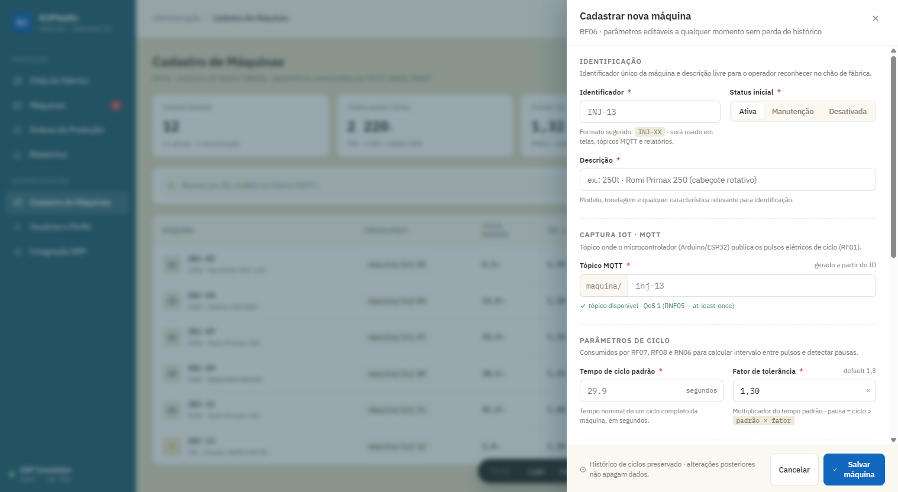
<p align="center"><em>Figura 30a. Drawer Cadastrar/Editar Máquina — topo: seções Identificação (ID, status inicial, descrição), Captura IoT · MQTT (tópico auto-gerado a partir do ID) e Parâmetros de ciclo (tempo padrão + fator de tolerância default 1,30).</em></p>

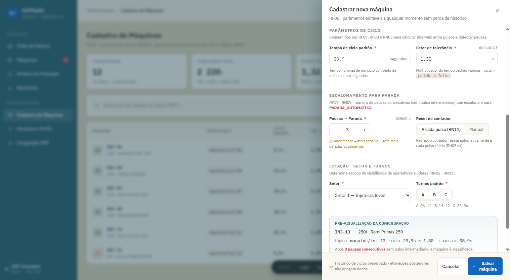
<p align="center"><em>Figura 30b. Drawer Cadastrar/Editar Máquina — rolagem: seção Escalonamento para Parada (stepper pausas_consecutivas_para_parada — RN09, política de reset do contador — RN11) e Lotação (setor + turnos chips A/B/C multi-escolha).</em></p>

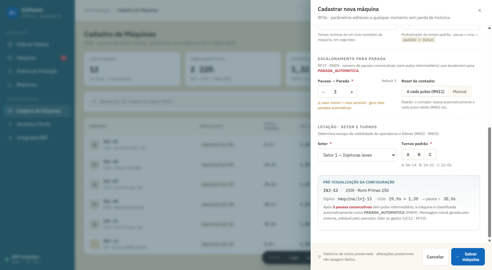
<p align="center"><em>Figura 30c. Drawer Cadastrar/Editar Máquina — pré-visualização ao vivo dos parâmetros calculados: "ciclo 29,9s × 1,30 → pausa > 38,9s · Aplica 3 pausas consecutivas sem pulso intermediário, a máquina é classificada automaticamente como PARADA_AUTOMATICA (RN09)".</em></p>

- **Propósito:** Cadastrar e editar máquinas com os parâmetros consumidos por RF17, RN06 e RN09 — `pausas_consecutivas_para_parada`, fator de tolerância e tempo de ciclo padrão. Edições posteriores aos parâmetros não apagam dados de ciclos já registrados (histórico preservado);
- **Acessada por:** Jair (Gestor — RN04, exclusivo). O _sider_ ganha um item "Cadastro de Máquinas" no grupo _Administração_, posicionado entre _Usuários e Perfis_ e _Integração ERP_;
- **UCs / RFs cobertos:** parte de UC09 (administração); RF06; RN04, RN06, RN09, RN11;
- **Ações principais (tela):**
  - Conferir KPIs do parque (cadastradas, tonelagem total, fator tol. médio, pausas/parada padrão);
  - Filtrar por ID / modelo / tópico MQTT, setor e _status_ (Todas / Ativas / Manutenção);
  - Acionar "+ Cadastrar nova máquina" (_Cobalt_) — abre o _drawer_ de cadastro;
  - Acionar "Editar" em uma linha — abre o mesmo _drawer_ pré-preenchido;
  - Inspecionar coluna _Tópico MQTT_ (em mono) para diagnóstico rápido de _broker_.
- **Ações principais (_drawer_ — 560 px lateral):**
  - Seção 1 — **Identificação:** Identificador (INJ-XX, único, usado em tópicos MQTT e relações), Status inicial (Ativa / Manutenção / Desativada), Descrição livre;
  - Seção 2 — **Captura IoT · MQTT:** Tópico MQTT auto-gerado a partir do ID (`maquina/inj-13`), _check_ de disponibilidade, _QoS_ 1 _at-least-once_ (RNF05);
  - Seção 3 — **Parâmetros de ciclo:** Tempo de ciclo padrão (segundos, consumido por RF07, RF08, RN06) + Fator de tolerância (multiplicador, _default_ 1,30);
  - Seção 4 — **Escalonamento para parada:** _stepper_ `pausas_consecutivas_para_parada` (_default_ 3, RN09) + política de Reset do contador (A cada pulso — RN11 / Manual);
  - Seção 5 — **Lotação · Setor e turnos:** Setor + Turnos padrão (chips A / B / C selecionáveis multi-escolha);
  - Conferir a **pré-visualização ao vivo** no rodapé do _drawer_ antes de salvar — exibe o cálculo derivado dos parâmetros (limite de pausa em segundos, regra de classificação como `PARADA_AUTOMATICA`);
  - Acionar "Salvar máquina" (_Cobalt_) ou "Cancelar" (_ghost_).

> **Nota:** Não há _fluxograma_ dedicado a "cadastrar nova máquina" em §4.3 — o caminho é trivial (sider _Administração → Cadastro de Máquinas_ → "+ Cadastrar nova máquina" → preencher _drawer_ → Salvar) e está totalmente coberto pelas Figuras 29 e 30a–c.

## 4.3. Fluxo de Interação do Usuário

Esta subseção detalha quatro fluxos representativos passo-a-passo, cobrindo: registro manual de pausa (UC03 — Carlos), edição _cross-persona_ de mensagem de parada automática (UC12 — Carlos / Marina / Jair), geração e exportação de relatório de turno (UC06 — Marina) e cadastro de usuário (UC09 — Jair). Cada fluxo cita explicitamente as telas envolvidas, os RFs aplicados e as RNs vigentes.

### 4.3.1. Carlos Registra uma Pausa Isolada (UC03)

1. Carlos acessa o sistema e autentica-se em [4.2.1 _Login_](#421-login) — credenciais validadas (RF03, RN01);
2. Sistema redireciona Carlos para [4.2.2 _Dashboard_ do Operador](#422-dashboard-do-operador-carlos), exibindo apenas as máquinas atribuídas ao seu turno (RN02);
3. O _backend_ detecta automaticamente uma pausa em INJ-04 — o intervalo entre dois pulsos excedeu `tempo_padrão × fator_tolerância` (RF08, RN06) — e incrementa o contador de pausas consecutivas;
4. Carlos visualiza no _card_ da INJ-04 o estado _PAUSA_ pendente de classificação;
5. Carlos aciona o botão "Registrar pausa" (_Cobalt_) — abre o [_Modal_ Registrar Pausa Manual](#429-modal-registrar-pausa-manual) (Figura 27);
6. Carlos seleciona o motivo (_Refugo_, _Setup_, _Manutenção_ ou _Outro_ com texto livre) e confirma;
7. Sistema persiste a pausa com `tipo = PAUSA` e motivo informado; emite _toast_ de sucesso; o _card_ da INJ-04 atualiza exibindo o motivo registrado e o relatório de turno (RF15) passa a refletir a classificação.

### 4.3.2. Edição _Cross-Persona_ de Mensagem de Parada Automática (UC12)

A edição da mensagem de uma `PARADA_AUTOMATICA` pode ser disparada por três caminhos distintos, conforme a _persona_. Todos convergem para o mesmo [_Modal_ Editar Mensagem da Parada](#4210-modal-editar-mensagem-de-parada-automática) — Trigger A (Carlos) usa a **variante Operador** (Figura 28a), enquanto Triggers B (Marina) e C (Jair) usam a **variante Líder/Gestor** (Figuras 28b–28c), que exibe o bloco _Histórico de edições_ e habilita a categoria adicional _Falta de operador_. O log imutável de auditoria (RN12, RF20) é gerado em todas as variantes.

**Trigger A — Carlos (Operador, escopo RN02)**
1. Carlos está em [4.2.2 _Dashboard_ do Operador](#422-dashboard-do-operador-carlos);
2. Um banner em destaque no topo sinaliza "INJ-07 está em parada automática há 14 min 38s · A mensagem padrão do sistema ainda não foi revisada";
3. Carlos aciona "Editar mensagem" (_Cinnabar_) — abre o _modal_;
4. Substitui a mensagem _default_ por contexto real (ex.: "Troca de molde MD-082 antecipada por refugo"); confirma;
5. Sistema persiste a nova mensagem, registra autor / _timestamp_ / texto anterior no log imutável (RN12) e fecha o _modal_.

**Trigger B — Marina (Líder de Turno, escopo RN03)**
1. Marina está em [4.2.4 Detalhe da Máquina](#424-detalhe-da-máquina) de uma máquina do seu setor;
2. _Header_ exibe o _badge_ "PARADA_AUTOMATICA" e o botão "Editar parada ativa" (_Cinnabar_);
3. Marina aciona o botão — abre a **variante Líder/Gestor** do _modal_ (Figuras 28b–28c) com a mensagem atual, a categoria adicional _Falta de operador_ e o bloco _Histórico de edições · auditável_ visível;
4. Edita e confirma — log de auditoria é incrementado (RN12); o registro fica visível em [4.2.6 Relatórios](#426-relatórios) na seção _Auditoria_ e na tabela de pausas / paradas de [4.2.4](#424-detalhe-da-máquina).

**Trigger C — Jair (Gestor, escopo RN04)**
1. Jair está em [4.2.3 _Dashboard_ de Chão de Fábrica](#423-dashboard-de-chão-de-fábrica-marina-e-jair) com visão global;
2. Identifica um _card_ vermelho (_Cinnabar_) sinalizando uma `PARADA_AUTOMATICA` em qualquer setor / turno;
3. Clica no _card_ — navega para [4.2.4 Detalhe da Máquina](#424-detalhe-da-máquina);
4. Aciona "Editar parada ativa" — abre a mesma **variante Líder/Gestor** do _modal_ (Figuras 28b–28c) com escopo "Visão completa (RN04)", edita e confirma — auditoria registrada.

### 4.3.3. Marina Gera e Exporta o Relatório de Turno (UC06)

1. Marina autentica-se em [4.2.1 _Login_](#421-login);
2. _Dashboard_ ([4.2.3](#423-dashboard-de-chão-de-fábrica-marina-e-jair)) carrega — Marina aciona "Relatórios" no _sider_ lateral;
3. Em [4.2.6 Relatórios](#426-relatórios), Marina seleciona o modelo "Relatório de Turno";
4. Configura período (turno atual ou personalizado), turno e setor — a pré-visualização lateral atualiza com os KPIs reais (ciclos, OEE, perdas, ordens concluídas);
5. Marca as seções a incluir (_checkboxes_): resumo do turno, pausas manuais (RF15), paradas automáticas com mensagem atual e autor da última edição (RF20), linha do tempo por máquina, histórico de auditoria (RN12);
6. Escolhe formato (PDF / CSV / XLSX) e modo de entrega (Apenas _download_ / _E-mail_ / Agendar);
7. Aciona "Gerar relatório" (_Cobalt_) — o relatório entra na lista de _Relatórios recentes_ com _status_ _em geração_, depois _concluído_, e o arquivo fica disponível para _download_ (RF16);
8. Em caso de falha (ex.: ERP fora durante a consulta), o relatório aparece com _status_ _erro – retry agendado_ — Marina pode reexecutar manualmente.

### 4.3.4. Jair Cadastra Novo Usuário (UC09)

1. Jair autentica-se em [4.2.1 _Login_](#421-login);
2. No _sider_ de [4.2.3](#423-dashboard-de-chão-de-fábrica-marina-e-jair), navega para _Administração → Usuários e Perfis_ ([4.2.7](#427-usuários-e-perfis));
3. Confere a tabela atual (24 usuários, 3 perfis) e aciona "+ Adicionar usuário" (_Cobalt_);
4. Preenche nome, _e-mail_ corporativo, matrícula, perfil (_Gestor_ / _Líder de Turno_ / _Operador_) e — se aplicável — setor e turno padrão;
5. Confirma — sistema envia convite por _e-mail_ com _link_ de definição de senha e cria o registro com _status_ _convite pendente_;
6. A nova linha aparece imediatamente na tabela paginada — Jair pode acionar "Reenviar" se o convite expirar;
7. Ao primeiro _login_ do convidado, o registro transita para _ativo_ e as permissões herdadas do perfil (RF05, RN02–RN04) passam a vigorar imediatamente.

## 4.5. Identidade Visual e Paleta de Cores

A paleta oficial da NJPlastic foi definida em [https://coolors.co/1168bd-2596be-296274-2d2d2a-80807a-c14953-e5dcc5](https://coolors.co/1168bd-2596be-296274-2d2d2a-80807a-c14953-e5dcc5) e será aplicada como base de tema do _Ant Design_ (ver [Seção 5.4](#54-stack-tecnológica)) por meio do `ConfigProvider`. As cores foram escolhidas para transmitir confiabilidade industrial (azul e _teal_), legibilidade em _dashboards_ longos (cinzas neutros) e sinalização clara de eventos críticos como `PARADA_AUTOMATICA` (vermelho).

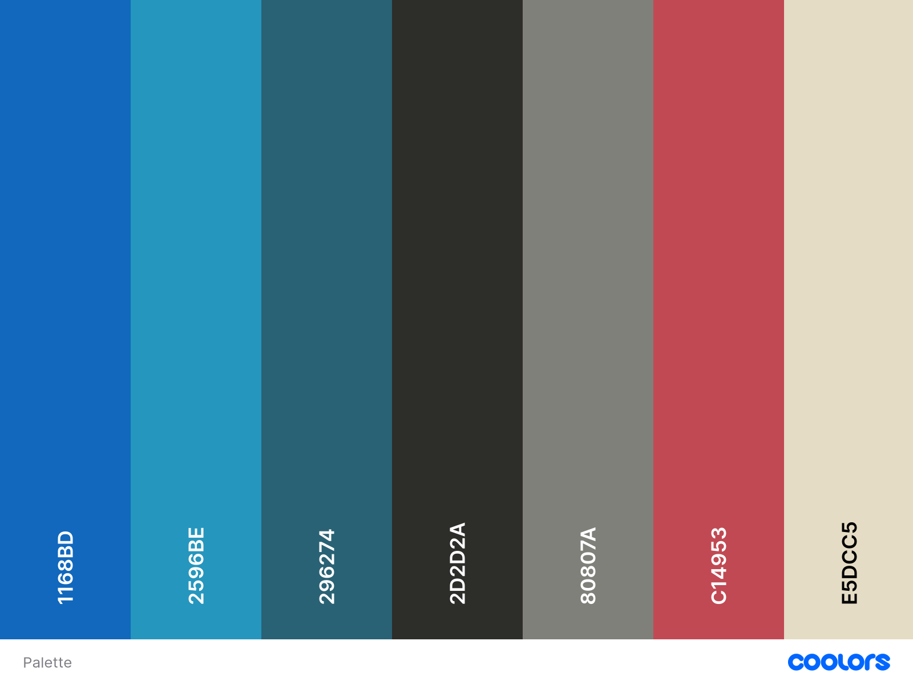
<p align="center"><em>Figura 18. Paleta oficial NJPlastic — Coolors.</em></p>

### 4.5.1. Cores e Aplicação Sugerida

| _Token_ | _Hex_ | Papel UI Sugerido | Mapeamento _Ant Design_ (v5) |
|---------|-------|-------------------|-------------------------------|
| _Cobalt_ | `#1168BD` | Cor primária — botões principais, _links_, _highlights_ do _dashboard_ | `colorPrimary` |
| _Cerulean_ | `#2596BE` | Cor primária clara — estado _hover_, ícones secundários, _info_ | `colorInfo` |
| _Teal Deep_ | `#296274` | _Sider_ lateral, _header_, áreas de navegação | Customização do `Layout.Sider` |
| _Charcoal_ | `#2D2D2A` | Texto principal, ícones em fundos claros | `colorTextBase` |
| _Warm Gray_ | `#80807A` | Texto secundário, _borders_, _disabled_ | `colorTextSecondary`, `colorBorder` |
| _Cinnabar_ | `#C14953` | _Danger_ — estado `PARADA_AUTOMATICA` (RN09), alertas e erros | `colorError` |
| _Bone_ | `#E5DCC5` | Fundo geral, _surfaces_ de _cards_, áreas de conteúdo | `colorBgLayout` |

### 4.5.2. Notas de Aplicação

- A indicação visual de máquinas em `PARADA_AUTOMATICA` (RF11, RN09) usará _Cinnabar_ (`#C14953`) como cor de _badge_ e ícone, garantindo contraste alto contra _Bone_ (`#E5DCC5`);
- O contraste _Cobalt_ × _Bone_ (~4,6:1) e _Charcoal_ × _Bone_ (~13:1) atende ao critério WCAG AA para texto normal;
- Operações destrutivas (_delete_, _cancel_) seguem o _token_ `colorError` da paleta;
- O tema deve ser instanciado uma única vez em `app/layout.tsx` via `<ConfigProvider theme={{ token: { ... } }} />` para evitar _flash_ de tema padrão durante a hidratação do React Server Components.

### 4.5.3. Tipografia

A NJPlastic adota o par tipográfico oficial **IBM Plex Sans** (UI geral) + **IBM Plex Mono** (números, IDs e telemetria) — combinação industrial de alta legibilidade, licença _OFL_ (uso comercial livre) e excelente cobertura latina. Ambas devem ser carregadas via `next/font/google` em `app/layout.tsx` para evitar _layout shift_ durante a hidratação.

| Família | Uso | Exemplos nos _mockups_ |
|---------|-----|-------------------------|
| _IBM Plex Sans_ | Cabeçalhos, _labels_, parágrafos, botões, _badges_, navegação lateral, _breadcrumbs_ | "Cadastro de Máquinas", "Olá, Carlos", "Registrar pausa", "Gerar relatório" |
| _IBM Plex Mono_ | Contadores de ciclo, IDs de máquina/ordem/molde, tópicos _MQTT_, _timestamps_ e durações, valores numéricos em KPIs | "412 / 980", "INJ-07", "#48217", "maquina/inj-04", "11:27:30", "00:14:38" |

Notas de aplicação:
- _IBM Plex Mono_ preserva alinhamento vertical em colunas numéricas de tabelas — exemplificado na tela [Cadastro de Máquinas](#4211-cadastro-de-máquinas-administração), em [Ordens de Produção](#425-ordens-de-produção) e na lista de pausas / paradas em [Detalhe da Máquina](#424-detalhe-da-máquina);
- IDs de máquina, molde e ordem aparecem sempre em _Mono_ para reforçar a leitura técnica e diferenciá-los de texto narrativo;
- Pesos sugeridos: _Sans_ em 400 / 500 / 600 (regular, _medium_, _semibold_), _Mono_ em 400 / 500 — evitar pesos extremos (100 / 200 / 800 / 900) para não comprometer a legibilidade em telas industriais e _displays_ de chão de fábrica;
- O `ConfigProvider` do _Ant Design_ recebe `theme.token.fontFamily = "var(--font-ibm-plex-sans)"`; componentes _Typography_ com `code` ou via classe utilitária customizada usam `var(--font-ibm-plex-mono)`.

# 5. Arquitetura do Sistema

<!-- Esta seção demonstra **como o sistema será construído**. -->

## 5.1. Diagrama C4

<!-- Apresente três níveis. -->

A NJPlastic utiliza os três primeiros níveis do modelo C4 — cada um com propósito e audiência distintos — permitindo que qualquer interessado, do gestor ao desenvolvedor, leia o diagrama no nível de abstração que lhe é útil.

### 5.1.1. Nível 1 — Diagrama de Contexto

<!-- É a **visão macro** do sistema. O foco aqui não é a tecnologia, mas sim como o software se encaixa no ecossistema e no mundo real.

* **Objetivo:** Mostrar o sistema como uma "caixa preta" e suas interações básicas com o ambiente externo.
* **O que incluir:**
    * **Atores:** Diferentes perfis de usuários (Ex: Cliente, Administrador, Operador).
    * **Sistemas Externos:** Softwares legados, serviços de terceiros ou provedores de identidade.
    * **Fluxo de Valor:** Como a informação entra, circula e sai do sistema principal. -->

O diagrama de contexto posiciona a NJPlastic no ecossistema industrial, mostrando quem usa o sistema e com quais sistemas externos ele se comunica. O sistema é tratado como uma única "caixa preta".

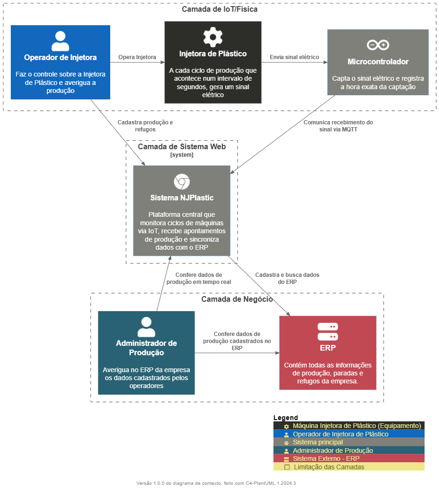
<p align="center"><em>Figura 19. Diagrama de Contexto C4 da NJPlastic: três camadas — IoT/Física (Operador, Injetora, Microcontrolador), Sistema Web (NJPlastic) e Negócio (Administrador de Produção, ERP). Fluxo de valor: pulso elétrico → NJPlastic → ERP corporativo (RF01, RF12–RF14).</em></p>

O diagrama é organizado em três camadas:

- **Camada IoT/Física:** O _Operador de Injetora_ controla a máquina e consulta a produção; a _Injetora de Plástico_ gera um sinal elétrico a cada ciclo; o _Microcontrolador_ (Arduino) captura o pulso e o transmite (RF01);
- **Camada de Sistema Web:** A NJPlastic recebe os pulsos, calcula métricas, persiste os dados e os disponibiliza para os usuários via _dashboard_ web;
- **Camada de Negócio:** O _Administrador de Produção_ (Gestor) consulta dados em tempo real no _dashboard_ e confirma registros no _ERP_ corporativo; a sincronização bidirecional com o ERP (RF12–RF14) encerra o fluxo de valor.

### 5.1.2. Nível 2 — Diagrama de Contêineres

<!-- Neste estágio, damos o primeiro **"zoom"**. Decompomos o sistema em suas unidades de execução independentes (containers).

* **Objetivo:** Apresentar a arquitetura de alto nível e as decisões tecnológicas fundamentais.
* **O que incluir:**
    * **Aplicações Web/Mobile:** Interfaces de usuário (Ex: SPA em React, App Android/iOS).
    * **Serviços de Backend:** Unidades lógicas de processamento (Ex: API Gateway, Microserviços em Node.js ou Go).
    * **Armazenamento:** Persistência de dados (Ex: PostgreSQL, MongoDB, Redis).
    * **Protocolos:** Como os containers se comunicam (Ex: JSON/HTTPS, gRPC, RabbitMQ). -->

O diagrama de contêineres abre a "caixa preta" da NJPlastic e revela as unidades de execução independentes, suas tecnologias e os protocolos de comunicação entre elas.

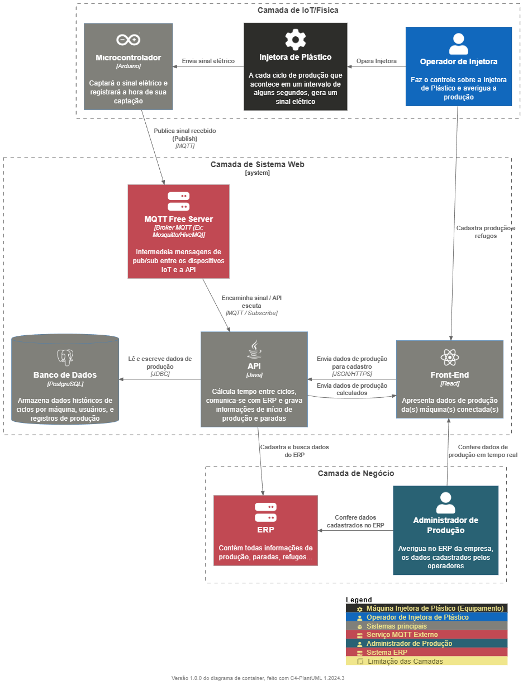
<p align="center"><em>Figura 20. Diagrama de Contêineres C4 da NJPlastic: Microcontrolador (Arduino) → MQTT Broker (Mosquitto) → API Java (Spring Boot) ↔ PostgreSQL; Frontend React ↔ API via JSON/HTTPS; API ↔ ERP via JDBC direto. (RF01, RF02, RF07–RF14, RNF05, RNF06, RNF13).</em></p>

Os contêineres e seus protocolos são:

| Contêiner | Tecnologia | Protocolo de Entrada | Responsabilidade |
|-----------|------------|----------------------|-----------------|
| Microcontrolador | Arduino | — (sinal elétrico da injetora) | Captura o pulso e publica o _timestamp_ via MQTT QoS 1 (RF01, RNF05) |
| _MQTT Broker_ | Mosquitto 2.x | MQTT Publish | Intermedeia mensagens _pub/sub_ entre microcontrolador e API (RF02) |
| API | Java / Spring Boot 4.0.x | MQTT Subscribe + JSON/HTTPS | Calcula ciclos, detecta pausas, sincroniza ERP e expõe _endpoints_ REST (RF07–RF14) |
| Banco de Dados | PostgreSQL 16 | JDBC / JPA | Armazena ciclos, estados de máquina, usuários e auditoria de requisições (RN07) |
| _Frontend_ | React (SPA) | JSON/HTTPS | Exibe _dashboards_ em tempo real por perfil de usuário (RF11, RF15, RF16) |
| ERP | externo (_SQL Server_ / _Oracle_ / _PostgreSQL_) | JDBC direto | Repositório corporativo de produção (RF12–RF14, RNF13) |

Decisões arquiteturais relevantes neste nível:

- **_Broker_ MQTT externo (não embarcado):** O uso de Mosquitto como processo separado permite trocar o _broker_ (por exemplo, por HiveMQ em produção com alta carga) sem alteração na API, facilitando também o teste isolado do microcontrolador;
- **Comunicação _Frontend_ ↔ API via _polling_ ou SSE:** A API não mantém conexão _WebSocket_ persistente, o _frontend_ consulta `/api/producao` periodicamente ou via _Server-Sent Events_, mantendo a latência abaixo de 2 segundos (RNF02) sem aumentar a complexidade do servidor;
- **JDBC direto ao ERP (RNF13):** O acesso ao _ERP_ usa `DriverManager` com _driver_ específico por fornecedor — sem _JPA_, sem mapeamento de entidades — para garantir compatibilidade com _SQL Server_, _Oracle_ e _PostgreSQL_ sem abstração intermediária.

### 5.1.3. Nível 3 — Diagrama de Componentes

<!-- O foco agora é o que acontece **dentro de um único container** (como uma API específica ou um serviço de backend).

* **Objetivo:** Identificar as responsabilidades internas, padrões de código e a organização lógica.
* **O que incluir:**
    * **Estrutura Interna:** Organização das camadas (Ex: Controladores, Serviços, Repositórios e Clientes de API).
    * **Lógica de Negócio:** Componentes que encapsulam as regras específicas do domínio.
    * **Interações:** Como os componentes internos se orquestram para processar e responder a uma requisição. -->

O diagrama de componentes aplica zoom ao contêiner **API (Backend)**, detalhando sua organização interna. Os demais contêineres (_Frontend_, _MQTT Broker_, PostgreSQL e ERP) aparecem como entidades externas para contextualizar as dependências.

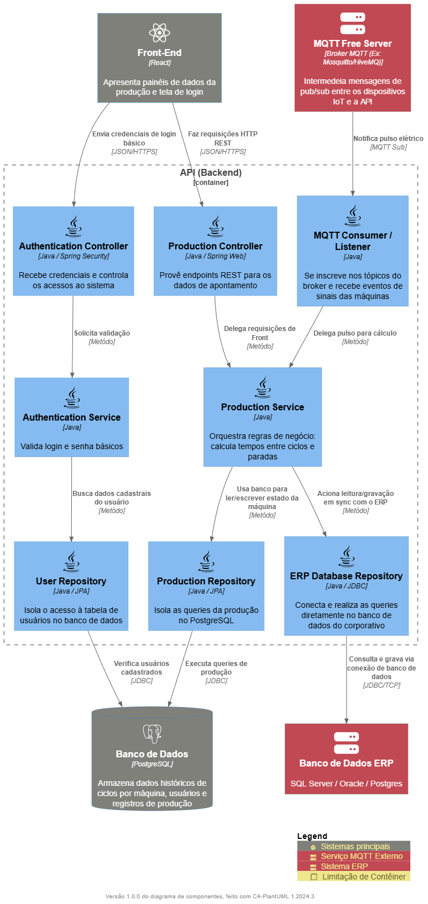
<p align="center"><em>Figura 21. Diagrama de Componentes C4 do Backend NJPlastic: três grupos funcionais — Autenticação (Spring Security + JWT), Produção/MQTT (Paho + ProductionService) e Integração ERP (JDBC direto). Padrão Controller → Service → Repository em todos os grupos (RNF12, RNF13).</em></p>

A API é dividida em três grupos funcionais que seguem o padrão _Controller → Service → Repository_ (RNF12):

**Autenticação (Spring Security + JWT)**
- `AuthenticationController` — Recebe credenciais via `POST /auth/login`, retorna _token_ JWT;
- `AuthenticationService` — Valida _login_ e senha contra o banco; emite _token_ com _claims_ de perfil (RN01–RN04);
- `UserRepository` (JPA) — Isola o acesso à tabela `user` no PostgreSQL (RF03, RF04).

**Auditoria de Requisições**
- `AuditFilter` (`OncePerRequestFilter`) — Intercepta todas as requisições após autenticação; captura método HTTP, _endpoint_, autor (`user_id` do contexto Spring Security), _payload_ de entrada e saída sanitizados (senhas e _tokens_ substituídos por `[REDACTED]`), status HTTP, duração e IP de origem; persiste na tabela `audit_log` (RF20, RN12, RNF08);
- `AuditRepository` (JPA) — Isola o acesso à tabela `audit_log` — inserção _append-only_, sem `UPDATE` ou `DELETE`.

**Produção / MQTT (Eclipse Paho + Spring)**
- `MqttListener` — Subscreve no _broker_ Mosquitto (tópico único `njplastic/pulso`) e delega cada pulso ao `ProductionService` (RF02, RNF05);
- `ProductionController` — Expõe _endpoints_ REST para o _frontend_ (RF11, RF15);
- `ProductionService` — Orquestra toda a lógica de negócio: _lookup_ de `machine` por `machine_code` (RF01), reconstrução de `TIMESTAMPTZ` a partir de `generated_at` (RN05), cálculo de intervalo (RF07), detecção de pausa (RF08, RN06), controle do contador consecutivo (RN09–RN11), transições de estado em `machine_status` (RF17, RF18);
- `ProductionRepository` (JPA) — Isola as _queries_ de `production_cycle` e `machine_status` no PostgreSQL.

**Integração ERP (JDBC direto)**
- `ErpDatabaseRepository` — Única classe que acessa o banco do ERP; usa `DriverManager` e _SQL_ nativo via _driver_ do fornecedor (RF12, RF13, RNF13); sem JPA, sem mapeamento de entidades, sem cache de segundo nível;
- `ErpSyncScheduler` — Agendador Spring (`@Scheduled`) que dispara a sincronização na janela configurável (RF14, RNF03).

O `ErpDatabaseRepository` é propositalmente isolado dos demais repositórios para garantir que uma eventual falha de conexão com o ERP não afete o fluxo produtivo principal — os apontamentos permanecem _confirmados_ e o retry é idempotente (RN08).

---

## 5.2. Modelo de Dados

<!-- Apresente:

- DER (diagrama entidade relacionamento)
- esquema relacional
- modelo de documentos (NoSQL)

Inclua **diagramas do modelo de dados**. -->

O modelo de dados da NJPlastic é integralmente relacional. O _PostgreSQL_ local armazena todos os dados operacionais (ciclos, estados de máquina, usuários, auditoria de requisições); o banco do _ERP_ é acessado via _JDBC_ direto e **não é espelhado localmente** — apenas a tabela `production_order_cache` mantém um _buffer_ de leitura para reduzir o número de _round-trips_ por janela de sincronização.

### 5.2.1. Diagrama Entidade-Relacionamento (DER)

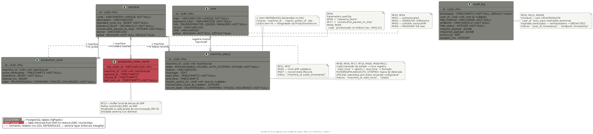
<p align="center"><em>Figura 22. DER da NJPlastic: entidades locais (PostgreSQL) — users, machine, production_cycle, machine_status, audit_log — e entidade de cache do ERP (production_order_cache). Colunas relacionais (machine_id, user_id) são UUIDs simples, sem REFERENCES declaradas (RN07, RN09–RN12, RF06–RF09, RF17–RF20).</em></p>

As entidades e seus atributos principais são:

- **`users`** — representa os três perfis do sistema (OPERATOR, LEADER, MANAGER); `role` governa as regras de visibilidade RN02–RN04; `sector` e `shift` restringem o escopo de dados acessíveis para Operador e Líder;
- **`machine`** — armazena os parâmetros de detecção: `standard_cycle_ms` e `tolerance_factor` definem o _threshold_ de pausa (RN06), `consecutive_pauses_to_stop` governa o limite de escalonamento para parada automática (RN09, RF06, RF17); o campo `code` (VARCHAR UNIQUE) é o identificador curto provisionado no Arduino (ex.: `MAQ-01`);
- **`production_cycle`** — cada pulso válido gera um registro com `pulse_timestamp` (reconstruído pelo _backend_ a partir do `generated_at` do Arduino + data local — RN05), `sequence` (para detecção de lacunas) e `state` seguindo o ciclo de vida de RN07;
- **`machine_status`** — registra todas as transições de estado operacional da máquina (RUNNING, PAUSED, AUTO_STOPPED, OFFLINE); cada transição cria um novo registro com `start_time` e `end_time` (NULL enquanto o estado estiver ativo); `reason` e `message` são aplicáveis apenas a PAUSED e AUTO_STOPPED (RF08, RF09, RF17, RF18); `message` é editável enquanto o registro estiver _confirmed_ (RF19, RN10); `consecutive_count_at_creation` preserva o valor do contador no instante da criação para rastreabilidade (RN09–RN11); OFFLINE é gerado pelo _watchdog_ quando nenhum pulso chega dentro da janela configurável;
- **`audit_log`** — log imutável de **todas** as requisições à API; nunca recebe `UPDATE` ou `DELETE`; armazena `user_id` (NULL para chamadas anônimas, referenciando registros de `users` em nível de aplicação), `http_method`, `endpoint`, `request_payload` e `response_payload` (sanitizados — senhas e _tokens_ substituídos por `[REDACTED]`), `http_status`, `source_ip` e `duration_ms`; edições de mensagem de `machine_status` ficam registradas como caso particular (RF20, RN12, RNF08);
- **`production_order_cache`** — _buffer_ de leitura das ordens do ERP; atualizado a cada janela de sincronização (RF14); evita consultas repetidas ao banco externo em cada ciclo de avaliação.

> **Sem _foreign keys_ declaradas no banco:** colunas como `machine_id` e `user_id` são UUIDs simples sem `REFERENCES`. O JPA modela essas colunas como `@Column UUID`, não `@ManyToOne`. A integridade referencial é garantida pela camada de serviço (`ProductionService`), isolando o ciclo de vida de cada tabela e permitindo manuseio independente sem cascata; no caso de `user_id`, a associação lógica é com a entidade/tabela `users`.

### 5.2.2. Esquema Relacional

Cada tabela tem sua chave primária em UUID, garantindo unicidade distribuída sem dependência de sequência do banco. Os índices críticos de desempenho são:

| Tabela | Índice | Colunas | Motivo |
|--------|--------|---------|--------|
| `production_cycle` | `idx_production_cycle_machine_ts` | `(machine_id, pulse_timestamp)` | Consultas de ciclo por máquina e período — base do _dashboard_ e OEE |
| `production_cycle` | `idx_production_cycle_state` | `(state)` | Seleção de registros CONFIRMED para sincronização com ERP |
| `machine_status` | `idx_machine_status_machine_start` | `(machine_id, start_time)` | Estado atual da máquina e histórico cronológico por máquina |
| `machine_status` | `idx_machine_status_state` | `(state)` | Filtro de `AUTO_STOPPED` confirmados para sincronização ERP |
| `audit_log` | `idx_audit_log_user_ts` | `(user_id, timestamp)` | Trilha de auditoria por usuário |
| `audit_log` | `idx_audit_log_endpoint_ts` | `(endpoint, timestamp)` | Investigação por _endpoint_ |

DDL ilustrativo para a tabela `machine_status` — entidade central da lógica de estado:

```sql
CREATE TYPE machine_state  AS ENUM ('RUNNING', 'PAUSED', 'AUTO_STOPPED', 'OFFLINE');
CREATE TYPE record_state   AS ENUM ('PENDING', 'CONFIRMED', 'SYNCED', 'DISCARDED');

CREATE TABLE machine_status (
    id                            UUID PRIMARY KEY DEFAULT gen_random_uuid(),
    machine_id                    UUID NOT NULL,
    state                         machine_state NOT NULL,
    reason                        VARCHAR(255),
    message                       TEXT,
    start_time                    TIMESTAMPTZ NOT NULL,
    end_time                      TIMESTAMPTZ,
    reason_author_id              UUID,
    consecutive_count_at_creation INTEGER,
    record_state                  record_state NOT NULL DEFAULT 'PENDING'
);
```

> Ausência intencional de `REFERENCES machine(id)` e `REFERENCES user(id)`: cada tabela manuseia seus dados de forma independente, sem cascata. A integridade referencial é responsabilidade da camada de serviço (`ProductionService`). Cada transição de estado fecha o registro anterior (`end_time = now()`) e abre um novo. Os estados RUNNING, PAUSED e AUTO_STOPPED são alimentados pela lógica de detecção (RN06, RN09–RN11); OFFLINE é gerado pelo _watchdog_ quando nenhum pulso chega dentro da janela configurável.

DDL ilustrativo para a tabela `audit_log`:

```sql
CREATE TABLE audit_log (
    id               UUID PRIMARY KEY DEFAULT gen_random_uuid(),
    timestamp        TIMESTAMPTZ NOT NULL DEFAULT now(),
    user_id          UUID,
    http_method      VARCHAR(8)   NOT NULL,
    endpoint         VARCHAR(512) NOT NULL,
    http_status      INTEGER      NOT NULL,
    request_payload  JSONB,
    response_payload JSONB,
    source_ip        INET,
    duration_ms      INTEGER
);
```

> `request_payload` e `response_payload` armazenam JSON sanitizado (senhas, _tokens_ e _secrets_ substituídos por `"[REDACTED]"`). `user_id` pode ser `NULL` para chamadas anônimas (ex.: `POST /auth/login` falhado). Implementado via `AuditFilter` (`OncePerRequestFilter`) registrado no `SecurityFilterChain`, executando após autenticação para capturar `user_id` do contexto.

As migrações de _schema_ são gerenciadas pelo **Flyway** (já incluído no `pom.xml`), com scripts versionados em `src/main/resources/db/migration/V1__init.sql`, garantindo que cada ambiente (dev, homologação, produção) parta do mesmo estado de banco.

---

## 5.3. Principais Componentes

<!-- Descreva os principais módulos do sistema.

Exemplo:

- API
- sistema de autenticação
- módulo de processamento
- camada de persistência -->

A arquitetura da NJPlastic segue rigorosamente o padrão de separação _Controller → Service → Repository_ em todos os grupos funcionais do _backend_ (RNF12), o que facilita o teste unitário de cada camada de forma isolada. O diagrama de componentes da Seção 5.1.3 é a referência visual; as tabelas abaixo detalhando responsabilidades e rastreabilidade com requisitos.

#### Camada IoT / Física

| Componente | Responsabilidade | RFs / RNs / UCs cobertos |
|------------|-----------------|--------------------------|
| Injetora de Plástico | Equipamento externo — gera sinal elétrico a cada ciclo de produção | — |
| Microcontrolador (Arduino) | Captura o pulso elétrico, registra o _timestamp_ preciso da captação e publica via MQTT | RF01 |

**Contrato MQTT do Microcontrolador:**
- Tópico único: `njplastic/pulso` (todas as máquinas publicam no mesmo tópico — o `MqttListener` assina apenas este tópico)
- QoS 1, `retain = false` (RNF05 — entrega _at-least-once_)
- _Payload_ JSON: `{ "machine_code": "MAQ-01", "generated_at": "14:23:55" }`

`machine_code` é o código curto provisionado no Arduino e armazenado no campo `machine.code` (VARCHAR UNIQUE); o _backend_ resolve para `machine_id` (UUID) via _lookup_ antes de processar o pulso. `generated_at` é gerado no Arduino com:

```cpp
NTPClient timeClient(ntpUDP, "pool.ntp.org", -10800, 60000);
timeClient.getFormattedTime().c_str();  // formato "HH:MM:SS", offset UTC-3 (Brasília)
```

`getFormattedTime()` retorna apenas hora-minuto-segundo, sem data. O `ProductionService` reconstrói o `TIMESTAMPTZ` completo combinando a hora recebida com `LocalDate.now(ZoneId.of("America/Sao_Paulo"))` no instante de chegada. Borda crítica: pulso gerado às `23:59:58` e recebido às `00:00:01` pode ser atribuído à data errada — _workaround_: se `generated_at > 23:00` e `now().getHour() < 01`, subtrair 1 dia antes de construir o `TIMESTAMPTZ`. O `ProductionService` valida o desvio entre o _timestamp_ reconstruído e `now()` — se exceder a janela de tolerância configurável, o ciclo é descartado (RN05, Fluxo Alternativo 3.2.2).

#### Camada _Backend_ — Autenticação

| Componente | Responsabilidade | RFs / RNs / UCs cobertos |
|------------|-----------------|--------------------------|
| `AuthenticationController` | Recebe `POST /auth/login` com credenciais; retorna JWT _Bearer Token_ | RF03, RN01 |
| `AuthenticationService` | Valida _login_ e senha; emite JWT com _claims_ de perfil e escopo | RF03, RF04, RN01–RN04 |
| Filtro JWT (Spring Security) | Intercepta todas as requisições e valida o _token_ antes de despachar ao _controller_ | RN01, RNF06, RNF08 |
| `UserRepository` (JPA) | Isola o acesso à tabela `usuario` | RF04, UC09 |

O sistema retorna mensagem genérica em toda falha de autenticação (credencial inválida, perfil sem permissão, _token_ expirado) — sem revelar se o _login_ existe — conforme OWASP A07 (RNF08, Seção 6).

#### Camada _Backend_ — Auditoria de Requisições

| Componente | Responsabilidade | RFs / RNs / UCs cobertos |
|------------|-----------------|--------------------------|
| `AuditFilter` (`OncePerRequestFilter`) | Intercepta todas as requisições após autenticação; captura método HTTP, _endpoint_, `user_id` (do contexto Spring Security), _payload_ de entrada e saída sanitizados, status HTTP, duração e IP de origem; persiste na tabela `audit_log` | RF20, RN12, RNF08 |
| `AuditRepository` (JPA) | Isola o acesso à tabela `audit_log` — inserção _append-only_, sem `UPDATE` ou `DELETE` | RF20, RN12 |

#### Camada _Backend_ — Produção / MQTT

| Componente | Responsabilidade | RFs / RNs / UCs cobertos |
|------------|-----------------|--------------------------|
| `MqttListener` (Eclipse Paho) | Subscreve no tópico único `njplastic/pulso`; encaminha cada mensagem ao `ProductionService` | RF02, RNF05 |
| `ProductionController` | Expõe _endpoints_ REST: ciclos, estados de máquina, OEE, histórico, edição de mensagem | RF11, RF15, RF19, UC02–UC06 |
| `ProductionService` | Orquestra: _lookup_ de `machine` por `machine_code` (RF01), reconstrução de `TIMESTAMPTZ` a partir de `generated_at` com tratamento de borda de virada de dia (RN05), cálculo de intervalo (RF07), detecção de estado (RF08, RN06), contador consecutivo (RN09–RN11), transições de estado em `machine_status` (UC13, RF17, RF18) | RF07–RF11, RF17–RF19, RN05–RN12, UC03, UC10, UC12, UC13 |
| `ProductionRepository` (JPA) | Isola as _queries_ de `production_cycle` e `machine_status` no PostgreSQL | RN07 |

O `ProductionService` é o único componente que conhece as regras de negócio de detecção — nenhuma lógica de estado ou contador existe nos _controllers_ ou repositórios.

#### Camada _Backend_ — Integração ERP

| Componente | Responsabilidade | RFs / RNs / UCs cobertos |
|------------|-----------------|--------------------------|
| `ErpDatabaseRepository` | Conecta ao banco ERP via `DriverManager` e _driver_ JDBC do fornecedor; executa _SQL_ nativo; sem JPA | RF12, RF13, RNF13, UC11 |
| `ErpSyncScheduler` | Agendador Spring `@Scheduled` que, na janela configurável, lê ordens abertas do ERP e grava ciclos _confirmed_; trata falhas sem regredir estado local | RF14, RN08, RNF03, UC11 |

#### Camada Persistência

| Componente | Responsabilidade | RFs / RNs / UCs cobertos |
|------------|-----------------|--------------------------|
| PostgreSQL 16 | Banco local — armazena todo o estado operacional e histórico da NJPlastic | RN07, RNF01, RNF04 |
| Flyway | Gerencia migrações de _schema_ versionadas (`V1__init.sql`, `V2__...`) | — |

#### Camada _Frontend_

| Componente | Responsabilidade | RFs / RNs / UCs cobertos |
|------------|-----------------|--------------------------|
| Next.js SPA (_App Router_) | _Single Page Application_ com _React Server Components_ — exibe _dashboards_ em tempo real, relatórios e formulários de ação; roteamento por arquivo organizado conforme perfil (Operador, Líder de Turno, Gestor) | RF11, RF15, RF16, UC02–UC09, RNF09, RNF10 |
| _Ant Design_ (`antd` v5) | Biblioteca de componentes — `Table`, `Form`, `Modal`, `DatePicker`, `Badge`, `Statistic`; tema aplicado via `ConfigProvider` com a paleta definida em [Seção 4.5](#45-identidade-visual-e-paleta-de-cores) | RF11, RNF09 |

As telas e sua relação com as _personas_ e UCs estão detalhadas em [[Fluxos do Sistema#Telas Referenciadas nos Fluxogramas]]; os _mockups_ visuais de cada tela estão na Seção 4 do RFC e a identidade visual (paleta, _tokens_ e mapeamento _Ant Design_) está consolidada em [4.5](#45-identidade-visual-e-paleta-de-cores).

#### Camada Infraestrutura

| Componente | Responsabilidade | RFs / RNs / UCs cobertos |
|------------|-----------------|--------------------------|
| Mosquitto 2.x | _Broker_ MQTT — intermedia mensagens entre microcontroladores e a API | RF02, RNF05 |
| Docker Compose | Orquestra os quatro serviços (PostgreSQL, Mosquitto, _backend_ JAR, _frontend_ estático) em um único _stack_ por _deployment_ de cliente | RNF04, Seção 2.6 |

---

## 5.4. Stack Tecnológica

<!-- Liste as tecnologias utilizadas.

Para cada tecnologia explique **por que ela foi escolhida**.

Exemplo:

Node.js  
Escolhido pela capacidade de lidar com alto volume de requisições I/O. -->

| Camada | Tecnologia | Versão | Motivo da escolha | Referência |
|--------|-----------|--------|-------------------|------------|
| IoT — Hardware | Arduino (UNO) | — | Hardware acessível, amplamente documentado, sem _vendor lock-in_; substituível por ESP32 via RF-F01 no _roadmap_ | 1.3.1.3 |
| IoT — Conectividade | ESP8266 (Wi-Fi) | — | Adaptador de baixo custo | RF01 |
| Linguagem _Backend_ | Java | 25 (LTS) | Ecossistema Spring maduro, vasta disponibilidade de profissionais, tipagem estática reduz erros em domínio de regras complexas | — |
| Framework _Backend_ | Spring Boot | 4.0.x | Convenção sobre configuração, _starter_ para todos os módulos necessários (Web, Security, Data JPA, Scheduling); ampla documentação; suporte de longo prazo | RNF12 |
| Segurança | Spring Security + JWT | Spring Security 6.x / JWT 0.12.x | JWT _stateless_ elimina sessão no servidor, facilitando escalabilidade horizontal (RNF11); Spring Security integra nativamente com Spring Boot | RNF06, RNF07, RNF08, RN01 |
| ORM (_PostgreSQL_ local) | Spring Data JPA (Hibernate) | Gerenciado pelo Spring Boot | Reduz _boilerplate_ de _query_ para as entidades do domínio NJPlastic (`user`, `machine`, `production_cycle`, `machine_status`, `audit_log`); alinhado com o C4 Component Diagram (§5.1.3) | RN07 |
| Acesso ERP | JDBC nativo (`DriverManager`) | Driver por fornecedor | Agnóstico de fornecedor de ERP (_SQL Server_, _Oracle_, _PostgreSQL_); sem abstração JPA — exigência arquitetural firme para compatibilidade com bancos legados | RNF13, RF12 |
| Driver _SQL Server_ | `mssql-jdbc` (Microsoft) | 12.x | Driver oficial JDBC para _SQL Server_ / Azure SQL — caso o ERP do cliente use _SQL Server_ | RF12 |
| Driver _Oracle_ | `ojdbc11` (Oracle) | 23.x | Driver oficial JDBC para Oracle Database — caso o ERP use Oracle | RF12 |
| Cliente MQTT | Eclipse Paho MQTT Client | 1.2.x (MQTT v5) | Biblioteca oficial Eclipse, madura, suporte completo a QoS 0/1/2 e MQTT v5; integra com Spring via `@Configuration` manual | RF02, RNF05 |
| Documentação API | SpringDoc OpenAPI (Swagger UI) | 3.0.x | Geração automática da especificação OpenAPI 3 e UI interativa (`/swagger-ui.html`); facilita integração do _frontend_ e testes manuais de _endpoints_ | — |
| Migrações de _Schema_ | Flyway | Gerenciado pelo Spring Boot | Controle versionado do _schema_ PostgreSQL (`V1__init.sql`, `V2__...`); execução automática no _startup_; garante equivalência entre ambientes | RNF04 |
| Utilitário Java | Lombok | Gerenciado pelo Spring Boot | Elimina _boilerplate_ de _getters_, _setters_, construtores e _builders_ em entidades e DTOs via anotações; compilado via _annotation processor_, sem impacto em _runtime_ | RNF12 |
| Build _Backend_ | Apache Maven (via `mvn`) | Wrapper incluído no repositório | Convenção padrão Spring Boot; _wrapper_ garante versão reproduzível sem instalação local | — |
| Banco de Dados Local | PostgreSQL | 16 | Banco relacional _open-source_ robusto, suporte a tipos avançados (ENUM, UUID, TIMESTAMPTZ), alinhado com as restrições relacionais do domínio; sem custo de licença | RN07, RNF04 |
| _Broker_ MQTT | Mosquitto | 2.x | _Broker_ MQTT _open-source_ leve, padrão em instalações industriais e Docker Compose; permite troca por HiveMQ em _deployments_ de maior escala sem alterar a API | RF02, RNF05 |
| Framework _Frontend_ | React | 19.x | UI declarativa com composição de componentes; ecossistema sólido; _dashboard_ em tempo real via _polling_ ou SSE; perfil do operador atendido por UX simples (RNF09) | RF11, RF15, RF16, RNF09, RNF10 |
| Linguagem _Frontend_ | TypeScript | 5.x | Tipagem estática no _frontend_ reduz erros de integração com a API; alinhado com práticas modernas de desenvolvimento React | — |
| _Meta-framework_ _Frontend_ | Next.js | 16.x | _App Router_ provê roteamento por arquivo alinhado aos perfis (Operador, Líder de Turno, Gestor — RN02 a RN04); _React Server Components_ reduzem o _bundle_ inicial dos _dashboards_; _Turbopack_ acelera o _HMR_ no desenvolvimento; `eslint-config-next` já alinhado com o React 19; auto-hospedável via `next build` + `next start` em Docker (RNF04), sem dependência da plataforma Vercel; `middleware.ts` cobre autorização por perfil sem código adicional. Substitui o _scaffolding_ anterior planejado em _Vite_ — a escolha foi consolidada após a tarefa _backlog_ `[📕] Pesquisar ESLint e Next` e está refletida em `Frontend/NJPlastic-Front/package.json` | RF11, RNF04, RNF10 |
| Biblioteca de componentes _Frontend_ | Ant Design (`antd`) | 5.x | Conjunto maduro de componentes prontos para _dashboards_ industriais (`Table`, `Form`, `Modal`, `DatePicker`, `Badge`, `Statistic`); tema customizável via `ConfigProvider` (_design tokens_ v5) — permite mapear a paleta da [Seção 4.5](#45-identidade-visual-e-paleta-de-cores) sem CSS manual; tipagem TypeScript nativa; integração com Next.js _App Router_ via `@ant-design/nextjs-registry` para evitar _flash_ de estilo em SSR; reduz tempo de implementação das telas das três _personas_ (UC02 a UC09) | RF11, RF15, RF16, RNF09, RNF10 |
| Gerenciador de Estado _Frontend_ | Zustand | 5.x | _Store_ global minimalista (~1 KB) baseada em _hooks_, com assinatura por fatia — evita o re-render em cascata do _React Context_ nativo; cobre sessão JWT, _role_, máquina selecionada, filtros do _dashboard_ e abertura de modais (UC03, UC12); estado de servidor resolvido por _polling_ REST via `useEffect` + `setInterval` gravando o resultado na _store_, suficiente para o MVP pela ausência de SSE/WebSocket no EP-BE-05; substitui a alternativa _TanStack Query_, que perderia tração sem invalidação por evento _push_. Decisão registrada em [7.5](#75-riscos-e-marcos-críticos) (BLOQ-02, tarefa `868jq8x15`) | RF11, RNF10 |
| Empacotamento / _Deployment_ | Docker + Docker Compose | Docker 26+ / Compose v2 | Um único `docker-compose.yml` por _deployment_ de cliente (PostgreSQL + Mosquitto + _backend_ + _frontend_); alinhado com o modelo de isolamento por infraestrutura — sem _multi-tenant_ (Seção 2.6) | RNF04, Seção 2.6 |
| Observabilidade | SLF4J + Logback | Padrão Spring Boot | _Logging_ estruturado; base suficiente para o MVP; extensível para Loki/Grafana na Seção 7 | RNF04 |

## 5.5. Geração Automatizada de Testes

O projeto adota geração de testes assistida por IA via Claude Code, disparada em CI a cada _push_ de _feature branch_. A decisão de _o que testar_ e _como testar_ vive em _skills_ versionadas — instruções determinísticas para o agente — e não em _prompts_ _ad-hoc_, garantindo reprodutibilidade entre execuções.

### 5.5.1. Visão Geral

- Testes unitários do _backend_ (_JUnit 5_ + _Mockito_) e do _frontend_ (_Jest_ + _React Testing Library_) são produzidos pelo agente após qualquer alteração em código de produção;
- O agente itera no máximo 5 ciclos editar→rodar; se não conseguir fazer o teste passar, deixa o arquivo no estado mais próximo de passar e reporta o motivo no _log_ do _workflow_ — o _pipeline_ segue sem bloquear o _merge_;
- O agente **não** executa `git add`, `git commit` ou `git push`. O _workflow_ é o único responsável pelo ciclo de vida do _git_, evitando _commits_ órfãos em caso de falha na publicação.

### 5.5.2. Componentes

- **_Skills_** (arquivos `.md` com _YAML frontmatter_): definem _framework_, padrões por tipo de classe, exclusões e limites por _stack_. Uma _skill_ para Java (`java-tests`), outra para React (`react-tests`);
- **_Workflows_ GitHub Actions** (`.github/workflows/generate-tests.yml`, um por repositório): disparam o agente, comitam os testes gerados e fazem _push_ na _branch_ de origem;
- **_Self-hosted runners_** (um por repositório): necessários porque o agente carrega o _Vault_ Obsidian do mantenedor como contexto (`--add-dir`) e usa o _wrapper_ `claude-smart` para resolver o caminho do _Vault_ por projeto.

### 5.5.3. Escopo e Limites

- O agente **não** gera testes para DTOs sem comportamento, classes anotadas apenas com `@Configuration`/`@ConfigurationProperties`, _enums_ sem métodos, `NjplasticApiApplication.java`, `package-info.java`, _Server Components_ puros do Next.js (sem `"use client"`), arquivos `next.config.*`/`eslint.config.*`/`tsconfig.json` ou arquivos já dentro de `src/test/` ou `src/__tests__/`;
- O agente escolhe o _slice_ Spring mais leve por tipo de classe: `@WebMvcTest` para `@RestController`, `@DataJpaTest` para _repositories_ JPA, JUnit 5 + Mockito puro (`@ExtendWith(MockitoExtension.class)`) para _services_, sem `@SpringBootTest` por padrão;
- Testes não podem depender de infraestrutura externa real (_PostgreSQL_, _broker_ MQTT, _backend_ HTTP) — devem usar _slices_ Spring, _mocks_ (`@MockitoBean`, `jest.mock`) ou _testcontainers_.

### 5.5.4. Trigger e Branches Protegidas

- O _workflow_ dispara em _push_ para qualquer _branch_ **exceto** `release/qa`, `main` e `develop`;
- O nome da _branch_ (padrão `feature/TAPIEMS-XXX-...`) é parseado para extrair o código de _issue_ usado na mensagem de _commit_ (`TAPIEMS-XXX: Generated tests by Claude Code agent`).

### 5.5.5. Referências de Implementação

Detalhes operacionais, _bugs_ resolvidos e estado atual dos _runners_ estão documentados na nota `GitHub Actions - Geração Automática de Testes` do _Vault_ Obsidian do projeto. As _skills_ ficam em `Claude/Skills/java-tests-skill.md` e `Claude/Skills/react-tests-skill.md` no mesmo _Vault_, com _symlinks_ ativos em `.claude/skills/{java,react}-tests/SKILL.md` para que o Claude Code as carregue como _skills_ reais.

# 6. Segurança e Privacidade

<!-- Inclua preocupações básicas de segurança.

Exemplos:

- proteção contra OWASP Top 10
- autenticação e autorização
- criptografia de dados sensíveis -->

A NJPlastic opera em ambiente industrial com dados pessoais de colaboradores (operadores, líderes de turno e gestores) e dados operacionais de produção, por isso, essa seção irá declarar as decisões de segurança, controles aplicados e o tratamento de dados pessoais conforme a _Lei Geral de Proteção de Dados_ — LGPD (Lei 13.709/2018)<sup>[[9]](#ref-9)</sup>. O escopo, profundidade e rastreabilidade equivalentes à Seção 5, onde cada controle aqui declarado seguindo RNF/RN da [Seção 2](#2-engenharia-de-requisitos) e em componentes da [Seção 5.3](#53-principais-componentes).

## 6.1. Privacidade e LGPD

<!-- Explique:

- quais dados serão coletados
- como serão armazenados
- como o usuário poderá solicitar remoção de dados -->

O _software_ será inicialmente comercializado para empresas brasileiras (perfil-alvo descrito em [1.4](#14-público-alvo)), portanto a conformidade com a LGPD é tratada como requisito de produto e não como item opcional. As subseções a seguir resumem dados coletados, papéis das partes, princípios aplicados, direitos do titular, retenção, encarregado e incidentes.

### 6.1.1. Dados Coletados e Categorias

A NJPlastic coleta três classes de dados, com escopo LGPD restrito às duas primeiras, as entidades referenciadas estão modeladas em [5.2.1](#521-diagrama-entidade-relacionamento-der).

| Entidade | Conteúdo | Classificação | Base legal aplicada |
|----------|----------|---------------|---------------------|
| `users` | Nome, _login_, _e-mail_ corporativo, perfil (`OPERATOR`/`LEADER`/`MANAGER`), setor, turno, _hash_ de senha | Dado pessoal direto<sup>[[9]](#ref-9)</sup> | Art. 7º, V (execução de contrato de trabalho) |
| `production_cycle.user_id`, `machine_status.reason_author_id` | Vinculação operador → máquina, turno, pausa, edição de mensagem | Dado pessoal indireto — rastreabilidade comportamental | Art. 7º, IX (legítimo interesse — controle de produção e auditoria) |
| `audit_log` | `user_id`, IP de origem, método HTTP, _endpoint_, _payload_ sanitizado, _timestamp_, duração | Dado pessoal por rastreabilidade comportamental | Art. 7º, II e VI (cumprimento de obrigação legal e exercício regular de direitos) |
| `production_cycle`, `machine_status`, `machine` | Ciclos, intervalos, estados de máquina, parâmetros de detecção | **Dado operacional** — não pessoal | Fora do escopo LGPD |
| `production_order_cache` | Cache de ordens lidas do ERP do Cliente | **Dado corporativo do Controlador** | Tratamento pelo Cliente (Controlador) — Operadora apenas armazena |

A NJPlastic **não coleta** CPF, RG, endereço residencial, telefone, dado bancário, dado sensível (Art. 5º, II — origem racial/étnica, saúde, biometria) ou dado de menor de idade, seguindo ao princípio da minimização (Art. 6º, III).

### 6.1.2. Papéis das Partes e Bases Legais

Em razão do modelo de _deployment_ isolado por cliente (declarado em [2.6](#26-fora-do-escopo) — sem _multi-tenant_, banco e _broker_ por cliente), os papéis LGPD ficam assim atribuídos<sup>[[11]](#ref-11)</sup>:

- **Controlador (Art. 5º, VI):** A empresa contratante decide sobre a finalidade do tratamento, contrata, demite e administra os colaboradores cujos dados são tratados;
- **Operador (Art. 5º, VII):** A NJPlastic processa os dados em nome do Controlador, sem decisão própria sobre finalidades;
- **Encarregado / DPO (Art. 5º, VIII e Art. 41):** Designado pelo Controlador, a NJPlastic mantém canal técnico de contato direto com o Encarregado para suporte a solicitações de titulares e incidentes.

Bases legais aplicadas (LGPD Art. 7º):
- **Inciso V — execução de contrato:** _Login_, perfil, vínculo operacional;
- **Inciso II — cumprimento de obrigação legal/regulatória:** Retenção de auditoria para fiscalização trabalhista e tributária;
- **Inciso VI — exercício regular de direitos:** Preservação de `audit_log` para defesa em processo judicial/administrativo;
- **Inciso IX — legítimo interesse:** Monitoramento de produção, detecção de incidentes e auditoria interna, com prevalência aferida em relatório de impacto sob demanda do Controlador (Art. 10).

### 6.1.3. Princípios da LGPD Aplicados (Art. 6º)

- **Finalidade:** Dados tratados exclusivamente para operação fabril, integração com o _ERP_ do Cliente e auditoria — sem reutilização para fins comerciais, _marketing_ ou enriquecimento de perfil;
- **Adequação e Necessidade:** Coleta limitada ao mínimo necessário descrito em [6.1.1](#611-dados-coletados-e-categorias);
- **Livre Acesso e Qualidade:** O colaborador pode consultar seus próprios registros via _frontend_ (telas de perfil e relatório de turno); o Gestor pode corrigir dados via UC09;
- **Transparência:** O presente RFC é o documento que descreve a forma do tratamento — versão pública para o Controlador anexar ao contrato com colaboradores;
- **Segurança e Prevenção:** TLS 1.3 ([6.3](#63-criptografia-e-armazenamento-seguro)), _hash_ de senha (RNF07), isolamento por _deployment_ (Seção 2.6), auditoria imutável ([5.2](#52-modelo-de-dados));
- **Não Discriminação:** Os dados não são usados para classificar, ranquear ou penalizar individualmente colaboradores fora do escopo do contrato de trabalho;
- **Responsabilização e Prestação de Contas:** Todas as transações ficam registradas no `audit_log` (RF20, RN12) e o Operador apresenta evidências de conformidade ao Controlador sob solicitação.

### 6.1.4. Direitos do Titular e Procedimentos (Art. 18)

A NJPlastic, como Operadora, dá suporte ao Controlador para atender as solicitações do titular nos seguintes prazos e canais:

| Direito (Art. 18) | Mecanismo no produto | Prazo de atendimento<sup>[[10]](#ref-10)</sup> |
|-------------------|----------------------|-----------------|
| I — Confirmação da existência de tratamento | Solicitação ao Gestor (`MANAGER`); resposta via canal corporativo do Controlador | 15 dias |
| II — Acesso aos dados | Tela de perfil (autosserviço) + _export_ JSON sob demanda (RF-F futuro) | 15 dias |
| III — Correção | Gestor atualiza diretamente via UC09 | 5 dias úteis |
| IV — Anonimização, bloqueio ou eliminação | _Script_ administrativo substitui nome/_login_/_e-mail_ por _hash_ e libera o registro de `users`; mantém integridade referencial em `audit_log` invocando a exceção do Art. 16, II (cumprimento de obrigação legal) | 15 dias |
| V — Portabilidade | _Export_ JSON do registro do usuário e seus apontamentos vinculados — planejado como RF-F futuro | 15 dias após disponibilização |
| VI — Eliminação de dados tratados com consentimento | N/A — base legal predominante é o contrato (Art. 7º, V), não o consentimento | — |
| VII — Compartilhamento com terceiros | Sob demanda, o Operador reporta ao Controlador a lista de integrações ativas (apenas o _ERP_ corporativo do próprio Controlador) | 15 dias |
| VIII — Revogação de consentimento | N/A pela mesma razão de VI | — |

Quando o direito IV é exercido, a NJPlastic preserva os campos numéricos e temporais de `audit_log` e `machine_status` para fins de comprovação fiscal e trabalhista — apenas os identificadores diretos do titular são anonimizados (LGPD Art. 16, II).

### 6.1.5. Retenção e Eliminação

| Entidade | Retenção | Critério |
|----------|----------|----------|
| `users` (ativo) | Enquanto vínculo ativo no Controlador | Acompanhamento via Gestor (UC09) |
| `users` (desligado) | Anonimização em até 15 dias após desligamento, mediante solicitação do Controlador | Art. 15, II (fim do contrato) |
| `audit_log` | **5 anos** mínimos | Art. 7º, II e VI — prazo de defesa em processo trabalhista/tributário; alinhado com prática de mercado<sup>[[10]](#ref-10)</sup> |
| `production_cycle`, `machine_status` | Retenção operacional indefinida (decisão do Controlador) | Não são dados pessoais; vínculo `user_id`/`reason_author_id` é anonimizado quando o usuário é eliminado |
| `production_order_cache` | _Buffer_ volátil, sobrescrito a cada janela de sincronização (RF14) | Não há retenção histórica |

### 6.1.6. Encarregado (DPO) e Incidentes (Art. 41, Art. 48)

- O Encarregado é designado pelo Controlador (cada cliente), a NJPlastic publica e mantém atualizado um canal técnico (`security@njplastic`) para contato direto;
- **Procedimento de incidente:**
    - _Detecção_: Monitoramento de `audit_log`, _spike_ de 401/403 e alarmes do _stack_ de observabilidade (planejado em [Seção 7.5](#75-riscos-e-marcos-críticos));
    - _Contenção_: Revogação imediata de _tokens_ JWT impactados via rotação do segredo HMAC; bloqueio de IP de origem; congelamento da máquina afetada via flag no `machine_status`;
    - _Notificação ao Controlador_: Até **72 horas** após a detecção, com escopo, dados envolvidos e medidas adotadas;
    - _Suporte à comunicação ANPD/titulares_: A NJPlastic fornece o material técnico; o Controlador faz a comunicação formal à ANPD e aos titulares afetados, conforme Art. 48;
    - _Pós-incidente_: relatório com causa-raiz, _patch_ e plano de prevenção, anexado ao `audit_log`.

### 6.1.7. Transferência Internacional (Art. 33)

- _Deployment_ padrão é **on-premise** no parque industrial do Controlador (Docker Compose — [Seção 5.4](#54-stack-tecnológica)): não há transferência internacional;
- Caso o Controlador opte por _hosting_ em provedor de nuvem com infraestrutura fora do Brasil, exigir adequação prévia: cláusulas contratuais específicas ou certificação do provedor, conforme Art. 33, II e IV. A NJPlastic não realiza essa transferência por decisão própria.

## 6.2. Autenticação e Autorização

A camada de autenticação utiliza Spring Security 6.x<sup>[[17]](#ref-17)</sup> + JWT (_JSON Web Token_, RFC 7519<sup>[[13]](#ref-13)</sup>), implementada conforme [5.3 — Backend / Autenticação](#camada-backend--autenticação) e [5.1.3 — Componentes](#513-nível-3--diagrama-de-componentes):

- **Fluxo de _login_:** `POST /auth/login` recebe `{ login, senha }` → `AuthenticationService` valida _hash_ `bcrypt` → emite JWT com _claims_ `sub` (`user_id`), `role`, `sector`, `shift`, `iat`, `exp`;
- **Validação:** Filtro JWT antes da cadeia de _controllers_, recusando _tokens_ expirados, com assinatura inválida ou _algorithm none_<sup>[[14]](#ref-14)</sup>;
- **Autorização:** Anotações `@PreAuthorize` em cada _controller_ refletindo RN02–RN04 (escopo por perfil/setor/turno); validação adicional em `ProductionService` para qualquer _query_ sensível a escopo;
- **Política de senha:** `bcrypt` com fator de custo ≥ 12<sup>[[15]](#ref-15)</sup>, comprimento mínimo de 12 caracteres conforme NIST SP 800-63B<sup>[[16]](#ref-16)</sup>; senhas nunca retornadas em _response_ e sanitizadas no `AuditFilter`;
- **Mensagem genérica em falha:** 401 sem distinção entre _login_ inexistente e senha inválida, alinhado a OWASP A07 e ao [Fluxo Alternativo 3.2.1](#321-falha-de-autenticação-uc01).

### 6.2.1. Justificativa do Uso Exclusivo de JWT

A escolha de JWT _stateless_ — sem _refresh tokens_, sem OAuth2/OIDC e sem MFA na v1 — não é uma simplificação ingênua, mas uma decisão deliberada para o perfil de produto e _deployment_ atual:

- **Escala do MVP e ausência de federação:** O produto atende empresas brasileiras pequenas e médias (RNF11 — até 50 máquinas por _deployment_), sem requisito declarado de _Single Sign-On_ corporativo, federação com Active Directory externo ou autenticação entre _tenants_. _Stacks_ mais elaboradas (OAuth2 _Authorization Code Flow_, OIDC, _refresh token rotation_) resolvem problemas que o produto não tem hoje, e adicionam superfície de ataque que precisaria ser auditada e mantida;
- **Modelo de _deployment_ isolado por cliente (Seção 2.6):** Cada _deployment_ tem seu próprio banco, _broker_ MQTT e usuários, não há cenário em que um JWT emitido por um _deployment_ precise ser aceito por outro. Esse cenário, que justificaria infraestrutura mais sofisticada (servidor de identidade central, JWKS rotativo), simplesmente não existe;
- **_Stateless_ e operação simples:** Sem sessão no servidor, o _backend_ não precisa de _store_ compartilhado (Redis/_sticky sessions_) — alinhado ao Docker Compose por cliente ([Seção 5.4](#54-stack-tecnológica)). O custo operacional de manter um _refresh token store_ rotativo, com _replay protection_, seria desproporcional;
- **MFA descartado na v1:** A [Persona 1 — Carlos](#persona-1--carlos-operador-de-injetora) opera em chão de fábrica, com terminais compartilhados e perfil de "nível técnico baixo" (RNF09). Exigir um segundo fator (SMS, app autenticador) introduziria fricção desproporcional e tempo de _login_ inaceitável. MFA pode ser reintroduzido em versão futura especificamente para o perfil `MANAGER` — que acessa dados estratégicos de fora do chão de fábrica — sem impactar Operador e Líder de Turno;
- **Mitigação dos riscos clássicos do JWT-único:**
    - _Token_ de curta duração — `exp` ≤ 8 horas, alinhado a um turno operacional: minimiza a janela de comprometimento (recomendação OWASP de 15–30 min para sessão idle + 8h absoluto<sup>[[14]](#ref-14)</sup>);
    - Segredo HMAC com ≥ 64 caracteres aleatórios, em variável de ambiente, fora do versionamento<sup>[[14]](#ref-14)</sup>;
    - Verificação explícita do _algorithm_ esperado (`HS256` apenas; recusar `none`)<sup>[[14]](#ref-14)</sup>;
    - HTTPS obrigatório (RNF06) — _token_ nunca trafega em claro;
    - Auditoria de toda emissão e validação via `AuditFilter` (RF20, RN12);
    - Em caso de comprometimento do segredo HMAC, todos os _tokens_ em circulação são invalidados pela troca da chave — ação compatível com o procedimento de incidente declarado em [6.1.6](#616-encarregado-dpo-e-incidentes-art-41-art-48).

Em resumo, as combinações mais sofisticadas (JWT + _refresh token_ rotativo + OAuth2 + MFA) protegem cenários que a NJPlastic, hoje, não tem, e cada camada extra é mais código para manter e mais superfície para falhar (considerando também, o nível técnico do proprietário e fundador). A decisão é revisitável quando o produto evoluir para _SaaS multi-tenant_ ou integração corporativa SSO, neste momento, o custo-benefício é desfavorável.

## 6.3. Criptografia e Armazenamento Seguro

- **_In transit_:**
    - HTTPS/TLS 1.3 obrigatório entre _Frontend_ e API (RNF06); cifras fracas (TLS 1.0/1.1, RC4, 3DES) desabilitadas no _reverse proxy_ (Nginx ou _ingress_);
    - MQTT pode operar em TLS na porta 8883 em _deployments_ com rede industrial não-isolada, sem alteração na lógica do `MqttListener`;
- **_At rest_:**
    - Senhas — `bcrypt` (RNF07, fator ≥ 12)<sup>[[15]](#ref-15)</sup>; nunca armazenadas em texto puro nem retornadas em _payload_ de API;
    - Segredo HMAC do JWT — variável de ambiente `JWT_SECRET`; nunca em `application.yml` versionado;
    - Credencial JDBC do ERP — variável de ambiente; rotação sob responsabilidade do Controlador, alinhada à política de TI corporativa;
    - `audit_log` — _payload_ JSONB sanitizado pelo `AuditFilter`: campos `password`, `token`, `authorization`, `secret` substituídos por `"[REDACTED]"` antes da persistência;
- **Backup:** responsabilidade do Controlador no _deployment_ on-premise; recomenda-se cifragem do backup com chave gerenciada pelo Controlador.

## 6.4. Proteção contra OWASP Top 10 (2021)

A tabela abaixo mapeia cada uma das categorias do _OWASP Top 10:2021_<sup>[[12]](#ref-12)</sup> a controles concretos da NJPlastic e à rastreabilidade com RFs/RNs/RNFs.

| Categoria | Risco no contexto NJPlastic | Mitigação aplicada | Rastreabilidade |
|-----------|------------------------------|--------------------|-----------------|
| A01 — _Broken Access Control_ | Operador acessando dados de outro turno; chamada direta ao _endpoint_ ignorando _frontend_ | `@PreAuthorize` por `role` no _controller_; filtros _scoped_ por `sector`/`shift` no `ProductionRepository`; validação de propriedade em `ProductionService` antes de cada mutação | RN02–RN04, RF05, RNF08 |
| A02 — _Cryptographic Failures_ | Senha em texto puro; _token_ em URL ou em _log_ | `bcrypt` fator ≥ 12; JWT no _header_ `Authorization`, nunca em URL; sanitização no `AuditFilter`; TLS 1.3 obrigatório | RNF06, RNF07, [6.3](#63-criptografia-e-armazenamento-seguro) |
| A03 — _Injection_ | SQL _injection_ no `ErpDatabaseRepository` (JDBC nativo, sem JPA — RNF13); injection em _payload_ MQTT | _PreparedStatement_ obrigatório em todas as _queries_ JDBC; validação de DTOs com _Bean Validation_; _whitelist_ de `machine_code` antes de executar _lookup_ | RNF13, RF01 |
| A04 — _Insecure Design_ | Lógica de detecção replicada em camadas; cálculo de pausa fora do _service_ | `ProductionService` é o **único** ponto que conhece RN05–RN12 ([5.3](#camada-backend--produção--mqtt)); padrão _Controller → Service → Repository_ rigoroso | RNF12, RNF13 |
| A05 — _Security Misconfiguration_ | Swagger UI exposto em produção; CORS permissivo; cabeçalhos de segurança ausentes | Swagger desabilitado em _profile_ `prod`; CORS restrito ao domínio do _Frontend_ do Controlador; cabeçalhos `X-Content-Type-Options`, `Strict-Transport-Security`, `Content-Security-Policy` configurados via Spring Security<sup>[[17]](#ref-17)</sup> | RNF04 |
| A06 — _Vulnerable and Outdated Components_ | Dependência com CVE conhecida (ex.: Log4Shell, Jackson) | Maven _Dependency Check_ no pipeline de CI; _pinning_ explícito de versões; | RNF04 |
| A07 — _Identification and Authentication Failures_ | Enumeração de _login_; força bruta em `/auth/login` | Mensagem 401 genérica (Fluxo Alt. [3.2.1](#321-falha-de-autenticação-uc01)); _rate limit_ por IP no _endpoint_ de _login_; expiração curta de JWT; política de senha conforme NIST<sup>[[16]](#ref-16)</sup> | RNF08, RF03 |
| A08 — _Software and Data Integrity Failures_ | JAR não-assinado em produção; _supply chain_ via dependência Maven; _payload_ MQTT adulterado | _Build_ reproduzível via Maven _wrapper_; imagem Docker assinada e versionada; verificação opcional de assinatura HMAC no _payload_ MQTT em redes industriais hostis | RNF04 |
| A09 — _Security Logging and Monitoring Failures_ | Falta de trilha para detectar acesso indevido | `AuditFilter` _append-only_ na `audit_log`, persistindo todas as requisições — ver [5.2](#52-modelo-de-dados) e [6.5](#65-auditoria-e-monitoramento) | RF20, RN12, RNF08 |
| A10 — _Server-Side Request Forgery (SSRF)_ | _Backend_ chamado a buscar URL fornecida por usuário | **N/A** — o _Backend_ não consome URLs externas a partir de _input_ de usuário; integração com ERP é via JDBC com _string_ de conexão fixa em variável de ambiente | RNF13 |

## 6.5. Auditoria e Monitoramento

A tabela `audit_log` ([5.2.1](#521-diagrama-entidade-relacionamento-der)) e o componente `AuditFilter` ([5.3 — Auditoria de Requisições](#camada-backend--auditoria-de-requisições)) formam o cerne de observabilidade de segurança. Esta seção apresenta apenas as **políticas** de uso, evitando duplicar o conteúdo arquitetural:

- **Retenção mínima de 5 anos** — Alinhada com [6.1.5](#615-retenção-e-eliminação) e justificada por Art. 7º, II e VI da LGPD<sup>[[9]](#ref-9)</sup>;
- **Imutabilidade** — `audit_log` é _append-only_; nenhuma operação `UPDATE` ou `DELETE` é exposta na API nem permitida pelo `AuditRepository`;
- **Sanitização obrigatória** — _payload_ de _request_ e _response_ passa pelo sanitizador antes da persistência (senha, _token_, _secret_, _authorization_ → `[REDACTED]`);
- **Alertas operacionais** Planejados em [7.5](#75-riscos-e-marcos-críticos) — _stack_ Loki/Grafana mencionado em [Seção 5.4](#54-stack-tecnológica)):
    - _Spike_ de respostas 401/403 em janela curta — possível tentativa de força bruta ou de enumeração;
    - Acesso fora do `sector`/`shift` do usuário — possível _bypass_ de autorização (A01);
    - Falha repetida na sincronização ERP (UC08) — sinal de credencial expirada ou _drift_ de _schema_ no banco do Controlador.

# 7. Planejamento do Projeto

<!-- Defina os principais marcos de desenvolvimento.

| Marco | Descrição | Prazo |
|---|---|---|
| M1 | Setup do ambiente e prova de conceito | Semana X |
| M2 | MVP funcional | Semana Y |
| M3 | Testes e melhorias | Semana Z | -->

O cronograma de entrega da NJPlastic é organizado em **_sprints_ quinzenais**, gerenciadas no ClickUp, onde sua primeira sprint iniciou em **31/03/26** e a última encerra em **22/06/26**, totalizando seis _sprints_. O cronograma do RFC é também o cronograma do MVP — as duas trilhas (documentação e código) convivem na mesma janela.

## 7.1. Cadência e Marcos

- **Cadência:** Seis _sprints_ quinzenais; revisões e ajustes ao final de cada _sprint_;
- **Marcos macro:**

| Marco | Escopo | Janela |
|-------|--------|--------|
| M1 — Fundação | Repositórios criados, arquitetura definida, primeira versão do _firmware_ Arduino | _Sprints_ 1–2 (31/03 – 27/04) |
| M2 — RFC consolidada | Seções 1–4 escritas; arquitetura formalizada (Seção 5); segurança e planejamento (Seções 6–7) | _Sprints_ 3–4 (28/04 – 25/05) |
| M3 — MVP funcional | _Backend_ Java/Spring Boot + _Frontend_ React/TS integrados ao Mosquitto e à camada Arduino; integração ERP com mock e início da integração real | _Sprints_ 5–6 (26/05 – 22/06) |
| M4 — Finalização | Revisão final do RFC e _release notes_ do MVP | Parte da _Sprint_ 6 (até 22/06) |

## 7.2. Panorama das _Sprints_

A tabela abaixo consolida **todas as tarefas existentes no ClickUp** mais as **tarefas propostas** ainda não criadas, sempre marcadas como `[PROPOSTA]`. A coluna "Status" reflete o estado atual em **15/05/26** (meio da _Sprint_ 4). Convenções de prefixo replicam o padrão usado no ClickUp: `[📕]` documentação/pesquisa, `[🧬]` desenvolvimento, `[💻]` infraestrutura/repositório, `RFC -` tarefas de redação do presente documento.

| Sprint | Janela | Tarefas existentes (ClickUp) | Tarefas propostas para criação |
|--------|--------|------------------------------|--------------------------------|
| 1 | 31/03/26 – 13/04/26 | `[RFC] - Base` (_Closed_); `[🧬] Terminar Arduino` (_Closed_); `[💻] Criar Repositórios` (_Closed_) | — |
| 2 | 14/04/26 – 27/04/26 | `[📕] Definir arquitetura` (_Closed_); `[🧬] Iniciar Repositórios` (_Closed_) | — |
| 3 | 28/04/26 – 11/05/26 | `RFC - 1. Visão do Produto e Impacto` (_Closed_); `RFC - 2. Engenharia de Requisitos` (_Closed_) | — |
| 4 | 12/05/26 – 25/05/26 | `RFC - 3+4. Fluxos e Mockups` (_in progress_); `RFC - 5. Arquitetura do Sistema` (_Closed_); `RFC - 6+7. Segurança e Planejamento` (_in progress_); `[📕] Explicar diagramas C4` (_Open_) | — |
| 5 | 26/05/26 – 08/06/26 | `[🧬] Melhorar Arduino` (_Open_) | `[PROPOSTA] EP-BE-01 Setup Backend`; `[PROPOSTA] EP-BE-02 Autenticação e Segurança`; `[PROPOSTA] EP-BE-03 Auditoria de Requisições`; `[PROPOSTA] EP-BE-04 Produção MQTT (Listener)`; `[PROPOSTA] EP-BE-06 ERP — Mock em PostgreSQL local (parte 1)`; `[PROPOSTA] EP-FE-01 Setup Frontend`; `[PROPOSTA] EP-FE-02 Autenticação Frontend`; `[PROPOSTA] EP-FE-03 Layout Base e Navegação` |
| 6 | 09/06/26 – 22/06/26 | `[📕] Revisar RFC` (_Open_); `RFC - Finalização` (_Open_) | `[PROPOSTA] EP-BE-05 API REST de Produção`; `[PROPOSTA] EP-BE-06 ERP — Integração real (parte 2)`; `[PROPOSTA] EP-BE-07 Empacotamento e Deployment`; `[PROPOSTA] EP-FE-04 Telas do Operador`; `[PROPOSTA] EP-FE-05 Telas da Líder de Turno`; `[PROPOSTA] EP-FE-06 Telas do Gestor`; `[PROPOSTA] EP-FE-07 Funcionalidades Transversais` |

### Backlog Atual (sem _sprint_ atribuída)

Tarefas hoje no _Backlog_ do ClickUp, mantidas para visibilidade — não impactam diretamente o MVP:

- `[📕] Documentar processos`;
- `[📕] Documentar criação de tarefas`;
- `[📕] Revisar Diagramas C4`;
- `[📕] Pesquisar ESLint e Next`.

## 7.3. Tarefas Propostas — Decomposição em Épicos

As tarefas marcadas como `[PROPOSTA]` em [7.2](#72-panorama-das-sprints) cobrem o desenvolvimento de código ainda não formalizado no ClickUp. Cada épico abaixo virá a ser criado como uma tarefa-pai no ClickUp, e cada item numerado dentro do épico será uma _subtask_ individual — viabilizando estimativa, atribuição e acompanhamento de progresso. A coluna "Sprint" indica em qual _sprint_ o épico deve ser concluído; épicos que atravessam _sprints_ são marcados com "5–6".

### 7.3.1. Backend (Spring Boot) — alinhado a [5.3](#53-principais-componentes)

**EP-BE-01 — _Setup_ e Infraestrutura Base do _Backend_** _(Sprint 5)_

1. Resolver conflito de versão Spring Boot 3.5.x no `pom.xml` (_parent_ `4.0.6` vs. dependências em `3.5.3`);
2. Adicionar dependências: `spring-boot-starter-security`, `spring-boot-starter-data-jpa`, `org.eclipse.paho:org.eclipse.paho.client.mqttv3`, `springdoc-openapi-starter-webmvc-ui`, _Lombok_;
3. Configurar dois _beans_ `DataSource` (`PostgreSQL` local + ERP, RNF13);
4. Configurar _Flyway_ com `V1__init.sql` cobrindo as entidades de [5.2](#52-modelo-de-dados);
5. Estruturar _packages_ base: `auth/`, `audit/`, `production/`, `erp/`, `config/`;
6. Configurar SpringDoc OpenAPI e expor _Swagger UI_ em `/swagger-ui.html`.

**EP-BE-02 — Autenticação e Segurança** _(Sprint 5)_

1. Criar entidade `User` e `UserRepository` (JPA → _PostgreSQL_);
2. Configurar `PasswordEncoder` (_BCrypt_);
3. Implementar `JwtTokenProvider` (geração, validação e _claims_ por perfil);
4. Implementar `AuthenticationService` (validação de credenciais e emissão de _token_);
5. Implementar `AuthenticationController` (`POST /auth/login`, `POST /auth/refresh`);
6. Implementar `JwtAuthenticationFilter` (`OncePerRequestFilter`);
7. Configurar `SecurityConfig` (_filter chain_, CORS, CSRF, sessão _stateless_);
8. Aplicar `@PreAuthorize` por _endpoint_ conforme RN01 a RN04.

**EP-BE-03 — Auditoria de Requisições** _(Sprint 5)_

1. Criar entidade `AuditLog` e `AuditRepository`;
2. Implementar `AuditFilter` (`OncePerRequestFilter`) capturando _request_/_response_, latência, usuário autenticado e IP;
3. Implementar _interceptor_ de sanitização de _payload_ — remover senhas, _tokens_ JWT e cabeçalhos sensíveis antes da persistência (alinhado à [Seção 6](#6-segurança-e-privacidade));
4. Configurar política de retenção de cinco anos via _migration Flyway_ específica.

**EP-BE-04 — Produção MQTT (_Listener_ e Processamento)** _(Sprint 5)_

1. Criar entidades `Machine`, `ProductionCycle`, `MachineStatus`;
2. Criar repositórios `MachineRepository`, `ProductionRepository`, `MachineStatusRepository`;
3. Configurar cliente _Eclipse Paho_ (_beans_ `MqttConnectOptions` e `IMqttClient`);
4. Implementar `MqttListener` (_subscribe_ por tópico de máquina e _dispatch_ para o _service_);
5. Implementar `ProductionService.processPulse()` (cálculo de _cycle time_, RN05 a RN07);
6. Implementar detecção de pausa por _threshold_ configurável por máquina (RN06, RF08);
7. Implementar contador consecutivo e transição automática para `PARADA_AUTOMATICA` (RN09 a RN12, RF17);
8. Implementar tratamento de _drift_ de relógio do microcontrolador (RN05);
9. Implementar cálculo de OEE (Disponibilidade × Performance × Qualidade — RF10).

**EP-BE-05 — API REST de Produção** _(Sprint 6)_

1. `ProductionController` — `GET /machines` e `GET /machines/{id}/status`;
2. `ProductionController` — `GET /machines/{id}/cycles` com paginação;
3. `POST /machines/{id}/pauses` — registro manual de motivo de pausa (RF09);
4. `PUT /machines/{id}/paradas/{paradaId}/mensagem` — edição da mensagem de `PARADA_AUTOMATICA` (UC12, RF18);
5. _Endpoints_ de OEE e relatórios consolidados (RF10, RF15);
6. DTOs e validações via _Bean Validation_;
7. Aplicar `@PreAuthorize` por _endpoint_ conforme RN02 a RN04.

**EP-BE-06 — Integração ERP (JDBC)** _(Sprints 5–6)_

1. Implementar `ErpDatabaseRepository` (JDBC direto, RNF13);
2. Implementar `ErpSyncScheduler` (`@Scheduled`) — leitura de ordens abertas;
3. Implementar escrita de apontamentos de ciclos e pausas no ERP;
4. Criar _mock_ de ERP em _PostgreSQL_ local (`production_order_cache`) — entrega da _Sprint_ 5;
5. Validar integração real contra o banco do Cliente — entrega da _Sprint_ 6;
6. `GET /erp/sync/status` — visibilidade da sincronização (UC08).

**EP-BE-07 — Empacotamento e _Deployment_** _(Sprint 6)_

1. `Dockerfile` do _backend_ (Java 25, JAR otimizado, _multi-stage build_);
2. `docker-compose.yml` orquestrando _PostgreSQL_, _Mosquitto_, _backend_ e _frontend_;
3. _Profiles_ Spring (`dev`, `prod`) com _placeholders_ de variáveis de ambiente;
4. `README.md` operacional do _backend_ (instruções de _build_, _run_ e variáveis exigidas).

### 7.3.2. Frontend (Next.js + TypeScript + Ant Design) — alinhado a [3.1.3](#313-jornadas-de-navegação-por-persona)

**EP-FE-01 — _Setup_ e _Scaffolding_** _(Sprint 5)_

1. Confirmar _scaffolding_ Next.js 16 + React 19 + TypeScript 5 (_App Router_) já presente em `Frontend/NJPlastic-Front/`;
2. Instalar _Ant Design_ 5, `@ant-design/icons` e `@ant-design/nextjs-registry`;
3. Configurar `ConfigProvider` com os _tokens_ da paleta de [4.5](#45-identidade-visual-e-paleta-de-cores);
4. Revisar configuração de _ESLint_ + _Prettier_ (`eslint-config-next` já incluído);
5. Implementar cliente HTTP (`axios` ou _wrapper_ sobre `fetch`) com _interceptor_ JWT;
6. Instalar e configurar _Zustand_ 5.x como gerenciador de estado (decidido em 24/05/26 — ver [7.5](#75-riscos-e-marcos-críticos)); criar _store_ inicial `useSessionStore` (`user`, `token`, `role`);
7. Gerar tipos TypeScript a partir do _schema_ OpenAPI do _backend_ (via _SpringDoc_ + ferramenta de geração).

**EP-FE-02 — Autenticação no _Frontend_** _(Sprint 5)_

1. Tela `/login` construída com `Form` do _Ant Design_;
2. Armazenamento de _token_ JWT (preferencialmente _httpOnly cookie_ via `middleware.ts`);
3. Fluxo de _logout_;
4. Rotas protegidas por perfil via `middleware.ts` (RN02 a RN04);
5. Telas de erro 401 e 403.

**EP-FE-03 — _Layout_ Base e Navegação** _(Sprint 5)_

1. `app/(authenticated)/layout.tsx` — composição `Layout` _Ant Design_ (_Header_ + _Sider_ + _Content_);
2. Componente de navegação lateral por perfil (Operador, Líder, Gestor);
3. _Header_ com dados do usuário autenticado e botão de _logout_;
4. Aplicação do tema global com a paleta de [4.5](#45-identidade-visual-e-paleta-de-cores).

**EP-FE-04 — Telas do Operador** _(Sprint 6)_ — UC02, UC03, UC12, RN02

1. _Dashboard_ "Minhas Máquinas" com atualização em tempo real;
2. Tela de detalhe da máquina;
3. _Modal_ de registro de Pausa manual (UC03 → RF09);
4. _Modal_ de edição de `PARADA_AUTOMATICA` (UC12 → RF18, escopo turno);
5. Indicação visual distinta para máquinas em `PARADA_AUTOMATICA` (RF11, RN09 — cor _Cinnabar_ de [4.5](#45-identidade-visual-e-paleta-de-cores)).

**EP-FE-05 — Telas da Líder de Turno** _(Sprint 6)_ — UC04, UC05, UC06, UC12, RN03

1. _Dashboard_ Consolidado do Turno;
2. Tela de Histórico de Ciclos e Pausas (com filtros e paginação);
3. Tela de Relatório de Turno;
4. _Modal_ de edição de `PARADA_AUTOMATICA` (escopo setor/turno).

**EP-FE-06 — Telas do Gestor** _(Sprint 6)_ — UC07, UC08, UC09, UC12, RN04

1. _Dashboard_ Gerencial com OEE consolidado;
2. Tela de Indicadores ERP;
3. Tela de Cadastro de Usuários (CRUD);
4. Tela de Configuração de Máquinas (CRUD com parâmetros RN06/RN09);
5. _Modal_ de edição de `PARADA_AUTOMATICA` (visão completa, RN04).

**EP-FE-07 — Funcionalidades Transversais** _(Sprint 6)_

1. Exportação de relatórios em CSV e PDF (RF16);
2. Tela de status de sincronização ERP (UC08);
3. Sistema de notificações global via `notification` do _Ant Design_;
4. Tratamento global de erros HTTP (renovação de _token_, _toast_ de erro, _retry_).

## 7.4. Observações de Capacidade

- As _Sprints_ 5 e 6 acumulam **simultaneamente** tarefas de código e tarefas de _Revisar RFC_/_Finalização_, o esforço de desenvolvimento concentrado em quatro semanas é o principal risco de cronograma;
- Caso parte do escopo de _Frontend_ Dashboards (M3) não caiba na _Sprint_ 6, ela será movida para um _backlog_ pós-22/06/26 sem prejuízo da entrega do RFC, que é o produto formal desta janela;
- A integração ERP real depende da disponibilidade de credencial e _schema_ do banco do Controlador (Meplas) — fator externo ao time. Mitigação: priorizar mock de ERP em PostgreSQL local na _Sprint_ 5 (`production_order_cache` populada manualmente), liberando a _Sprint_ 6 para o ajuste fino contra o ambiente real.

## 7.5. Riscos e Marcos Críticos

- **Conflito de versão no `pom.xml`** — _parent_ 4.0.6 vs. dependências pinadas em 3.5.3 (declarado no fim da [Seção 5.4](#54-stack-tecnológica)). **Resolvido em 24/05/26** pela tarefa `868jq8x10`: pins `3.5.3` removidos (herdam do BOM 4.0.6), `spring-boot-starter-web` redundante eliminado em favor de `spring-boot-starter-webmvc`, _parent_ confirmado em `4.0.6` conforme decisão do _commit_ `NJP-868jdc4jv`. `EP-BE-01` desbloqueado para a _Sprint_ 5;
- **Disponibilidade do banco do _ERP_ no piloto** — entregue pelo Cliente; sem ele, o _ErpSyncScheduler_ não pode ser validado contra dados reais. Mitigação descrita em [7.4](#74-observações-de-capacidade);
- **Concorrência entre RFC e código nas _Sprints_ 5–6** — risco de uma trilha atrasar a outra. Mitigação: priorizar a entrega documental (RFC) e mover excedente de código para _backlog_ pós-22/06;
- **Observabilidade ainda em fase inicial** — _stack_ Loki/Grafana mencionado em [Seção 5.4](#54-stack-tecnológica) é planejado, mas não foi escopado para o MVP. O monitoramento descrito em [6.5](#65-auditoria-e-monitoramento) será implementado em nível básico (logs Logback + tabela `audit_log`) e estendido em release posterior ao MVP;
- **Decisão de gerenciamento de estado no _Frontend_** — _React Context_ nativo, _Zustand_ ou _TanStack Query_ (EP-FE-01 tarefa 6). **Resolvido em 24/05/26** pela tarefa `868jq8x15` (BLOQ-02): escolhido **Zustand 5.x**. A comunicação _backend→frontend_ será REST com _polling_ (sem SSE/WebSocket no EP-BE-05), eliminando o ganho de invalidação reativa do _TanStack Query_. _Zustand_ cobre estado de UI/sessão (JWT, _role_, máquina selecionada, filtros, modais UC03/UC12) com assinatura por fatia — sem o re-render em cascata do _React Context_ — e _bundle_ mínimo (~1 KB); estado de servidor resolvido com `useEffect` + `setInterval` gravando o resultado na _store_, adequado ao escopo MVP. EP-FE-01 desbloqueado para a _Sprint_ 5.

# 8. Referências

1. <a id="ref-1">EGA SISTEMAS.</a> <i>Sistema MES na indústria de plástico injetado</i>. EGA, [s.d.]. Disponível em: [https://ega.com.br/sistema-mes-na-industria-de-plastico-injetado/](https://ega.com.br/sistema-mes-na-industria-de-plastico-injetado/). Acesso em: 29 abr. 2026.
2. <a id="ref-2">MEPLAS.</a> <i>Meplas</i>. [s.d.]. Disponível em: [https://meplas.com.br/](https://meplas.com.br/). Acesso em: 03 mai. 2026.
3. <a id="ref-3">PROJEDATA.</a> <i>Autoflex MES</i>. Projedata, [s.d.]. Disponível em: [https://www.projedata.com.br/autoflex/](https://www.projedata.com.br/autoflex/). Acesso em: 03 mai. 2026.
4. <a id="ref-4">VEDOIS TECNOLOGIA.</a> <i>Vedois MES</i>. Vedois, [s.d.]. Disponível em: [https://vedois.com.br/](https://vedois.com.br/). Acesso em: 03 mai. 2026.
5. <a id="ref-5">LIVEMES TECNOLOGIA.</a> <i>LiveMES — Sistema MES para Monitoramento Online de Produtividade</i>. LiveMES, [s.d.]. Disponível em: [https://www.livemes.com/](https://www.livemes.com/). Acesso em: 03 mai. 2026.
6. <a id="ref-6">DOEET.</a> <i>MES system for the plastics industry</i>. Doeet, [s.d.]. Disponível em: [https://doeet.com/en/industries/plastic-industry/](https://doeet.com/en/industries/plastic-industry/). Acesso em: 03 mai. 2026.
7. <a id="ref-7">EGA SISTEMAS.</a> <i>EGA — Sistema MES Indústria 4.0</i>. EGA, [s.d.]. Disponível em: [https://ega.com.br/](https://ega.com.br/). Acesso em: 03 mai. 2026.
8. <a id="ref-8">ESPRESSIF SYSTEMS.</a> <i>ESP32 Series</i>. Espressif, [s.d.]. Disponível em: [https://www.espressif.com/en/products/socs/esp32](https://www.espressif.com/en/products/socs/esp32). Acesso em: 05 mai. 2026.
9. <a id="ref-9">BRASIL.</a> <i>Lei nº 13.709, de 14 de agosto de 2018. Lei Geral de Proteção de Dados Pessoais (LGPD)</i>. Brasília: Presidência da República, 2018. Disponível em: [https://www.planalto.gov.br/ccivil_03/_ato2015-2018/2018/lei/l13709.htm](https://www.planalto.gov.br/ccivil_03/_ato2015-2018/2018/lei/l13709.htm). Acesso em: 15 mai. 2026.
10. <a id="ref-10">AUTORIDADE NACIONAL DE PROTEÇÃO DE DADOS (ANPD).</a> <i>Guia Orientativo sobre Segurança da Informação para Agentes de Tratamento de Pequeno Porte</i>. Brasília: ANPD, 2024 (atualizado em jan. 2025). Disponível em: [https://www.gov.br/anpd/pt-br/centrais-de-conteudo/materiais-educativos-e-publicacoes/guia-orientativo-sobre-seguranca-da-informacao-para-agentes-de-tratamento-de-pequeno-porte](https://www.gov.br/anpd/pt-br/centrais-de-conteudo/materiais-educativos-e-publicacoes/guia-orientativo-sobre-seguranca-da-informacao-para-agentes-de-tratamento-de-pequeno-porte). Acesso em: 15 mai. 2026.
11. <a id="ref-11">AUTORIDADE NACIONAL DE PROTEÇÃO DE DADOS (ANPD).</a> <i>Guia Orientativo para Definições dos Agentes de Tratamento de Dados Pessoais e do Encarregado</i>. Brasília: ANPD, [2.ª versão retificada]. Disponível em: [https://www.gov.br/anpd/pt-br/centrais-de-conteudo/materiais-educativos-e-publicacoes/guia-orientativo-para-definicoes-dos-agentes-de-tratamento-de-dados-pessoais-e-do-encarregado](https://www.gov.br/anpd/pt-br/centrais-de-conteudo/materiais-educativos-e-publicacoes/guia-orientativo-para-definicoes-dos-agentes-de-tratamento-de-dados-pessoais-e-do-encarregado). Acesso em: 16 mai. 2026.
12. <a id="ref-12">OWASP FOUNDATION.</a> <i>OWASP Top 10:2021</i>. OWASP, 2021. Disponível em: [https://owasp.org/Top10/2021/](https://owasp.org/Top10/2021/). Acesso em: 16 mai. 2026.
13. <a id="ref-13">JONES, M.; BRADLEY, J.; SAKIMURA, N.</a> <i>RFC 7519 — JSON Web Token (JWT)</i>. Internet Engineering Task Force (IETF), maio 2015. Disponível em: [https://datatracker.ietf.org/doc/html/rfc7519](https://datatracker.ietf.org/doc/html/rfc7519). Acesso em: 16 mai. 2026.
14. <a id="ref-14">OWASP FOUNDATION.</a> <i>JSON Web Token for Java Cheat Sheet</i>. OWASP Cheat Sheet Series, [s.d.]. Disponível em: [https://cheatsheetseries.owasp.org/cheatsheets/JSON_Web_Token_for_Java_Cheat_Sheet.html](https://cheatsheetseries.owasp.org/cheatsheets/JSON_Web_Token_for_Java_Cheat_Sheet.html). Acesso em: 16 mai. 2026.
15. <a id="ref-15">OWASP FOUNDATION.</a> <i>Password Storage Cheat Sheet</i>. OWASP Cheat Sheet Series, [s.d.]. Disponível em: [https://cheatsheetseries.owasp.org/cheatsheets/Password_Storage_Cheat_Sheet.html](https://cheatsheetseries.owasp.org/cheatsheets/Password_Storage_Cheat_Sheet.html). Acesso em: 17 mai. 2026.
16. <a id="ref-16">GRASSI, P. A.; FENTON, J. L.; NEWTON, E. M. et al.</a> <i>NIST Special Publication 800-63B — Digital Identity Guidelines: Authentication and Lifecycle Management</i>. National Institute of Standards and Technology, jun. 2017 (rev. 3). Disponível em: [https://pages.nist.gov/800-63-3/sp800-63b.html](https://pages.nist.gov/800-63-3/sp800-63b.html). Acesso em: 17 mai. 2026.
17. <a id="ref-17">SPRING TEAM.</a> <i>Spring Security Reference</i>. VMware Tanzu / Spring, [s.d.]. Disponível em: [https://docs.spring.io/spring-security/reference/index.html](https://docs.spring.io/spring-security/reference/index.html). Acesso em: 17 mai. 2026.

- <a id="ref-x">AGÊNCIA CRAB.</a> <i>Marketing agressivo: o que é?</i> Agência Crab, [s.d.]. Disponível em: [https://agenciacrab.com/marketing-agressivo-o-que-e/](https://agenciacrab.com/marketing-agressivo-o-que-e/). Acesso em: 29 abr. 2026.

# 9. Apêndices

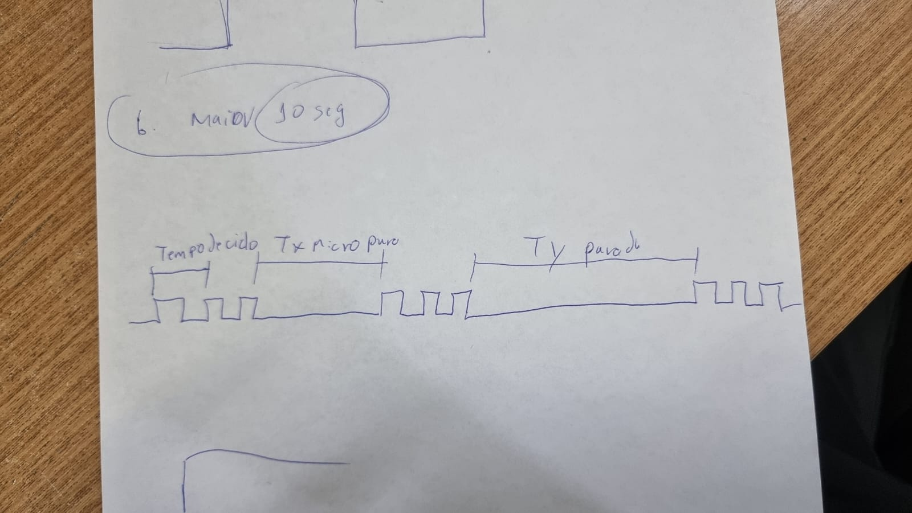
<p align="center"><em>Figura 23. Primeiro esboço sobre os ciclos de produção</em></p>

<!-- Podem incluir:

- mockups adicionais
- resultados de pesquisa
- entrevistas com usuários
- diagramas complementares
- links para protótipos ou repositórios

Sempre que possível inclua **imagens, protótipos ou referências visuais**. -->

# 10. Parecer do Comitê de Avaliação

(A ser preenchido pelos professores)

**Avaliador 1:** __________________________  
**Status:** [ ] Aprovado  [ ] Ajustar

Observações:

---

**Avaliador 2:** __________________________  
**Status:** [ ] Aprovado  [ ] Ajustar

Observações:

---

**Avaliador 3:** __________________________  
**Status:** [ ] Aprovado  [ ] Ajustar

Observações:
